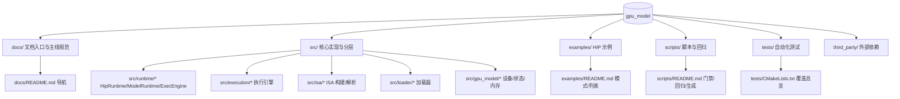

本页为初学者提供对 gpu_model 的一眼通透：它是什么、能做什么、如何运行与如何继续深入。gpu_model 是一个面向 AMD/GCN 风格 GPU kernel 的轻量级 C++ 功能模型与 naive cycle 模型，提供可执行、可追踪、可扩展的分析平台，支持 HIP 程序拦截、GCN ISA 解码与 Perfetto 时间线输出。你现在在：概览 [You are currently here]。Sources: [README.md](README.md#L3-L5) [README.md](README.md#L28-L39)

## 你将获得什么
- 认识项目目标与边界：以“分析与对比”为核心，而非硬件级精确仿真；cycle 为近似模型，用于相对比较和时间线分析。Sources: [README.md](README.md#L28-L39) [README.md](README.md#L92-L96)
- 理解执行模式与常见产物：st/mt/cycle 三模式与 trace.txt、trace.jsonl、timeline.perfetto.json 的用途。Sources: [README.md](README.md#L34-L39) [examples/README.md](examples/README.md#L75-L84)
- 把握分层架构关键词：HipRuntime → ModelRuntime → ExecEngine → Functional/Cycle 执行引擎 → Wave/Memory/Program 主链。Sources: [README.md](README.md#L41-L53) [docs/runtime-layering.md](docs/runtime-layering.md#L1-L26)

## 能力速览（面向初学者）
- 核心能力与默认策略：支持 st/mt/cycle 三种执行模式；非对比型示例默认只跑 mt；支持 HIP C ABI 拦截与真实程序联动；输出 Perfetto 时间线；支持 AMDGPU object / HIP fatbin / HIP .out 加载与执行。Sources: [README.md](README.md#L34-L39) [examples/README.md](examples/README.md#L7-L13)
- 成功产物判定：stdout/launch_summary/trace 三类产物用于快速验证路径是否接通。Sources: [examples/README.md](examples/README.md#L49-L57)

表：执行模式对比与适用场景（建议从 mt 入门，再过渡到 cycle 分析）
| 模式 | 全称 | 适用场景 | 备注 |
|------|------|----------|------|
| st | SingleThreaded | 语义核对、最简确定性参考 | 单线程功能执行 |
| mt | MultiThreaded | 常规功能验证、并行正确性 | Marl fiber 并行，示例默认 |
| cycle | Cycle | 时间线/调度/等待分析、相对对比 | Naive cycle 模型 |
说明：模式定义与默认策略见 examples/README。Sources: [examples/README.md](examples/README.md#L7-L21)

## 架构总览
项目遵循“runtime → program → instruction → execution → wave”主链：最外层 HipRuntime 提供 HIP 兼容 C ABI 与参数适配；ModelRuntime 作为项目对外 Facade 汇聚内存/加载/执行；ExecEngine 统一调度 Functional/Cycle/ProgramObject 路径，并组织 WaveContext 生命周期与运行时结果输出。Sources: [README.md](README.md#L41-L53) [docs/runtime-layering.md](docs/runtime-layering.md#L1-L26) [docs/runtime-layering.md](docs/runtime-layering.md#L54-L86)

架构示意（阅读提示：从左到右是调用链，从上到下是分层；粗体标注为对外可感知层）
```mermaid
flowchart LR
  subgraph Host
    A[HIP 调用/可执行程序]
  end
  subgraph Runtime
    B[HipRuntime<br/>(C ABI 兼容层)]
    C[ModelRuntime<br/>(项目 Facade)]
  end
  subgraph Engine
    D[ExecEngine<br/>(执行总控)]
    E1[FunctionalExecEngine]
    E2[CycleExecEngine]
    E3[ProgramObjectExecEngine]
  end
  subgraph Program & ISA
    P[ProgramObject<br/>ELF/Code Object/Metadata]
    I[Instruction<br/>解码/描述/语义分发]
  end
  subgraph State & Memory
    W[WaveContext / 状态]
    M[Device Memory / Pools]
    T[Trace/Timeline/Stats]
  end

  A --> B --> C --> D
  D --> P --> I
  D --> E1
  D --> E2
  D --> E3
  E1 & E2 & E3 --> W
  D --> M
  D --> T
```
该结构与职责边界的正式解释可在 runtime-layering 查阅。Sources: [docs/runtime-layering.md](docs/runtime-layering.md#L27-L72)

表：层级与核心组件速查（初学者可据此定位问题归属）
| 层级 | 核心组件 |
|------|----------|
| runtime | HipRuntime, ModelRuntime, ExecEngine |
| program | ProgramObject, ExecutableKernel, EncodedProgramObject |
| instruction | 指令解码与语义分发 |
| execution | FunctionalExecEngine, CycleExecEngine, WaveContext |
| arch | GpuArchSpec, 设备拓扑 |
来源：README 架构概览。Sources: [README.md](README.md#L41-L53)

## 目录与资产导览（可视化）
上手建议先关注四块：docs（文档资产与阅读顺序）、examples（可执行示例）、scripts（回归与工具脚本）、tests（自动化测试覆盖）。这些目录在各自 README/CMake 中均有明确入口与职责说明。Sources: [docs/README.md](docs/README.md#L7-L18) [examples/README.md](examples/README.md#L1-L3) [scripts/README.md](scripts/README.md#L1-L9) [tests/CMakeLists.txt](tests/CMakeLists.txt#L1-L20)

项目结构示意（高层视图）

参考入口：docs/README（阅读顺序）、examples/README（模式与列表）、scripts/README（门禁与回归）、tests/CMakeLists（测试分层）。Sources: [docs/README.md](docs/README.md#L28-L40) [examples/README.md](examples/README.md#L22-L39) [scripts/README.md](scripts/README.md#L20-L39) [tests/CMakeLists.txt](tests/CMakeLists.txt#L1-L20)

表：常用脚本与用途（只列最常用三项，完整列表见 scripts/README）
| 脚本 | 用途 | 默认行为摘要 |
|------|------|--------------|
| run_push_gate_light.sh | 轻量门禁 | 并行跑 Debug+ASan 与 Release smoke；不跑全量 tests/examples |
| run_push_gate.sh | 全量门禁 | 三条 pipeline 并行，含全量 tests 与 01-11 示例；禁用 hipcc 缓存保障重复性 |
| run_exec_checks.sh | 最小执行检查 | 快速验证基础路径 |
详情与可配置过滤器见 scripts/README。Sources: [scripts/README.md](scripts/README.md#L11-L39) [scripts/README.md](scripts/README.md#L40-L47)

## 重要限制与预期
- ISA 覆盖尚不完整（graphics/image family 仍为占位）；cycle 为 naive 近似，只用于相对对比而非硬件精确仿真；trace 中的 cycle 为模型时间而非物理时间。理解这些边界有助于设置合理预期与评估结果可解释性。Sources: [README.md](README.md#L92-L96)

## 下一步阅读与行动建议
- 立刻动手：构建与运行一条最小路径，建议按“快速上手”分步浏览。[快速开始](2-kuai-su-kai-shi) → [环境与依赖](3-huan-jing-yu-yi-lai) → [运行示例与验证](4-yun-xing-shi-li-yu-yan-zheng) → 如需可视化看 [可视化 Trace（Perfetto）](5-ke-shi-hua-trace-perfetto)。Sources: [README.md](README.md#L7-L19) [examples/README.md](examples/README.md#L49-L57)
- 想了解模型边界与适用范围：参见 [限制与适用范围](9-xian-zhi-yu-gua-yong-fan-wei)。Sources: [README.md](README.md#L92-L96)
- 想理解整体分层与职责：阅读 [分层与职责边界总览](10-fen-ceng-yu-zhi-ze-bian-jie-zong-lan) 与 [执行模式与 ExecEngine 工作流](11-zhi-xing-mo-shi-yu-execengine-gong-zuo-liu)。Sources: [docs/runtime-layering.md](docs/runtime-layering.md#L1-L26)
- 想按示例逐步建立直觉：从 01-05 入门，再看 07/11-13 的 st/mt/cycle 对比与 Perfetto 可视化，[运行示例与验证](4-yun-xing-shi-li-yu-yan-zheng)。Sources: [examples/README.md](examples/README.md#L41-L47) [examples/README.md](examples/README.md#L22-L39)