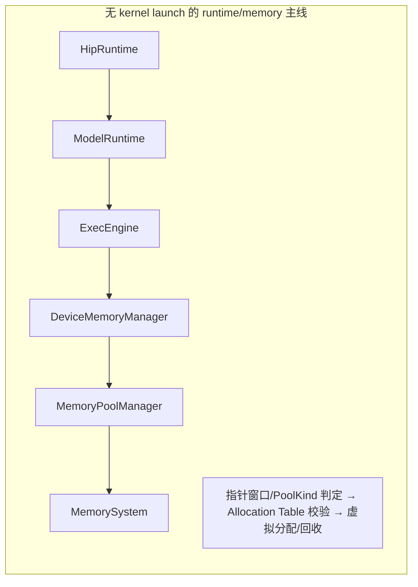
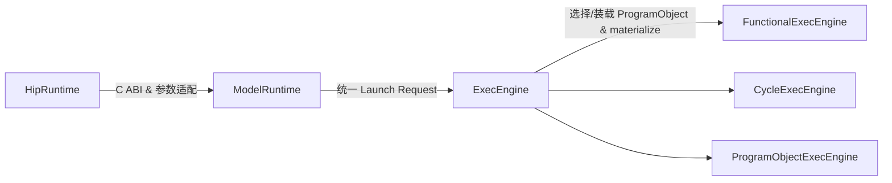
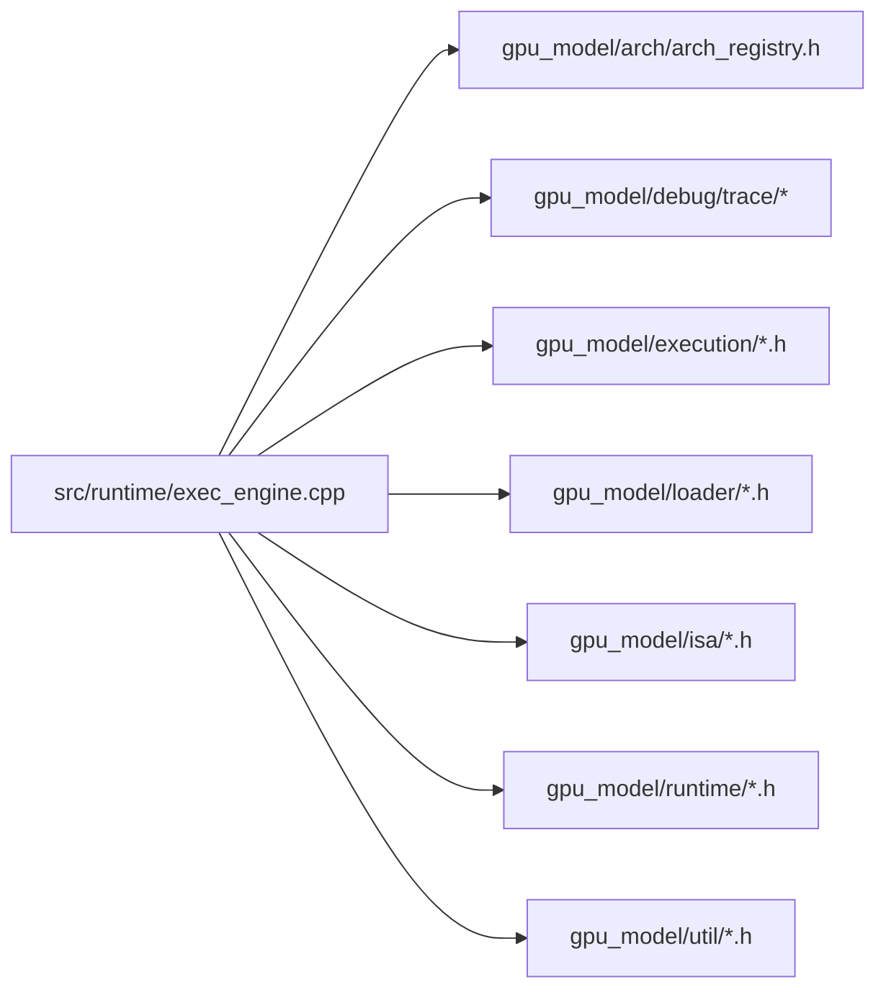

本页作为“架构与执行链”的起点，给出项目自顶向下的分层方式、各层的职责范围与“禁止跨界”的硬性约束，确保后续阅读能在统一的边界认知下定位实现与扩展点。特别强调 runtime 侧采用“两层”（HipRuntime 与 ModelRuntime）设计，ExecEngine 作为 ModelRuntime 的内部执行主链，而非对外第三层。Sources: [runtime-layering.md](docs/runtime-layering.md#L1-L40)

## 全局分层蓝图（5 层视角）
为便于全局导航，项目在概念上可归纳为五层：Runtime → Program → Instruction → Execution → Memory & Arch。该视角用于统一认知与讨论，但请注意 runtime 的正式分层见下一小节。Sources: [system_architecture_design.md](docs/architecture/system_architecture_design.md#L33-L90)

```mermaid
flowchart TB
  subgraph L5[Layer 5: Runtime Layer]
    Hip[HipRuntime (HIP ABI 入口)]
    MR[ModelRuntime (核心运行时 Facade)]
    EE[ExecEngine (内部执行主链)]
    Hip --> MR --> EE
  end

  subgraph L4[Layer 4: Program Layer]
    PO[ProgramObject]
    EK[ExecutableKernel]
    EPO[EncodedProgramObject]
    PO --> EK --> EPO
  end

  subgraph L3[Layer 3: Instruction Layer]
    IO[InstructionObject]
    DI[DecodedInstruction]
    ID[InstructionDecoder]
    ID --> DI --> IO
  end

  subgraph L2[Layer 2: Execution Layer]
    FEE[FunctionalExecEngine]
    CEE[CycleExecEngine]
    PEE[ProgramObjectExecEngine]
    WCB[WaveContextBuilder]
    EE --> FEE
    EE --> CEE
    EE --> PEE
    WCB -.-> FEE
    WCB -.-> CEE
    WCB -.-> PEE
  end

  subgraph L1[Layer 1: Memory & Arch]
    MS[MemorySystem]
    GAS[GpuArchSpec]
    MS --> EE
    GAS --> EE
  end

  Hip -. C ABI/LD_PRELOAD .-> Host[Host 程序]
  EE -. Trace -> Trace[TraceSink / Recorder]
```
该五层图与项目“系统架构”描述一致，用于宏观理解模块位置与依赖走向；其中 Runtime 层仅定义 HipRuntime 与 ModelRuntime 两层，ExecEngine 归属于 ModelRuntime 的内部执行主链。Sources: [system_architecture_design.md](docs/architecture/system_architecture_design.md#L33-L90)

## 运行时两层与 ExecEngine 的职责边界
- HipRuntime 层：与 AMD HIP runtime 对齐的兼容层，提供 C ABI 入口与参数适配，不应自有 kernel 执行逻辑/程序加载/内存语义实现；`src/runtime/hip_runtime_abi.cpp` 仅是 C ABI/LD_PRELOAD 的载体。Sources: [runtime-layering.md](docs/runtime-layering.md#L17-L49)
- ModelRuntime 层：项目核心运行时，统一设备选择、属性查询、内存分配/拷贝、ProgramObject 装载、ExecutableKernel 启动、trace/结果收口，并统一进入 ExecEngine。Sources: [runtime-layering.md](docs/runtime-layering.md#L51-L86)

ExecEngine 是 ModelRuntime 的内部执行主链，负责 ProgramObject 的 materialize、ExecutableKernel 与 launch 计划构建、驱动 Functional/Cycle/ProgramObject 三种执行器、组织 WaveContext 生命周期与状态输出。它不是与 HipRuntime/ModelRuntime 并列的第三层。Sources: [runtime-layering.md](docs/runtime-layering.md#L86-L100)

## 边界禁止清单（Do/Don't）
- HipRuntime 层禁止：独立 kernel 执行逻辑、重复实现 program load/launch/memory 语义；其动态库目标仅代表兼容入口，不应被误解为独立 runtime 层。Sources: [runtime-layering.md](docs/runtime-layering.md#L17-L49)
- Trace 主线只消费执行结果、可全局关闭，关闭不影响执行事实；日志统一收口至 loguru。Sources: [runtime-layering.md](docs/runtime-layering.md#L190-L205)

## 关键交互主线（概念流转）
为便于把握“哪些层与谁交互、依赖如何穿透”，以下按两条主线描述。


该主线必须可独立于 kernel launch 被测试覆盖，优先收敛在 hipMalloc/Free、三类 memcpy 与 memset，同步语义为主；pointer-window 判定与 allocation-table 校验顺序是边界约束的一部分。Sources: [runtime-layering.md](docs/runtime-layering.md#L102-L170)


kernel launch 主线强调 HipRuntime 仅做入口与适配，ModelRuntime 统一请求，ExecEngine 决策/装载并发起具体执行模式。Sources: [runtime-layering.md](docs/runtime-layering.md#L170-L190)

## 模块职责与目录映射（按层对齐）
- Runtime 侧映射：HipRuntime 主要由 `src/runtime/hip_runtime_abi.cpp` 与 `src/runtime/hip_runtime.cpp` 提供对外入口与参数适配；ModelRuntime 由 `src/gpu_model/runtime/*` 与 `src/runtime/exec_engine.cpp` 组成统一主线与执行衔接。Sources: [runtime-layering.md](docs/runtime-layering.md#L51-L86)
- 其余层级的角色概述：Program（程序对象与可执行内核）、Instruction（解码与语义）、Execution（执行引擎与 Wave 管理）、Memory（内存系统）、Loader（装载器）、Debug（Trace/Timeline）、Arch（架构规格）；该分类用于宏观定位讨论。Sources: [system_architecture_design.md](docs/architecture/system_architecture_design.md#L92-L120)

表：核心层与职责摘要（与上文一致，仅用于快速比对）
- Runtime：HIP 兼容 + 统一运行时主线
- Program：静态程序表示与可执行内核
- Instruction：解码与语义处理链
- Execution：功能/周期/编码执行器与 Wave 上下文
- Memory & Arch：内存系统与架构规格供给
Sources: [system_architecture_design.md](docs/architecture/system_architecture_design.md#L33-L90)

## ExecEngine 边界与执行器族
- 存在三种执行器：FunctionalExecEngine、CycleExecEngine、ProgramObjectExecEngine，由 ExecEngine 统一调度；这一关系在编译期头文件依赖中直接体现。Sources: [exec_engine.cpp](src/runtime/exec_engine.cpp#L1-L30)
- ExecEngineImpl 内聚 MemorySystem、TraceSink 选择、全套时序/发射策略覆盖开关（如共享银行冲突模型、全球存储层级延迟、launch 各阶段周期等），并通过 Launch() 在运行时解析架构规格与执行模式。Sources: [exec_engine.cpp](src/runtime/exec_engine.cpp#L41-L110)
- Launch() 入口内解析 arch_name，默认回落 mac500，通过 ArchRegistry 查表；查无则返回错误，查到则据规格驱动执行。Sources: [exec_engine.cpp](src/runtime/exec_engine.cpp#L140-L200)

表：执行器族定位（面向“分层”而非工作流细节）
- FunctionalExecEngine：功能语义优先，支持单/多线程模式
- CycleExecEngine：可解释的周期模型，受时序/发射策略与 issue 限制控制
- ProgramObjectExecEngine：以编码程序对象为核心的执行形态
Sources: [exec_engine.cpp](src/runtime/exec_engine.cpp#L1-L30)

## C ABI 边界与参数适配（HipRuntime）
HipRuntime 作为 C ABI 入口，承担 host 符号注册、Launch 配置入栈/出栈与 stream 校验、LaunchConfig 构造等适配职责，不承载 kernel 执行/装载/内存语义。示例：__hipRegisterFunction、__hipPushCallConfiguration/__hipPopCallConfiguration 的实现体现了“入口与适配”的单一职责边界。Sources: [hip_runtime_abi.cpp](src/runtime/hip_runtime_abi.cpp#L120-L180)

## 可视化项目结构（按依赖走向）
下图以 ExecEngine 为中心展示关键依赖与协作点，用于快速在代码中定位边界交汇处。


这些依赖在 exec_engine.cpp 的头文件引用中可直接观测，体现“ModelRuntime 内的执行主链”如何连接架构规格、trace、执行器、装载与 ISA 元数据。Sources: [exec_engine.cpp](src/runtime/exec_engine.cpp#L1-L30)

## 扩展与稳定边界（阅读与维护约束）
关于“如何解释当前 runtime 的职责与分层”，以 runtime-layering.md 与 my_design.md 为准；历史命名/过渡包装不得反向影响当前边界解释。真实 HIP 可执行的主路径固定：Host → HIP 符号 → HipRuntime C ABI → ModelRuntime → ExecEngine → loader/program/execution/memory/trace。Sources: [runtime-layering.md](docs/runtime-layering.md#L200-L209)

## 推荐后续阅读路径
- 若需理解具体执行模式与 ExecEngine 内部工作流，请转至：[执行模式与 ExecEngine 工作流](11-zhi-xing-mo-shi-yu-execengine-gong-zuo-liu)
- 若需理解程序对象在装载-解码-启动全过程中的定位，请转至：[ProgramObject 与可执行内核生命周期](13-programobject-yu-ke-zhi-xing-nei-he-sheng-ming-zhou-qi)
- 若需理解指令系统的解码、描述符与语义处理链，请转至：[GCN ISA 解码、描述符与语义处理链](15-gcn-isa-jie-ma-miao-shu-fu-yu-yu-yi-chu-li-lian)
- 若需理解设备内存管理与指针映射规则，请转至：[设备内存管理与指针映射规则](16-she-bei-nei-cun-guan-li-yu-zhi-zhen-ying-she-gui-ze)
上述阅读建议遵循 docs 入口页所倡导的“先主线规范、再细分主题”的秩序，以缩短定位时间并减少边界混淆。Sources: [README.md](docs/README.md#L1-L40)
