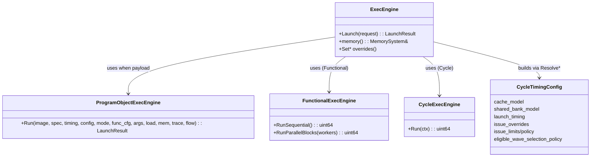

本页解释模型的两类执行模式（Functional 与 Cycle）及其在 ExecEngine 内的端到端工作流：从 LaunchRequest 校验、架构解析、元数据对齐、网格/Block/Wave 放置，到根据模式分派至对应执行引擎（FunctionalExecEngine 或 CycleExecEngine/ProgramObjectExecEngine），并说明可配置的时序/调度策略如何在 ResolveCycleTimingConfig 中生效。读者可据此明确何时选择功能级快速执行、何时选择周期级精确建模，以及如何通过 ExecEngine API 注入延迟、共享冲突、发射限额/策略等控制。Sources: [exec_engine.h](src/gpu_model/runtime/exec_engine.h#L17-L61) [exec_engine.cpp](src/runtime/exec_engine.cpp#L66-L99) [launch_request.h](src/gpu_model/runtime/launch_request.h#L20-L33)

## 执行模式总览与选择
执行模式由 ExecutionMode 枚举给出：Functional 与 Cycle。LaunchRequest 默认 mode 为 Functional；ExecEngine.Launch 根据该字段决定具体分派路径。Cycle 模式下，ExecEngine 计算 submit_cycle/begin_cycle，并在完成后推进 device_cycle_；Functional 模式下不推进 device_cycle_，begin_cycle 保持默认 0，仅根据执行引擎返回的总周期设置 end_cycle。Sources: [launch_request.h](src/gpu_model/runtime/launch_request.h#L20-L54) [exec_engine.cpp](src/runtime/exec_engine.cpp#L339-L346) [exec_engine.cpp](src/runtime/exec_engine.cpp#L458-L463)

功能模式的并行度通过 FunctionalExecutionConfig 控制，支持 SingleThreaded 与 MultiThreaded 两种 functional 子模式；构造时从全局 RuntimeConfig 读取 functional 配置（含 worker_threads），其中 mode 的环境呈现字符串映射为 "st"/"mt"。Sources: [functional_execution_mode.h](src/gpu_model/execution/functional_execution_mode.h#L1-L1) [exec_engine.cpp](src/runtime/exec_engine.cpp#L103-L111) [exec_engine.cpp](src/runtime/exec_engine.cpp#L115-L127)

## ExecEngine 角色与可配置项
ExecEngine 对外暴露 MemorySystem 访问与一组配置注入 API：固定/分档的全局内存延迟、共享内存 bank 冲突模型、launch 各阶段时序、Issue 类/操作级覆盖、架构发射上限与策略、functional 执行模式设置等，均影响后续 ResolveCycleTimingConfig 的合成结果。Sources: [exec_engine.h](src/gpu_model/runtime/exec_engine.h#L26-L56) [exec_engine.h](src/gpu_model/runtime/exec_engine.h#L47-L61)

这些配置在 ResolveCycleTimingConfig 中与 GpuArchSpec 缺省值合并：设置固定全局延迟会禁用 cache_model.enabled 并统一三层延迟；共享 bank 数/宽度的覆盖会启用 shared_bank_model；launch_timing 的各阶段可被选择性覆盖；Issue 覆盖与限额/策略按是否显式设置进行替换或重组，并可指定 eligible wave selection policy。Sources: [cycle_exec_engine.h](src/gpu_model/execution/cycle_exec_engine.h#L11-L21) [cycle_issue_policy.h](src/gpu_model/execution/internal/cycle_issue_policy.h#L7-L17) [exec_engine.cpp](src/runtime/exec_engine.cpp#L508-L590)

## ExecEngine.Launch 工作流（验证 → 放置 → 分派）
ExecEngineImpl::Launch 的关键步骤如下：1) 解析/回退架构名后从 ArchRegistry 获取 GpuArchSpec；2) 获取内核来源：优先 program_object 的 encoded payload，否则需要 ExecutableKernel/从 ProgramObject 解析 ASM；3) 校验 grid/block 维度非零；4) 解析并校验 kernel 元数据（架构/入口/形参数），结合 group_segment_fixed_size 与静态加载的共享内存字节数，调整 LaunchConfig.shared_memory_bytes，验证 block_dim_x 的倍数与上限；5) 生成 Trace 快照（运行配置/模型/内核）；6) 基于架构 spec 与 LaunchConfig 调用 Mapper::Place 完成 Block→DPC/AP/Wave 放置并发出 BlockPlaced 事件；7) 按 ExecutionMode 分派执行引擎并收集结果与统计，最终在 Cycle 模式更新 device_cycle_ 并汇总 Summary 快照。Sources: [exec_engine.cpp](src/runtime/exec_engine.cpp#L187-L205) [exec_engine.cpp](src/runtime/exec_engine.cpp#L205-L226) [exec_engine.cpp](src/runtime/exec_engine.cpp#L239-L301) [exec_engine.cpp](src/runtime/exec_engine.cpp#L305-L338) [exec_engine.cpp](src/runtime/exec_engine.cpp#L357-L368) [exec_engine.cpp](src/runtime/exec_engine.cpp#L419-L460) [exec_engine.cpp](src/runtime/exec_engine.cpp#L469-L499)

## 模式分派与引擎行为
- Functional 模式：若使用 program_object payload，则委托 ProgramObjectExecEngine::Run（execution_mode=Functional，传入 functional_execution_config）；否则构造 ExecutionContext，依据 functional_execution_config.mode 选择 RunParallelBlocks(workers) 或 RunSequential，随后计算 end_cycle=begin_cycle+total_cycles。Sources: [exec_engine.cpp](src/runtime/exec_engine.cpp#L369-L385) [exec_engine.cpp](src/runtime/exec_engine.cpp#L399-L417) [functional_exec_engine.h](src/gpu_model/execution/functional_exec_engine.h#L11-L24) [program_object_exec_engine.h](src/gpu_model/execution/program_object_exec_engine.h#L18-L31)

- Cycle 模式：同理优先 ProgramObjectExecEngine::Run（execution_mode=Cycle），或构造 ExecutionContext 后以 CycleExecEngine(timing_config) 执行，结果用于 end_cycle 与 total_cycles，并保存 ProgramCycleStats；完成后推进 device_cycle_ 并记录有 launch 历史。Sources: [exec_engine.cpp](src/runtime/exec_engine.cpp#L419-L436) [exec_engine.cpp](src/runtime/exec_engine.cpp#L446-L457) [exec_engine.cpp](src/runtime/exec_engine.cpp#L458-L460) [cycle_exec_engine.h](src/gpu_model/execution/cycle_exec_engine.h#L23-L34)

- ExecutionContext 关键字段包括：spec、kernel、launch_config、args、placement、device_load、memory、trace、trace_flow_id_source、stats、arg_load_cycles、issue 覆盖等，为两类执行引擎提供统一上下文。Sources: [exec_engine.cpp](src/runtime/exec_engine.cpp#L386-L402) [exec_engine.cpp](src/runtime/exec_engine.cpp#L437-L451)

## CycleTimingConfig 与策略覆盖
ResolveCycleTimingConfig 基于架构 spec 初始值，按以下优先级注入覆盖：1) 固定全局延迟优先于分档延迟（并关闭 cache_model.enabled）；2) 共享 bank 数与宽度任一设置即启用 bank 模型；3) 启动时序各阶段逐项覆盖；4) Issue 类/操作覆盖直接替换；5) 若设置 issue_policy 则同步其 type_limits；若仅设置 issue_limits 则以 CycleIssuePolicyWithLimits 合成 group_limits 并写回 policy 的 type_limits；6) eligible wave selection policy 取自 spec。Sources: [exec_engine.cpp](src/runtime/exec_engine.cpp#L508-L589) [cycle_issue_policy.h](src/gpu_model/execution/internal/cycle_issue_policy.h#L19-L42) [cycle_exec_engine.h](src/gpu_model/execution/cycle_exec_engine.h#L11-L21)

下表对配置入口与生效位置进行对应，便于核对配置链路的一致性：
- SetFixedGlobalMemoryLatency/SetGlobalMemoryLatencyProfile → CycleTimingConfig.cache_model.* 与 enabled 标志；SetSharedBankConflictModel → shared_bank_model.* 与 enabled；SetLaunchTimingProfile → launch_timing.*；SetIssueCycleClass/OpOverrides → issue 覆盖；SetCycleIssueLimits/Policy → issue_limits/issue_policy；SetFunctionalExecutionMode/Config → FunctionalExecEngine 并行度。Sources: [exec_engine.h](src/gpu_model/runtime/exec_engine.h#L26-L56) [exec_engine.cpp](src/runtime/exec_engine.cpp#L129-L166) [exec_engine.cpp](src/runtime/exec_engine.cpp#L168-L174) [exec_engine.cpp](src/runtime/exec_engine.cpp#L546-L589)

## 追踪与时间线基准
ExecEngine 在发射前生成三类 Trace 快照：RunSnapshot（execution_model、trace_time_basis=modeled_cycle）、ModelConfigSnapshot（DPC/AP/PEU/slot 拓扑与 slot_model）、KernelSnapshot（kernel_name 与 grid/block 三维）。随后逐 Block 发出 BlockPlaced 事件，以及 RuntimeLaunch 事件包含 arch 与 AGPR/accum_offset（如存在）。最后生成 SummarySnapshot，统计 PASS/FAIL、总周期、指令数、IPC、波前退出与各类 stall 累计。Sources: [exec_engine.cpp](src/runtime/exec_engine.cpp#L305-L338) [exec_engine.cpp](src/runtime/exec_engine.cpp#L345-L356) [exec_engine.cpp](src/runtime/exec_engine.cpp#L357-L368) [exec_engine.cpp](src/runtime/exec_engine.cpp#L469-L499)

Cycle 模式的 submit_cycle 与 begin_cycle 由架构 launch_timing 决定：首个周期内核的 submit_cycle=0，否则为上次 device_cycle_ 加 kernel_launch_gap_cycles；begin_cycle=submit_cycle+kernel_launch_cycles。Functional 模式不设置 submit_cycle/begin_cycle，仅以执行引擎返回 total_cycles 计算 end_cycle。Sources: [exec_engine.cpp](src/runtime/exec_engine.cpp#L339-L346) [exec_engine.cpp](src/runtime/exec_engine.cpp#L458-L460)

## 元数据对齐与共享内存调整
Launch 前对元数据进行严格对齐：核对 arch/entry/module_kernels/arg_count；共享内存以 max(launch.shared, metadata.group_segment_fixed_size, device_load.required_shared_bytes) 调整，并验证 required_shared_bytes、block_dim_multiple、max_block_dim 等约束。任何不满足导致早期错误返回。Sources: [exec_engine.cpp](src/runtime/exec_engine.cpp#L245-L271) [exec_engine.cpp](src/runtime/exec_engine.cpp#L272-L290) [exec_engine.cpp](src/runtime/exec_engine.cpp#L291-L301)

## 放置策略与设备时钟推进
Mapper::Place 按架构 spec 与 LaunchConfig 生成 PlacementMap，并为每个放置的 Block 记录其 dpc/ap 与波前数；Cycle 模式完成后，device_cycle_ 更新为当前内核 end_cycle，并置位 has_cycle_launch_history_。这直接影响后续内核的 submit_gap 行为。Sources: [exec_engine.cpp](src/runtime/exec_engine.cpp#L357-L368) [exec_engine.cpp](src/runtime/exec_engine.cpp#L458-L460)

## 概念关系图（执行模式与引擎分派）
以下图示展示 ExecutionMode → ExecEngine → 具体执行引擎的分派关系，以及 ProgramObject 路径的旁路：
```mermaid
flowchart TD
  A[LaunchRequest.mode] -->|Functional| B{use_program_object_payload?}
  A -->|Cycle| C{use_program_object_payload?}
  B -->|Yes| D[ProgramObjectExecEngine.Run(Functional)]
  B -->|No| E[FunctionalExecEngine.RunSequential/RunParallel]
  C -->|Yes| F[ProgramObjectExecEngine.Run(Cycle)]
  C -->|No| G[CycleExecEngine.Run]
  subgraph Context
    H[ResolveCycleTimingConfig(spec)]
    I[Mapper::Place]
    J[ExecutionContext]
  end
  H --> G
  I --> E
  I --> G
  J --> E
  J --> G
```
图中 Context 模块表示在两种模式下共享的放置与时序配置/上下文构建链路。Sources: [exec_engine.cpp](src/runtime/exec_engine.cpp#L357-L368) [exec_engine.cpp](src/runtime/exec_engine.cpp#L369-L417) [exec_engine.cpp](src/runtime/exec_engine.cpp#L419-L457) [exec_engine.cpp](src/runtime/exec_engine.cpp#L508-L590)

## 类与模块交互图（高级）

该交互图聚焦 ExecEngine 与三类执行引擎、以及时序配置对象之间的耦合边界与数据流。Sources: [exec_engine.h](src/gpu_model/runtime/exec_engine.h#L17-L61) [program_object_exec_engine.h](src/gpu_model/execution/program_object_exec_engine.h#L18-L31) [functional_exec_engine.h](src/gpu_model/execution/functional_exec_engine.h#L11-L24) [cycle_exec_engine.h](src/gpu_model/execution/cycle_exec_engine.h#L11-L29)

## Functional vs Cycle 模式差异对比
- 引擎选择：Functional → FunctionalExecEngine 或 ProgramObjectExecEngine(Functional)；Cycle → CycleExecEngine 或 ProgramObjectExecEngine(Cycle)。Sources: [exec_engine.cpp](src/runtime/exec_engine.cpp#L369-L417) [exec_engine.cpp](src/runtime/exec_engine.cpp#L419-L457)
- 时间线基准：Cycle 产生 submit/begin/end 并推进 device_cycle_；Functional 不推进 device_clock，默认 begin=0，仅计算 end=total。Sources: [exec_engine.cpp](src/runtime/exec_engine.cpp#L339-L346) [exec_engine.cpp](src/runtime/exec_engine.cpp#L458-L460)
- 并行度：Functional 支持单线程与多线程 worker 数控制；Cycle 由时序/调度策略主导，未在该路径上使用 worker 线程。Sources: [functional_exec_engine.h](src/gpu_model/execution/functional_exec_engine.h#L11-L24) [exec_engine.cpp](src/runtime/exec_engine.cpp#L403-L411)
- 时序/资源建模：Cycle 使用 CycleTimingConfig（cache、bank、launch、issue 限额/策略、eligible policy）；Functional 仅携带部分 launch 参数（如 arg_load_cycles）与统计。Sources: [cycle_exec_engine.h](src/gpu_model/execution/cycle_exec_engine.h#L11-L29) [exec_engine.cpp](src/runtime/exec_engine.cpp#L396-L402)

## 运行时配置与环境变量
ExecEngine 构造时读取 RuntimeConfig：默认 execution_mode=Functional，functional.mode=MultiThreaded，trace 默认为禁用；环境变量文档化包括 GPU_MODEL_EXECUTION_MODE、GPU_MODEL_FUNCTIONAL_MODE、GPU_MODEL_FUNCTIONAL_WORKERS、GPU_MODEL_DISABLE_TRACE 等。ExecEngineImpl 会将 functional 配置与 disable_trace 应用到实例行为。Sources: [runtime_config.h](src/gpu_model/runtime/runtime_config.h#L12-L29) [runtime_config.h](src/gpu_model/runtime/runtime_config.h#L34-L56) [exec_engine.cpp](src/runtime/exec_engine.cpp#L115-L127)

## 决策建议与下一步阅读
- 若需快速功能验证/端到端正确性，选择 Functional 模式，并按 CPU 资源配置 worker_threads；需要严格的周期开销与资源竞争分析时选择 Cycle 模式，并通过 Set* API 注入延迟、bank 模型、issue 限额/策略。Sources: [exec_engine.h](src/gpu_model/runtime/exec_engine.h#L26-L56) [exec_engine.cpp](src/runtime/exec_engine.cpp#L508-L590)
- 进一步理解波前调度与等待条件、资源限额与 eligible wave 选择，请参阅 [Wave/Block/Device 语义与状态管理](12-wave-block-device-yu-yi-yu-zhuang-tai-guan-li)；程序对象路径与 encoded payload 的装载执行流程，请参阅 [ProgramObject 与可执行内核生命周期](13-programobject-yu-ke-zhi-xing-nei-he-sheng-ming-zhou-qi)；指令解码与语义处理链路，请参阅 [GCN ISA 解码、描述符与语义处理链](15-gcn-isa-jie-ma-miao-shu-fu-yu-yu-yi-chu-li-lian)。Sources: [exec_engine.cpp](src/runtime/exec_engine.cpp#L205-L214) [issue_eligibility.h](src/gpu_model/execution/internal/issue_eligibility.h#L44-L53) [cycle_exec_engine.h](src/gpu_model/execution/cycle_exec_engine.h#L11-L21)