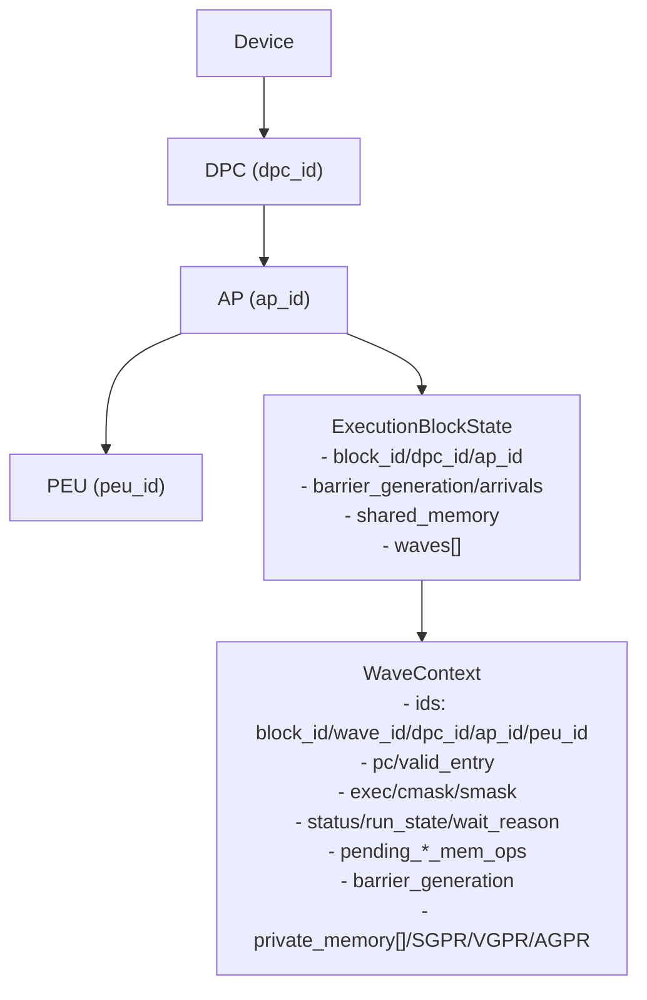
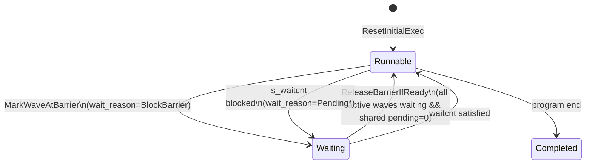

本页聚焦模型中 Wave（波前）、Block（工作组）与 Device（设备拓扑）三层语义及其状态管理：如何定义 Wave 可运行性、等待原因与挂起计数，Block 级 barrier 的达成与释放条件，以及设备级拓扑（DPC/AP/PEU）和属性对上述语义的约束。目标读者为需要基于内部状态构建调度/同步/可视化的高级开发者。Sources: [wave_context.h](src/gpu_model/execution/wave_context.h#L13-L35) [execution_state.h](src/gpu_model/execution/internal/execution_state.h#L12-L21) [c500_spec.cpp](src/arch/c500_spec.cpp#L11-L16) [device_properties.h](src/gpu_model/runtime/device_properties.h#L42-L55)

## 语义分层与对象关系总览
模型采用自上而下的设备拓扑：Device 由多个 DPC 组成，每个 DPC 含多个 AP，每个 AP 含多个 PEU；Block 被放置到特定的 dpc/ap 上并划分为多个 Wave，Wave 再映射到具体 peu。该拓扑由映射器产出 Placement（含 block_id、block_idx_xyz、dpc_id、ap_id 以及 waves 的 wave_id/peu_id/lane_count），并作为后续执行状态构建输入。Sources: [mapper.h](src/gpu_model/runtime/mapper.h#L11-L26) [mapper.h](src/gpu_model/runtime/mapper.h#L28-L35) [c500_spec.cpp](src/arch/c500_spec.cpp#L11-L16)

下图给出层级与主要状态承载对象（ExecutionBlockState、WaveContext）的关系，便于建立“谁持有何状态”的全局心智模型。Sources: [execution_state.h](src/gpu_model/execution/internal/execution_state.h#L12-L21) [wave_context.h](src/gpu_model/execution/wave_context.h#L36-L67)



## Wave 上下文：可运行性、掩码与私有内存
WaveContext 定义了可运行必需的核心字段：pc、valid_entry、exec/cmask/smask、线程数 thread_count 以及寄存器文件（SGPR/VGPR/AGPR）。其中 exec 是按 lane 的活跃位图，cmask/smask 用于控制流与标量掩码，私有内存为每个 lane 单独的字节向量数组。Sources: [wave_context.h](src/gpu_model/execution/wave_context.h#L36-L67)

ResetInitialExec 会按 thread_count 初始化 exec 有效位、清零 cmask/smask，重置 valid_entry、branch_pending、waiting_at_barrier、run_state、wait_reason 等运行相关状态，并将 pending_* 内存计数清零，为新 Wave 的首次调度建立干净基线。Sources: [wave_context.h](src/gpu_model/execution/wave_context.h#L68-L87)

smask 提供了位级访问器，ScalarMaskBit0/SetScalarMaskBit0 可查询和设置 bit0，用于精细的标量流控。Sources: [wave_context.h](src/gpu_model/execution/wave_context.h#L89-L97)

私有内存的语义为“每个 lane 独立的可扩展 byte 数组”；读路径在访问越界时可选择按需扩展或返回 0，写路径在需要时扩展底层存储。这些语义由 Lane 私有存取函数实现并与 WaveContext 的 private_memory 对应。Sources: [memory_ops.cpp](src/execution/memory_ops.cpp#L83-L101) [memory_ops.cpp](src/execution/memory_ops.cpp#L109-L118) [wave_context.h](src/gpu_model/execution/wave_context.h#L63-L67)

## Block 状态：共享内存与 barrier 代数
ExecutionBlockState 聚合了 Block 级共享资源：shared_memory、barrier_generation、barrier_arrivals，以及该 Block 下的所有 WaveContext 列表，是 block 级 barrier 管理与 LDS 访问的载体。Sources: [execution_state.h](src/gpu_model/execution/internal/execution_state.h#L12-L21)

WaveContextBlocks 的构建会为每个 block 初始化 barrier_generation/arrivals，并按启动参数分配 shared_memory 字节容量，同时基于 Placement 映射生成各 Wave 的初始上下文（包括 block_idx_xyz、dpc_id、ap_id、wave_id、peu_id、thread_count 并调用 ResetInitialExec）。Sources: [wave_context_builder.cpp](src/execution/wave_context_builder.cpp#L21-L36) [wave_context_builder.cpp](src/execution/wave_context_builder.cpp#L37-L45) [wave_context_builder.cpp](src/execution/wave_context_builder.cpp#L5-L19)

AP 级别还维护了独立的 shared_memory 与 BarrierState（armed 标志），用于与硬件抽象一致的资源归属；但在执行路径上，block 层面的 shared_memory 与 barrier_generation/arrivals 是 barrier 判定与数据通路的直接依据。Sources: [ap_state.h](src/gpu_model/state/ap_state.h#L15-L22)

## Wave 生命周期与前端可发行性
Wave 的生命周期由两组正交状态描述：WaveStatus（Active/Exited/Stalled）与 WaveRunState（Runnable/Waiting/Completed），以及 Waiting 的具体原因 WaveWaitReason（None/BlockBarrier/Pending{Global,Shared,Private,ScalarBuffer}Memory）。这些字段共同决定前端是否可以发射指令。Sources: [wave_context.h](src/gpu_model/execution/wave_context.h#L15-L35) [wave_context.h](src/gpu_model/execution/wave_context.h#L36-L60)

前端可发行性的判定要求 dispatch 启用、Wave 处于 Active、Runnable、valid_entry = true，且不存在 branch_pending 与 waiting_at_barrier；对应的阻塞原因会以字符串形式给出，包括 barrier_wait、branch_wait、front_end_wait 以及 waitcnt_*。Sources: [issue_eligibility.cpp](src/execution/internal/issue_eligibility.cpp#L243-L249) [issue_eligibility.cpp](src/execution/internal/issue_eligibility.cpp#L271-L281) [issue_eligibility.cpp](src/execution/internal/issue_eligibility.cpp#L251-L269)

下面的状态关系图展示了 barrier/waitcnt 对 WaveRunState 的影响以及 Mark/Release 两个操作如何切换 Waiting/Runnable。Sources: [sync_ops.cpp](src/execution/sync_ops.cpp#L67-L80) [sync_ops.cpp](src/execution/sync_ops.cpp#L24-L33)



## Waitcnt 等待域与挂起计数
模型将等待域划分为 Global/Shared/Private/ScalarBuffer 四类，对应 WaveContext 中的 pending_global_mem_ops、pending_shared_mem_ops、pending_private_mem_ops、pending_scalar_buffer_mem_ops 四个计数器；S_WAITCNT 指令通过立即数阈值对各域进行门限判定，若 pending 超阈则阻塞。Sources: [issue_eligibility.h](src/gpu_model/execution/internal/issue_eligibility.h#L13-L26) [wave_context.h](src/gpu_model/execution/wave_context.h#L52-L59) [issue_eligibility.cpp](src/execution/internal/issue_eligibility.cpp#L181-L190)

域到指令类别的映射如下：Global 包含全局存取与原子，Shared 包含 LDS 读写与原子，Private 包含私有内存读写，ScalarBuffer 包含常量/SBuffer 加载；该映射用于决定递增/递减的计数器归属。Sources: [issue_eligibility.cpp](src/execution/internal/issue_eligibility.cpp#L98-L117) [issue_eligibility.cpp](src/execution/internal/issue_eligibility.cpp#L135-L179)

等待判定与可视化：WaitCntSatisfied/WaitCntBlockReason 会根据阈值与 pending 比较给出是否阻塞以及阻塞原因字符串，而 MakeTraceWaitcntState 则组织 pending/threshold/blocked 标志用于 Trace。Sources: [issue_eligibility.cpp](src/execution/internal/issue_eligibility.cpp#L221-L233) [issue_eligibility.cpp](src/execution/internal/issue_eligibility.cpp#L235-L242) [issue_eligibility.cpp](src/execution/internal/issue_eligibility.cpp#L202-L218)

为便于对照，下表列出等待域与字段/函数的对应关系（事实均由代码直接定义）：
- 域: Global/Shared/Private/ScalarBuffer
- 计数: pending_global_mem_ops/pending_shared_mem_ops/pending_private_mem_ops/pending_scalar_buffer_mem_ops
- 指令映射: MLoad*/MStore*/MAtomic* 族、SBufferLoadDword/MLoadConst
- 判定函数: PendingMemoryOpsForDomain/WaitCntSatisfied/WaitCntBlockReason
Sources: [issue_eligibility.cpp](src/execution/internal/issue_eligibility.cpp#L119-L133) [issue_eligibility.cpp](src/execution/internal/issue_eligibility.cpp#L221-L242) [issue_eligibility.h](src/gpu_model/execution/internal/issue_eligibility.h#L28-L33)

## Block 级 Barrier：达成与释放
抵达 barrier 时，MarkWaveAtBarrier 会将 wave 状态置为 Stalled/Waiting，原因为 BlockBarrier，记录当前 barrier_generation 并可按需清除 valid_entry，同时累加 barrier_arrivals。Sources: [sync_ops.cpp](src/execution/sync_ops.cpp#L67-L80)

释放 barrier 的必要条件为：该 Block 内所有 Active/Stalled 的 wave 均处于 waiting_at_barrier 且 wait_reason=BlockBarrier，且 Shared 域 pending 计数为 0；满足后对当前 generation 的 waves 执行 Resume（清除 waiting、置 Active/Runnable、清除 wait_reason 并推进 pc），然后清零 barrier_arrivals 并自增 barrier_generation。Sources: [sync_ops.cpp](src/execution/sync_ops.cpp#L35-L46) [sync_ops.cpp](src/execution/sync_ops.cpp#L49-L63) [sync_ops.cpp](src/execution/sync_ops.cpp#L55-L63)

若提供可执行内核对象，ReleaseBarrierIfReady 会从 kernel 计算 next_pc 决定 pc 增量，否则使用固定 pc_increment；两种重载均保持相同的达成条件与 generation 语义。Sources: [sync_ops.cpp](src/execution/sync_ops.cpp#L96-L108) [sync_ops.cpp](src/execution/sync_ops.cpp#L124-L163)

Barrier 指令族（s_barrier/s_wave_barrier）与 s_waitcnt 的描述在 ISA 描述符中标记为 Sync/Waitcnt，作为上层语义处理链的入口。Sources: [opcode_descriptor.cpp](src/isa/opcode_descriptor.cpp#L42-L42) [opcode_descriptor.cpp](src/isa/opcode_descriptor.cpp#L85-L86)

## Wave 构建与拓扑映射
初始 WaveContext 由 BuildInitialWaveContext 从 BlockPlacement/WavePlacement 派生，设置 block_id、block_idx_xyz、dpc_id、ap_id、peu_id 与 wave_id，并记录线程数 lane_count 后调用 ResetInitialExec 完成可运行状态初始化。Sources: [wave_context_builder.cpp](src/execution/wave_context_builder.cpp#L5-L19) [mapper.h](src/gpu_model/runtime/mapper.h#L17-L26)

Block 封装在 ExecutionBlockState 中，包含 barrier_generation/arrivals、shared_memory 与 waves[]；BuildWaveContextBlocks 会按 LaunchConfig 的 shared_memory_bytes 初始化共享内存容量，从而将启动配置落入具体执行状态。Sources: [execution_state.h](src/gpu_model/execution/internal/execution_state.h#L12-L21) [wave_context_builder.cpp](src/execution/wave_context_builder.cpp#L21-L36)

## 设备属性与资源约束
设备运行时属性给出 warp_size（64）、每 Block/每 Multiprocessor 的共享内存与寄存器上限，以及网格/块尺寸约束；这些属性限定了 Wave 规模与 Block 资源的上界。Sources: [device_properties.h](src/gpu_model/runtime/device_properties.h#L42-L55) [device_properties.h](src/gpu_model/runtime/device_properties.h#L56-L75)

架构规格 c500 进一步定义了每 DPC/AP/PEU 的数量、每 PEU 可驻留/可发射的 Wave 数，以及每 AP 的 barrier 槽位数等周期资源参数，为 barrier 并发与调度选择提供硬约束。Sources: [c500_spec.cpp](src/arch/c500_spec.cpp#L11-L16) [c500_spec.cpp](src/arch/c500_spec.cpp#L37-L45)

## 类/模块交互视图
交互主线：Mapper 产出 Placement → WaveContextBuilder 构建 ExecutionBlockState/WaveContext → 前端用 IssueEligibility 判定可发射性（含 waitcnt/前端门控）→ SyncOps 进行 barrier 到达与释放 → WaveContext/ExecutionBlockState 状态被更新。Sources: [mapper.h](src/gpu_model/runtime/mapper.h#L28-L35) [wave_context_builder.h](src/gpu_model/execution/wave_context_builder.h#L10-L15) [issue_eligibility.h](src/gpu_model/execution/internal/issue_eligibility.h#L45-L53) [sync_ops.h](src/gpu_model/execution/sync_ops.h#L7-L29)

```mermaid
flowchart LR
  A[Mapper::Place\nPlacementMap] --> B[BuildWaveContextBlocks\nExecutionBlockState{waves,shared,barrier_*}]
  B --> C[IssueEligibility\n- CanIssueInstruction\n- WaitCntSatisfied/BlockReason]
  C --> D[SyncOps\n- MarkWaveAtBarrier\n- ReleaseBarrierIfReady]
  D --> E[WaveContext/BlockState 更新\nstatus/run_state/wait_reason\nbarrier_generation/arrivals]
```

## 关键状态与阻塞来源对照表
- 可运行性（前端）：dispatch_enabled && status=Active && run_state=Runnable && valid_entry && !branch_pending && !waiting_at_barrier；阻塞原因依次来自 WaitingStateBlockReason、valid_entry、barrier、branch。Sources: [issue_eligibility.cpp](src/execution/internal/issue_eligibility.cpp#L243-L249) [issue_eligibility.cpp](src/execution/internal/issue_eligibility.cpp#L251-L269)

- Waitcnt：S_WAITCNT 阈值对各域 pending 比较，任一域超阈即阻塞；阻塞原因字符串为 waitcnt_*，并可生成 TraceWaitcntState。Sources: [issue_eligibility.cpp](src/execution/internal/issue_eligibility.cpp#L221-L233) [issue_eligibility.cpp](src/execution/internal/issue_eligibility.cpp#L235-L242) [issue_eligibility.cpp](src/execution/internal/issue_eligibility.cpp#L202-L218)

- Barrier（Block 级）：所有 Active/Stalled 的 wave 均处于 barrier 等待且 Shared 域 pending=0 才会释放；释放后自增 barrier_generation 并清零 arrivals。Sources: [sync_ops.cpp](src/execution/sync_ops.cpp#L35-L46) [sync_ops.cpp](src/execution/sync_ops.cpp#L60-L63)

## 设计意图小结
- 将等待分为“前端门控”（valid_entry/branch/barrier）与“存储域门控”（waitcnt）两条独立路径，均以 WaveContext 字段表达，便于调度器与追踪器一致地读取和解释。Sources: [wave_context.h](src/gpu_model/execution/wave_context.h#L46-L60) [issue_eligibility.cpp](src/execution/internal/issue_eligibility.cpp#L243-L249)

- Barrier 的代数化处理（barrier_generation/arrivals + waiting_at_barrier + wait_reason）使“达成/释放”具备可验证性与幂等性，避免跨代误释放。Sources: [execution_state.h](src/gpu_model/execution/internal/execution_state.h#L17-L21) [sync_ops.cpp](src/execution/sync_ops.cpp#L55-L63) [sync_ops.cpp](src/execution/sync_ops.cpp#L67-L74)

- 私有/共享/全局/标量缓冲四域的独立计数器提供了 waitcnt 的最小完备实现单元，配合域到指令族的静态映射，形成一致的“发射前可发行性 + 指令级等待”框架。Sources: [issue_eligibility.cpp](src/execution/internal/issue_eligibility.cpp#L98-L117) [issue_eligibility.cpp](src/execution/internal/issue_eligibility.cpp#L119-L133) [issue_eligibility.cpp](src/execution/internal/issue_eligibility.cpp#L181-L190)

## 关联阅读（建议下一步）
- 若需理解发射/切换如何贯穿全栈，请继续阅读：[执行模式与 ExecEngine 工作流](11-zhi-xing-mo-shi-yu-execengine-gong-zuo-liu)。Sources: [wave_context.h](src/gpu_model/execution/wave_context.h#L46-L60)
- 若需查看指令解析到语义处理链条，请参阅：[GCN ISA 解码、描述符与语义处理链](15-gcn-isa-jie-ma-miao-shu-fu-yu-yu-yi-chu-li-lian)。Sources: [opcode_descriptor.cpp](src/isa/opcode_descriptor.cpp#L42-L86)