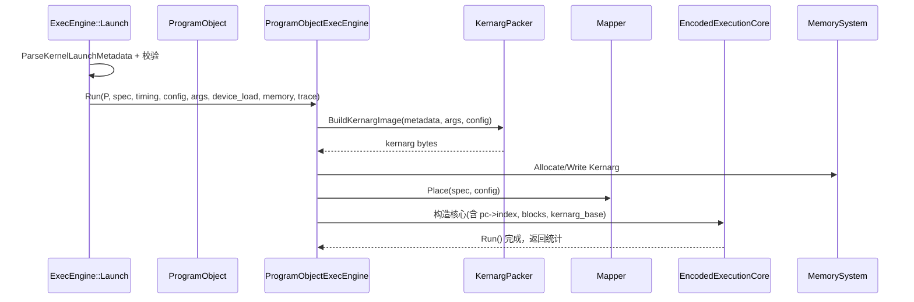

本页聚焦 ProgramObject 在「从输入工件到可执行内核」全链路中的角色与状态演化：如何被构造（文本/码对象两条路径）、如何携带内核元数据与指令负载、在 ExecEngine/ProgramObjectExecEngine 中如何被验证、打包参数、映射放置并驱动执行。内容严格围绕 ProgramObject 与其生命周期，避免扩展到通用加载器细节、指令语义或更广的运行时主题。Sources: [program_object.h](src/gpu_model/program/program_object.h#L58-L130)

## 概念与范围：ProgramObject 的职责
ProgramObject 是承载「可执行内核镜像」的统一数据结构，包含内核名、元数据、常量/数据段、编码/解码后的指令负载、以及可选的 AmdgpuKernelDescriptor 等，既支持从文本汇编与侧车元数据构建，也支持从 AMDGPU 码对象或 HIP fatbin 解包构建。其 has_encoded_payload() 用于指示是否已具备可直接执行的指令负载，是后续选择执行路径的关键判断。Sources: [program_object.h](src/gpu_model/program/program_object.h#L58-L130)

## 关系总览图（概念）
下图概述两条构建路径与执行入口的关系。阅读提示：图中边表示「数据/控制流」，节点表示模块或数据结构。

```mermaid
flowchart LR
  subgraph Build["ProgramObject 构建"]
    A1["ObjectReader::LoadFromStem(文本)"] --> P["ProgramObject"]
    A2["ObjectReader::LoadProgramObject(码对象/HIP fatbin)"] --> P
  end

  subgraph Exec["执行入口 (ExecEngine)"]
    E["Launch(request)"]
    E -->|has_encoded_payload()==false| PARSE["AsmParser::Parse"]
    E -->|has_encoded_payload()==true| POE["ProgramObjectExecEngine::Run"]
  end

  subgraph Run["运行期准备与执行"]
    K["KernargPacker::BuildKernargImage"]
    M["Mapper::Place (放置)"]
    C["EncodedExecutionCore (发射/调度/统计)"]
  end

  P --> E
  POE --> K --> C
  POE --> M --> C
```
Sources: [object_reader.h](src/gpu_model/program/object_reader.h#L11-L16), [object_reader.cpp](src/program/object_reader.cpp#L80-L102), [encoded_program_object.cpp](src/program/encoded_program_object.cpp#L553-L637), [exec_engine.cpp](src/runtime/exec_engine.cpp#L204-L216), [exec_engine.cpp](src/runtime/exec_engine.cpp#L336-L418), [program_object_exec_engine.cpp](src/execution/program_object_exec_engine.cpp#L2740-L2806), [kernarg_packer.cpp](src/runtime/kernarg_packer.cpp#L91-L143)

## ProgramObject 结构与不变式
ProgramObject 聚合了执行所需的完整上下文：kernel_name、assembly_text、MetadataBlob、常量/数据段、AmdgpuKernelDescriptor、二进制 code_bytes、编码指令、解码指令与 InstructionObject 列表。只要 code_bytes、decoded_instructions 或 instruction_objects 三者任一非空，has_encoded_payload() 返回 true，表明可走「ProgramObject 直连执行」路径。Sources: [program_object.h](src/gpu_model/program/program_object.h#L58-L130)

## 两条构建路径对比（文本 vs 码对象）
- 文本路径：ObjectReader::LoadFromStem 读取 stem 同名的 asm 文本、可选 .meta 元数据与 .const.bin 常量段，构造 ProgramObject；若无编码负载，后续由 ExecEngine 在运行前用 AsmParser 解析为 ExecutableKernel。Sources: [object_reader.cpp](src/program/object_reader.cpp#L80-L102), [exec_engine.cpp](src/runtime/exec_engine.cpp#L204-L216)
- 码对象路径：ObjectReader::LoadProgramObject 识别 AMDGPU ELF 或 HIP fatbin，解包出设备码对象，解析符号/节、提取 .text/.rodata、读取 llvm notes 构建元数据、解码 .text 为指令负载，并可解析内核描述符注入 ProgramObject。Sources: [encoded_program_object.cpp](src/program/encoded_program_object.cpp#L106-L158), [encoded_program_object.cpp](src/program/encoded_program_object.cpp#L432-L481), [encoded_program_object.cpp](src/program/encoded_program_object.cpp#L553-L637), [encoded_program_object.cpp](src/program/encoded_program_object.cpp#L592-L613), [encoded_program_object.cpp](src/program/encoded_program_object.cpp#L495-L533)

对比要点（简表）：输入工件（asm+meta vs ELF/fatbin）、元数据来源（.meta vs llvm-readelf notes）、是否自带编码负载（否/需解析 vs 是/经解码）、工具依赖（无外部工具 vs readelf/llvm-objcopy/clang-offload-bundler）。Sources: [object_reader.cpp](src/program/object_reader.cpp#L80-L102), [encoded_program_object.cpp](src/program/encoded_program_object.cpp#L106-L158), [encoded_program_object.cpp](src/program/encoded_program_object.cpp#L432-L481), [encoded_program_object.cpp](src/program/encoded_program_object.cpp#L592-L613)

## ExecEngine 如何选择执行路径与一致性校验
ExecEngine.Launch 首先尝试从 ProgramObject.metadata()["arch"] 推断架构；若 ProgramObject 带有编码负载（has_encoded_payload），则走 ProgramObjectExecEngine；否则在运行前用 AsmParser 解析文本 ProgramObject 为 ExecutableKernel。随后，统一基于 ParseKernelLaunchMetadata 解析的元数据进行校验：arch/entry 一致性、module_kernels 包含、参数个数匹配、共享内存需求、block 维度约束等，不满足则直接返回错误。Sources: [exec_engine.cpp](src/runtime/exec_engine.cpp#L187-L201), [exec_engine.cpp](src/runtime/exec_engine.cpp#L204-L216), [exec_engine.cpp](src/runtime/exec_engine.cpp#L239-L244), [exec_engine.cpp](src/runtime/exec_engine.cpp#L246-L299), [kernel_metadata.cpp](src/isa/kernel_metadata.cpp#L191-L207)

## 元数据建模与来源（码对象路径）
码对象路径下，LoadProgramObject 通过 llvm-readelf --notes 解析 amdhsa.kernels，提取并编码 entry、arg_layout、hidden_arg_layout、group/private/kernarg 尺寸、sgpr/vgpr/agpr 计数、wavefront_size、uniform_work_group_size、descriptor_symbol 等为 MetadataBlob 的键值。随后，如存在 descriptor_symbol，会在 .rodata 中按符号解析并反序列化 AmdgpuKernelDescriptor，写入 ProgramObject。Sources: [encoded_program_object.cpp](src/program/encoded_program_object.cpp#L432-L481), [encoded_program_object.cpp](src/program/encoded_program_object.cpp#L553-L590)

## Kernel Descriptor 注入与用途边界
解析得到的 AmdgpuKernelDescriptor 会写入 ProgramObject，ExecEngine 在 Launch 日志中输出其中的 agpr_count 与 accum_offset 信息；在更低层的执行管线中，存在基于 descriptor 的 ABI 决策（例如是否启用特定 SGPR/私有段/预取等）的能力检测函数，但本页仅确认其存在与可用，不展开细节实现。Sources: [program_object.h](src/gpu_model/program/program_object.h#L82-L107), [exec_engine.cpp](src/runtime/exec_engine.cpp#L327-L358), [program_object_exec_engine.cpp](src/execution/program_object_exec_engine.cpp#L173-L191)

## 指令负载解码与收敛
LoadProgramObject 从 .text 区间依据选中的 FUNC 符号切片内核字节，交给 InstructionArrayParser 进行解析，填充 ProgramObject 的 raw/decoded/instruction_objects 三种形态；若某些指令仅具备解码操作数文本，会在收尾阶段补写 operands 字符串；若解码为空则抛错。Sources: [encoded_program_object.cpp](src/program/encoded_program_object.cpp#L560-L567), [encoded_program_object.cpp](src/program/encoded_program_object.cpp#L600-L613), [encoded_program_object.cpp](src/program/encoded_program_object.cpp#L614-L628), [encoded_program_object.cpp](src/program/encoded_program_object.cpp#L629-L634)

## 启动期参数打包：Kernarg 镜像
ProgramObjectExecEngine 在 Run 之前通过 BuildKernargImage 将 KernelArgPack 与 LaunchConfig 根据元数据中 arg_layout/hidden_arg_layout 打包为连续内存。hidden 参数的来源包括 grid/block 维度、global_offset、维度数、动态共享内存大小、各内存池基址高 32 位、queue_ptr 等。若描述符提供固定 kernarg_segment_size 则直接对齐成该尺寸，否则按照可见参数大小并至少 128B 的规则生成。Sources: [program_object_exec_engine.cpp](src/execution/program_object_exec_engine.cpp#L2768-L2773), [kernarg_packer.cpp](src/runtime/kernarg_packer.cpp#L91-L143), [kernel_metadata.cpp](src/isa/kernel_metadata.cpp#L221-L230)

## 设备内存写入与放置准备
Kernarg 镜像生成后，ProgramObjectExecEngine 在 MemorySystem 的 Kernarg 池分配空间并写入；若 device_load 包含已预置的 KernargTemplate 段，则复用其分配基址。随后解析 launch_metadata 的共享内存需求，与 LaunchConfig.shared_memory_bytes 取上界，MaterializeRawBlocks 为每个放置的 block 生成共享内存与波形容器；放置策略由 Mapper::Place 决定。Sources: [program_object_exec_engine.cpp](src/execution/program_object_exec_engine.cpp#L2769-L2784), [program_object_exec_engine.cpp](src/execution/program_object_exec_engine.cpp#L2784-L2790), [program_object_exec_engine.cpp](src/execution/program_object_exec_engine.cpp#L2753-L2759), [program_object_exec_engine.cpp](src/execution/program_object_exec_engine.cpp#L2785-L2790)

## 执行调度骨架与统计
ProgramObjectExecEngine 构造 EncodedExecutionCore，并将 ProgramObject、架构规约、周期配置、放置结果、kearnarg 基址与镜像、以及 PC→指令索引表等注入，调用 core.Run() 驱动执行；整个过程中会产出 Trace 事件与 ProgramCycleStats 统计。Sources: [program_object_exec_engine.cpp](src/execution/program_object_exec_engine.cpp#L2740-L2759), [program_object_exec_engine.cpp](src/execution/program_object_exec_engine.cpp#L2764-L2806)

## 生命周期时序（执行态）
下图聚焦 has_encoded_payload()==true 的执行态时序。


Sources: [exec_engine.cpp](src/runtime/exec_engine.cpp#L239-L299), [exec_engine.cpp](src/runtime/exec_engine.cpp#L336-L385), [program_object_exec_engine.cpp](src/execution/program_object_exec_engine.cpp#L2740-L2806), [kernarg_packer.cpp](src/runtime/kernarg_packer.cpp#L91-L143)

## 错误面与诊断要点
- 输入工件阶段：非 AMDGPU ELF 且不含 .hip_fatbin；fatbin 中不存在 amdgcn 目标；无法定位内核符号；.text 切片越界；解码结果为空。对应错误包括 “ELF is neither AMDGPU code object...”、“HIP fatbin does not contain...”、“failed to locate any kernel symbol”、“kernel symbol range exceeds...”、“failed to decode AMDGPU kernel instructions”。Sources: [encoded_program_object.cpp](src/program/encoded_program_object.cpp#L129-L133), [encoded_program_object.cpp](src/program/encoded_program_object.cpp#L150-L156), [encoded_program_object.cpp](src/program/encoded_program_object.cpp#L283-L289), [encoded_program_object.cpp](src/program/encoded_program_object.cpp#L600-L603), [encoded_program_object.cpp](src/program/encoded_program_object.cpp#L629-L634)
- 启动校验阶段：缺失内核/ProgramObject、网格/块维度为零、arch/entry 不匹配、module_kernels 不包含、参数数目不符、共享内存小于需求、block 维度不满足倍数/上限约束。Sources: [exec_engine.cpp](src/runtime/exec_engine.cpp#L213-L221), [exec_engine.cpp](src/runtime/exec_engine.cpp#L246-L299)
- 参数打包阶段：hidden kernarg 标量尺寸仅支持 2/4/8 字节，其他尺寸抛错。Sources: [kernarg_packer.cpp](src/runtime/kernarg_packer.cpp#L110-L126)

## 关键 API/结构提要（阅读导航）
- 构建入口：ObjectReader::LoadFromStem / LoadProgramObject。Sources: [object_reader.h](src/gpu_model/program/object_reader.h#L11-L16)
- ProgramObject 核心字段与 has_encoded_payload 判定。Sources: [program_object.h](src/gpu_model/program/program_object.h#L58-L99)
- 元数据解析：ParseKernelLaunchMetadata 可识别键集合与派生规则（required_shared_bytes 缺省等于 group_segment_fixed_size；kernarg_template 尺寸规则）。Sources: [kernel_metadata.cpp](src/isa/kernel_metadata.cpp#L191-L207), [kernel_metadata.cpp](src/isa/kernel_metadata.cpp#L210-L230)
- 执行入口与路径分派：ExecEngine::Launch 分支与校验序列。Sources: [exec_engine.cpp](src/runtime/exec_engine.cpp#L204-L216), [exec_engine.cpp](src/runtime/exec_engine.cpp#L239-L299), [exec_engine.cpp](src/runtime/exec_engine.cpp#L336-L418)
- ProgramObject 直连执行：ProgramObjectExecEngine::Run 的放置、打包、执行骨架。Sources: [program_object_exec_engine.cpp](src/execution/program_object_exec_engine.cpp#L2740-L2806)

## 延伸阅读
建议按以下顺序继续阅读以深化上下文与边界理解：
- 加载工件细节与镜像支持：[加载器与镜像格式支持（AMDGPU object/HIP fatbin）](14-jia-zai-qi-yu-jing-xiang-ge-shi-zhi-chi-amdgpu-object-hip-fatbin) Sources: [encoded_program_object.cpp](src/program/encoded_program_object.cpp#L106-L158)
- 指令系统与解码语义链：[GCN ISA 解码、描述符与语义处理链](15-gcn-isa-jie-ma-miao-shu-fu-yu-yu-yi-chu-li-lian) Sources: [encoded_program_object.cpp](src/program/encoded_program_object.cpp#L600-L613)
- 执行模式与运行工作流：[执行模式与 ExecEngine 工作流](11-zhi-xing-mo-shi-yu-execengine-gong-zuo-liu) Sources: [exec_engine.cpp](src/runtime/exec_engine.cpp#L204-L216)