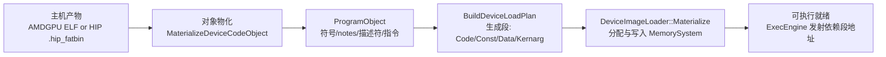
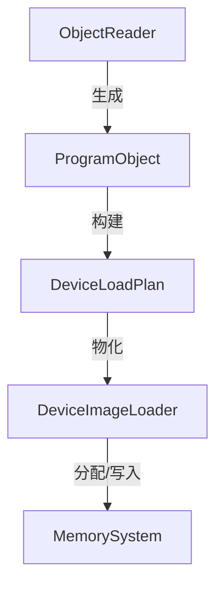

本页定位于“技术深潜/程序对象与指令系统”，聚焦从外部产物（AMDGPU 目标文件、HIP 可执行/主机对象 fatbin）到内部 ProgramObject、再到设备内存段物化（DeviceLoadPlan → DeviceImageLoader）的端到端加载路径与镜像格式支持；你现在的位置：[加载器与镜像格式支持（AMDGPU object/HIP fatbin）](14-jia-zai-qi-yu-jing-xiang-ge-shi-zhi-chi-amdgpu-object-hip-fatbin) [You are currently here]。Sources: [object_reader.cpp](src/program/encoded_program_object.cpp#L553-L637) [device_segment_image.cpp](src/loader/device_segment_image.cpp#L48-L79) [device_image_loader.cpp](src/loader/device_image_loader.cpp#L18-L50)

本页采用 AIDA 结构：问题注意点（兼容多来源产物与稳定解析）、加载兴趣点（如何落地到 ProgramObject）、转化欲望（如何映射为设备段与内存布局）、后续行动（进一步阅读 ISA 解码/运行时 ABI 页面）。Sources: [amdgpu_obj_loader_test.cpp](tests/loader/amdgpu_obj_loader_test.cpp#L33-L64) [amdgpu_code_object_decoder_test.cpp](tests/loader/amdgpu_code_object_decoder_test.cpp#L70-L131)

## 支持的镜像来源与判定策略
- AMDGPU 代码对象 ELF：通过 readelf 识别“Machine: AMD GPU”直接作为设备对象处理。Sources: [object_reader.cpp](src/program/encoded_program_object.cpp#L106-L110)
- HIP 主机对象/可执行（含 .hip_fatbin）：先检测 .hip_fatbin 段，使用 llvm-objcopy dump 出 fatbin，再用 clang-offload-bundler list/unbundle 提取 amdgcn-amd-amdhsa 设备 bundle，得到设备代码对象。Sources: [object_reader.cpp](src/program/encoded_program_object.cpp#L111-L158)

表：镜像来源与处理流水线
- AMDGPU ELF: 判定→直接读取符号/段→解析
- HIP fatbin: 检测 .hip_fatbin → dump → list targets → unbundle → 得到设备对象再解析
Sources: [object_reader.cpp](src/program/encoded_program_object.cpp#L121-L158) [amdgpu_obj_loader_test.cpp](tests/loader/amdgpu_obj_loader_test.cpp#L66-L95)

补充：项目还提供两种内部封装格式，便于测试与分发：
- Bundle（.gpubin）：线性打包 kernel_name、assembly、metadata、const/data 段。Sources: [program_bundle_io.cpp](src/loader/program_bundle_io.cpp#L45-L69)
- Sectioned（.gpusec）：按区段写入 KernelName/AssemblyText/MetadataKv/ConstData/RawData/DebugInfo。Sources: [executable_image_io.cpp](src/loader/executable_image_io.cpp#L225-L278)

## 解析流程：从目标文件到 ProgramObject
解析入口 ObjectReader::LoadProgramObject 执行以下步骤：选择/生成设备代码对象→读取符号表选择 kernel 符号→从 notes 构建元数据→定位 .rodata 解析 kernel 描述符→dump .text 并解码指令→封装 ProgramObject。Sources: [object_reader.cpp](src/program/encoded_program_object.cpp#L553-L637)

- 设备对象物化：AMDGPU ELF 直接使用；HIP fatbin 经 dump/unbundle 提取 amdgcn 设备对象。Sources: [object_reader.cpp](src/program/encoded_program_object.cpp#L121-L158)
- 符号选择：优先命名匹配，否则选择首个 FUNC 符号。Sources: [object_reader.cpp](src/program/encoded_program_object.cpp#L273-L289)
- 元数据构建：通过 llvm-readelf --notes 解析 amdhsa.kernels，生成 entry、arg_layout/hidden_arg_layout、组/私有段大小、SGPR/VGPR/AGPR、wavefront_size、uniform 标志、descriptor_symbol 等键。Sources: [object_reader.cpp](src/program/encoded_program_object.cpp#L432-L481)

内核描述符解析：从 .rodata 中按符号范围切片，解析 AmdgpuKernelDescriptor（组/私有段、kernarg_size、PGM 资源位、user_sgpr_count、内置指针开关、wavefront_size32 等）。Sources: [object_reader.cpp](src/program/encoded_program_object.cpp#L566-L590) [program_object.h](src/gpu_model/program/program_object.h#L17-L48)

.text 指令区解析：通过 llvm-objcopy dump .text，配合 readelf -S 计算符号偏移，随后 InstructionArrayParser 解码得到编码指令、解码操作数与对象化指令，并保留原始 code_bytes。Sources: [object_reader.cpp](src/program/encoded_program_object.cpp#L592-L613) [object_reader.cpp](src/program/encoded_program_object.cpp#L600-L633)

验证用例覆盖：能从 llc 产物与 hipcc 产物中成功解析 kernel 名称、指令、元数据与描述符字段。Sources: [amdgpu_obj_loader_test.cpp](tests/loader/amdgpu_obj_loader_test.cpp#L33-L64) [amdgpu_code_object_decoder_test.cpp](tests/loader/amdgpu_code_object_decoder_test.cpp#L70-L131)

## ProgramObject → 设备镜像段（DeviceLoadPlan）
ProgramObject 汇聚了解析产物：kernel_name、assembly_text、metadata、const/data 段、可选的 code_bytes、AmdgpuKernelDescriptor、已解码的指令与对象化指令。Sources: [program_object.h](src/gpu_model/program/program_object.h#L58-L130)

BuildDeviceLoadPlan 根据 ProgramObject 构造设备加载计划：
- Code 段：若存在 code_bytes 则以 .text 形式映射到 Code 池；否则回退为 .asm 文本字节。Sources: [device_segment_image.cpp](src/loader/device_segment_image.cpp#L51-L58)
- Const/Data 段：分别映射到 Constant/RawData 池，按 16 字节对齐。Sources: [device_segment_image.cpp](src/loader/device_segment_image.cpp#L22-L44)
- 共享内存需求与 kernarg 模板：从元数据推导 required_shared_bytes 与 preferred_kernarg_bytes；若需要，追加 ZeroFill 的 KernargTemplate 段（Kernarg 池，16B 对齐）。Sources: [device_segment_image.cpp](src/loader/device_segment_image.cpp#L65-L77) [kernel_metadata.cpp](src/isa/kernel_metadata.cpp#L221-L230)

元数据到 kernarg 估算规则：若显式给出 kernarg_segment_size 用之，否则按可见参数布局估算并至少 128B，用于预留 kernarg 模板空间。Sources: [kernel_metadata.cpp](src/isa/kernel_metadata.cpp#L221-L230)

## 设备镜像段物化（DeviceImageLoader）
DeviceImageLoader::Materialize 将 DeviceLoadPlan 物化到 MemorySystem：
- 对各段按要求对齐，按 required_bytes 与实际 bytes.size() 取大者分配；Copy 段写入字节，ZeroFill 段零初始化。Sources: [device_image_loader.cpp](src/loader/device_image_loader.cpp#L18-L36)
- 返回 LoadedDeviceSegment 列表（含分配的地址范围、对齐与命名标签），并回传所需共享内存与偏好 kernarg 字节数。Sources: [device_image_loader.cpp](src/loader/device_image_loader.cpp#L37-L50) [device_image_loader.h](src/gpu_model/loader/device_image_loader.h#L11-L20)

用例验证：代码与常量段被正确装载到对应池，Kernarg 模板以零填充形式分配到专用池，能按种类/池/名称检索已加载段。Sources: [device_image_loader_test.cpp](tests/loader/device_image_loader_test.cpp#L8-L54) [device_image_loader_test.cpp](tests/loader/device_image_loader_test.cpp#L56-L80) [device_image_loader_test.cpp](tests/loader/device_image_loader_test.cpp#L104-L135)

## 端到端加载与执行工作流（概览图）
图示前提说明：加载器链路从“主机产物”归并成 ProgramObject，再生成 DeviceLoadPlan，最终入驻 MemorySystem，为运行时发射提供可寻址的 Code/Const/Data/Kernarg 空间。Sources: [object_reader.cpp](src/program/encoded_program_object.cpp#L553-L637) [device_segment_image.cpp](src/loader/device_segment_image.cpp#L48-L79) [device_image_loader.cpp](src/loader/device_image_loader.cpp#L18-L50)

Sources: [object_reader.cpp](src/program/encoded_program_object.cpp#L121-L158) [object_reader.cpp](src/program/encoded_program_object.cpp#L566-L613) [device_segment_image.cpp](src/loader/device_segment_image.cpp#L48-L77) [device_image_loader.cpp](src/loader/device_image_loader.cpp#L18-L50)

## 元数据键与语义（来自 amdhsa.notes）
- 入口与参数布局：entry、arg_count、arg_layout（形如 global_buffer:8 或 by_value:offset:size），hidden_arg_layout（内置维度/偏移/大小）。Sources: [object_reader.cpp](src/program/encoded_program_object.cpp#L432-L481)
- 资源与规模参数：group_segment_fixed_size、private_segment_fixed_size、kernarg_segment_size、sgpr_count、vgpr_count、agpr_count、wavefront_size、uniform_work_group_size、descriptor_symbol。Sources: [object_reader.cpp](src/program/encoded_program_object.cpp#L451-L468)
- 加载器消费：required_shared_bytes 缺省等于 group_segment_fixed_size；RequiredKernargTemplateBytes 基于显式大小或估算可见参数并 ≥128B。Sources: [kernel_metadata.cpp](src/isa/kernel_metadata.cpp#L191-L207) [kernel_metadata.cpp](src/isa/kernel_metadata.cpp#L221-L230)

示例（用例覆盖）：HIP vecadd 解析出 arg_count=4、descriptor_symbol、kernarg_segment_size=288 且描述符中 user_sgpr_count=6、启用 kernarg 指针/工作组 ID 标志。Sources: [amdgpu_code_object_decoder_test.cpp](tests/loader/amdgpu_code_object_decoder_test.cpp#L91-L101) [amdgpu_code_object_decoder_test.cpp](tests/loader/amdgpu_code_object_decoder_test.cpp#L97-L101)

## 模块交互视图（类/职责）
- ObjectReader：统一入口；判定来源（ELF/hip fatbin），剥离设备对象；读取符号/notes；dump 段并解析指令与描述符；产出 ProgramObject。Sources: [object_reader.cpp](src/program/encoded_program_object.cpp#L106-L158) [object_reader.cpp](src/program/encoded_program_object.cpp#L553-L637)
- ProgramObject：承载指令/字节、段、元数据、描述符，作为跨层数据载体。Sources: [program_object.h](src/gpu_model/program/program_object.h#L58-L130)
- BuildDeviceLoadPlan：将 ProgramObject 投影为 DeviceSegmentImage 列表，决定内存池、映射方式、对齐与大小。Sources: [device_segment_image.cpp](src/loader/device_segment_image.cpp#L48-L79)
- DeviceImageLoader：物化 DeviceLoadPlan 到 MemorySystem，返回 LoadedDeviceSegment 集合与资源需求摘要。Sources: [device_image_loader.cpp](src/loader/device_image_loader.cpp#L18-L50)

Sources: [object_reader.cpp](src/program/encoded_program_object.cpp#L553-L637) [device_segment_image.cpp](src/loader/device_segment_image.cpp#L48-L79) [device_image_loader.cpp](src/loader/device_image_loader.cpp#L18-L50)

## 内部封装格式（测试与分发）
- ProgramBundleIO（.gpubin）：顺序写入字符串与二进制段，便于轻量分发与回归；可直接读回并通过 ExecEngine 发射。Sources: [program_bundle_io.cpp](src/loader/program_bundle_io.cpp#L45-L69) [program_bundle_io_test.cpp](tests/loader/program_bundle_io_test.cpp#L22-L59)
- ExecutableImageIO（.gpusec）：多区段封装并可嵌入 DebugInfo，可还原 ProgramObject 与符号级调试映射。Sources: [executable_image_io.cpp](src/loader/executable_image_io.cpp#L225-L309) [executable_image_io_test.cpp](tests/loader/executable_image_io_test.cpp#L24-L60)

注意：两者均作为工程内部格式服务测试/示例工作流，并不替代对 LLVM/ROCm 产物的解析支持。Sources: [executable_image_io_test.cpp](tests/loader/executable_image_io_test.cpp#L24-L80) [program_bundle_io_test.cpp](tests/loader/program_bundle_io_test.cpp#L22-L79)

## 典型故障与排查建议
- 工具链缺失导致无法解析 HIP fatbin：需提供 clang-offload-bundler、llvm-objcopy、llvm-readelf、readelf；用例会在缺失时跳过。Sources: [amdgpu_obj_loader_test.cpp](tests/loader/amdgpu_obj_loader_test.cpp#L15-L21) [amdgpu_code_object_decoder_test.cpp](tests/loader/amdgpu_code_object_decoder_test.cpp#L15-L22)
- 符号/段范围不一致：当符号落在 .text/.rodata 之外或越界时会报错，检查目标文件一致性与工具版本。Sources: [object_reader.cpp](src/program/encoded_program_object.cpp#L600-L603) [object_reader.cpp](src/program/encoded_program_object.cpp#L576-L579)
- notes 缺字段：未能从 amdhsa.kernels 中匹配目标 kernel 将导致元数据不完整，影响 kernarg/共享内存推导。Sources: [object_reader.cpp](src/program/encoded_program_object.cpp#L440-L479) [kernel_metadata.cpp](src/isa/kernel_metadata.cpp#L221-L230)

## 与执行发射的连接点
装载完成后，ExecEngine 发射依赖 ProgramObject 与已物化的段（尤其是 Code/Const/Kernarg），运行时会按 metadata/descriptor 驱动映射与寄存器配置；端到端用例验证 bundle/sectioned 也可直接发射。Sources: [executable_image_io_test.cpp](tests/loader/executable_image_io_test.cpp#L61-L78) [program_bundle_io_test.cpp](tests/loader/program_bundle_io_test.cpp#L60-L77)

进一步建议阅读：
- 若关注解码与语义处理链条，请继续阅读 [GCN ISA 解码、描述符与语义处理链](15-gcn-isa-jie-ma-miao-shu-fu-yu-yu-yi-chu-li-lian)。
- 若关注发射与 ABI 映射，请参阅 [HipRuntime C ABI 与 API 对齐](18-hipruntime-c-abi-yu-api-dui-qi) 与 [ModelRuntime 外观与会话生命周期](19-modelruntime-wai-guan-yu-hui-hua-sheng-ming-zhou-qi)。Sources: [object_reader.cpp](src/program/encoded_program_object.cpp#L553-L637)