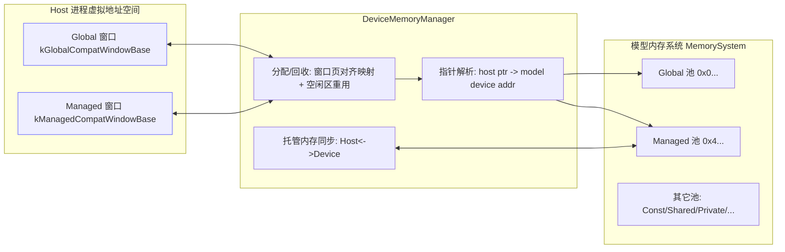
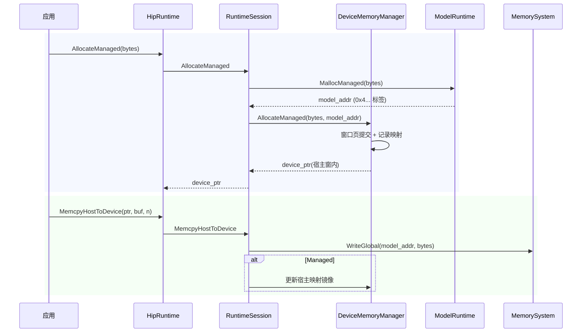

本页定位于“技术深潜 → 内存模型与地址映射”子域，系统化说明模型内存池（tagged addressing）与宿主侧兼容性窗口（Compatibility Window）的协同机制，给出设备指针生成、分类、解析与托管内存一致性规则，服务于高级开发者进行运行时集成、调试与错误归因。[You are currently here] Sources: [device_memory_manager.h](src/gpu_model/runtime/device_memory_manager.h#L15-L38)

## 核心抽象与总体关系
- 设备侧采用“带高位标签的地址空间”，以 MemoryPoolKind 为粒度划分 Global/Constant/Shared/Private/Managed/Kernarg/Code/RawData 八类池，地址高 4 比特为池基址标签；MemorySystem 依标签路由读写，从而在统一 64 位地址上复用多池存储。宿主侧通过固定大页窗口映射（Compatibility Window）承载“兼容性设备指针”，并由 DeviceMemoryManager 维护映射、重用与一致性。Sources: [memory_pool.h](src/gpu_model/memory/memory_pool.h#L9-L18) [memory_pool.h](src/gpu_model/memory/memory_pool.h#L20-L38) [memory_system.cpp](src/memory/memory_system.cpp#L10-L21) [memory_system.cpp](src/memory/memory_system.cpp#L103-L121)

上图刻画宿主兼容性窗口与模型 MemorySystem 的分层关系：宿主侧只见到两个稳定窗口（Global/Managed），一切读写最终以“带标签”的设备地址在 MemorySystem 中路由到对应池。Sources: [device_memory_manager.cpp](src/runtime/core/device_memory_manager.cpp#L245-L260) [device_memory_manager.cpp](src/runtime/core/device_memory_manager.cpp#L262-L291) [memory_system.cpp](src/memory/memory_system.cpp#L103-L121)

## 设备地址空间与池标签（tagged addressing）
- MemoryPoolKind 到高位基址的映射为常量：Global=0x0..., Constant=0x1..., Shared=0x2..., Private=0x3..., Managed=0x4..., Kernarg=0x5..., Code=0x6..., RawData=0x7...，均由 MemoryPoolBase 定义，供地址判定与偏移计算使用。Sources: [memory_pool.h](src/gpu_model/memory/memory_pool.h#L20-L38)
- MemorySystem 以高 4 比特掩码（0xF000000000000000）判定地址归属并计算偏移；WriteGlobal/ReadGlobal 会优先匹配“非 Global”的其它带标签池（含 Managed），否则降级写入 Global 池。Sources: [memory_system.cpp](src/memory/memory_system.cpp#L10-L21) [memory_system.cpp](src/memory/memory_system.cpp#L70-L87) [memory_system.cpp](src/memory/memory_system.cpp#L111-L121)

## 兼容性窗口：基址、大小与内存保护
- 运行时在构造 DeviceMemoryManager 时建立两类窗口：Global 与 Managed，默认大小均为 1GiB（kCompatibilityWindowSize=1<<30）。Sources: [device_memory_manager.h](src/gpu_model/runtime/device_memory_manager.h#L65-L69) [device_memory_manager.cpp](src/runtime/core/device_memory_manager.cpp#L245-L260)
- 窗口基址固定且分离：Global=0x0000600000000000，Managed=0x0000610000000000，启动即以 mmap + MAP_FIXED_NOREPLACE 预留，保证宿主指针区间稳定不与其他映射冲突。Sources: [device_memory_manager.cpp](src/runtime/core/device_memory_manager.cpp#L15-L24) [device_memory_manager.cpp](src/runtime/core/device_memory_manager.cpp#L262-L271)
- 页面提交策略：按页对齐提交映射（PageAlignedBytes 基于 sysconf 获取页大小），Global 分配提交为 PROT_NONE（宿主不可直接解引用），Managed 为 PROT_READ|PROT_WRITE 并显式清零，形成“只读屏障 vs 可读写镜像”的区别。Sources: [device_memory_manager.cpp](src/runtime/core/device_memory_manager.cpp#L239-L243) [device_memory_manager.cpp](src/runtime/core/device_memory_manager.cpp#L70-L81) [device_memory_manager.cpp](src/runtime/core/device_memory_manager.cpp#L100-L109)

## 分配、回收与地址重用
- 分配路径：AllocateGlobal/AllocateManaged 先在对应窗口尝试复用空闲区（First-fit，若完全匹配则回收节点，过大则劈分偏移与长度），否则推进 next_offset 线性增长；提交后记录 CompatibilityAllocation（模型地址、原始字节数、页对齐字节数、池种类、映射地址）。Sources: [device_memory_manager.cpp](src/runtime/core/device_memory_manager.cpp#L58-L81) [device_memory_manager.cpp](src/runtime/core/device_memory_manager.cpp#L88-L111) [device_memory_manager.h](src/gpu_model/runtime/device_memory_manager.h#L31-L37) [device_memory_manager.cpp](src/runtime/core/device_memory_manager.cpp#L332-L349)
- 回收路径：Free 通过 mapped_addr 反推出窗口偏移，munmap 已提交页，并在窗口 free_ranges 中插入空闲区并做相邻区合并；同时维护 committed_bytes 递减。Sources: [device_memory_manager.cpp](src/runtime/core/device_memory_manager.cpp#L114-L137) [device_memory_manager.cpp](src/runtime/core/device_memory_manager.cpp#L351-L367)
- 行为验证：单元测试覆盖“同池地址复用”、“窗口分离与边界约束”和“committed_bytes 统计清零/复用一致”，为重用与统计逻辑提供证据。Sources: [device_memory_manager_test.cpp](tests/runtime/device_memory_manager_test.cpp#L28-L39) [device_memory_manager_test.cpp](tests/runtime/device_memory_manager_test.cpp#L54-L80) [device_memory_manager_test.cpp](tests/runtime/device_memory_manager_test.cpp#L82-L115)

## 指针分类、内含指针与设备地址解析
- 分类与判定：IsPointerInCompatibilityWindow 仅按窗口区间判定；IsDevicePointer 需命中活动分配表；ClassifyCompatibilityPointer 返回窗口对应池（Global/Managed）。Sources: [device_memory_manager.cpp](src/runtime/core/device_memory_manager.cpp#L147-L158) [device_memory_manager.h](src/gpu_model/runtime/device_memory_manager.h#L52-L59)
- 内含指针（interior pointer）：FindAllocation 支持“范围命中”，即使键非起始地址，只要在 begin..begin+bytes 之内即可解析到同一分配，用于计算 ResolveDeviceAddress 的偏移叠加。Sources: [device_memory_manager.cpp](src/runtime/core/device_memory_manager.cpp#L170-L181) [device_memory_manager.cpp](src/runtime/core/device_memory_manager.cpp#L185-L199)
- 地址解析：ResolveDeviceAddress = allocation.model_addr + (ptr - allocation.mapped_addr)，确保宿主侧偏移与设备侧地址空间严格同构；测试覆盖对内含指针的解析正确性。Sources: [device_memory_manager.cpp](src/runtime/core/device_memory_manager.cpp#L201-L209) [device_memory_manager_test.cpp](tests/runtime/device_memory_manager_test.cpp#L141-L155)

## 托管内存一致性与同步边界
- 托管池（Managed）在分配时创建可读写宿主镜像；在 RuntimeSession，同步策略为“在设备工作前 Host->Device，工作后 Device->Host”，分别由 DeviceSynchronize/StreamSynchronize 包裹执行引擎调用触发，从而维持宿主镜像与模型内存一致。Sources: [device_memory_manager.cpp](src/runtime/core/device_memory_manager.cpp#L100-L111) [runtime_session.cpp](src/runtime/core/runtime_session.cpp#L126-L136)
- 显式拷贝/置值对 Managed 的镜像维护：MemcpyHostToDevice/MemsetDevice 等在写入模型内存后，若目标为 Managed 分配且映射有效，会同步更新宿主映射页；DeviceToHost 直接从模型内存读取到宿主缓冲区。Sources: [runtime_session.cpp](src/runtime/core/runtime_session.cpp#L213-L227) [runtime_session.cpp](src/runtime/core/runtime_session.cpp#L262-L305) [runtime_session.cpp](src/runtime/core/runtime_session.cpp#L229-L235)
- 托管池的批量同步 API：HipRuntime 暴露 SyncManagedHostToDevice / SyncManagedDeviceToHost，内部委托 DeviceMemoryManager 逐分配执行写入/读取，用于需要精准控制同步时机的场景。Sources: [hip_runtime.cpp](src/runtime/hip_runtime.cpp#L135-L141) [device_memory_manager.cpp](src/runtime/core/device_memory_manager.cpp#L211-L237)

## 运行时集成与生命周期管理
- 分配接口链路：AllocateDevice/AllocateManaged 先由 ModelRuntime 在 MemorySystem 中各自池分配带标签地址，再交给 DeviceMemoryManager 在对应窗口提交映射并返回“兼容性设备指针”。Sources: [runtime_session.cpp](src/runtime/core/runtime_session.cpp#L190-L198) [model_runtime.cpp](src/runtime/core/model_runtime.cpp#L44-L53)
- 释放接口链路：FreeDevice 先以精确地址确认原始分配（要求 device_ptr 为 mapped 起始地址），释放模型地址，再由 DeviceMemoryManager 归还窗口映射与空闲区。Sources: [runtime_session.cpp](src/runtime/core/runtime_session.cpp#L201-L207) [device_memory_manager.cpp](src/runtime/core/device_memory_manager.cpp#L114-L137)
- 兼容态复位：ResetCompatibilityState 会清空映射与统计但保留窗口预留；随后 ModelRuntime::Reset 重建 MemorySystem；最后重新绑定 DeviceMemoryManager 的 MemorySystem 指针，保证后续同步与解析依旧有效。Sources: [runtime_session.cpp](src/runtime/core/runtime_session.cpp#L37-L46) [hip_runtime.cpp](src/runtime/hip_runtime.cpp#L70-L77)

## 启动参数打包中的指针规则
- 对标 HIP 模式的参数打包：内核元数据被解析为参数布局，凡标记为 GlobalBuffer 的实参统一通过 ResolveDeviceAddress 写入 64 位设备地址（带标签），确保指针从宿主视图到模型地址空间的一致映射。Sources: [runtime_session.cpp](src/runtime/core/runtime_session.cpp#L315-L327) [runtime_session.cpp](src/runtime/core/runtime_session.cpp#L329-L357)

## 规则表与注意事项
- 兼容性窗口行为总览（节选）：
  - Global 窗口：基址 0x0000600000000000，PROT_NONE，页对齐提交；禁止宿主直接读写，违规访问可快速暴露越界错误。Sources: [device_memory_manager.cpp](src/runtime/core/device_memory_manager.cpp#L15-L24) [device_memory_manager.cpp](src/runtime/core/device_memory_manager.cpp#L70-L81)
  - Managed 窗口：基址 0x0000610000000000，PROT_READ|PROT_WRITE，页对齐提交且 memset 0；适合频繁 Host/Device 交互并受同步策略保护。Sources: [device_memory_manager.cpp](src/runtime/core/device_memory_manager.cpp#L15-L24) [device_memory_manager.cpp](src/runtime/core/device_memory_manager.cpp#L100-L109)
- 指针判定与错误态：
  - 非窗口指针：IsPointerInCompatibilityWindow/IsDevicePointer 均返回假；分类失败；单测覆盖。Sources: [device_memory_manager.cpp](src/runtime/core/device_memory_manager.cpp#L147-L158) [device_memory_manager_test.cpp](tests/runtime/device_memory_manager_test.cpp#L41-L52)
  - 内含指针：允许解析与分类，但 Free 仅接受分配起始地址作为键。Sources: [device_memory_manager.cpp](src/runtime/core/device_memory_manager.cpp#L170-L181) [runtime_session.cpp](src/runtime/core/runtime_session.cpp#L201-L207)

## 模块交互与关键路径

该时序整合托管分配与 H2D 写入路径，体现“带标签设备地址”与“宿主窗口指针”的相互解析与同步更新。Sources: [model_runtime.cpp](src/runtime/core/model_runtime.cpp#L50-L53) [runtime_session.cpp](src/runtime/core/runtime_session.cpp#L213-L227)

## 设计权衡与实践建议
- 选择 PROT_NONE 的 Global 窗口有助于在错误访问时尽早崩溃暴露问题；而 Managed 通过映射镜像换取 Host/Device 交互便利，但需依赖明确的同步边界（同步由 Session 统一封装）。Sources: [device_memory_manager.cpp](src/runtime/core/device_memory_manager.cpp#L70-L81) [runtime_session.cpp](src/runtime/core/runtime_session.cpp#L126-L136)
- 空闲区重用采用简单顺序合并策略，降低外部碎片；committed_bytes 提供 O(1) 级窗口内存压力跟踪，利于调试与统计。Sources: [device_memory_manager.cpp](src/runtime/core/device_memory_manager.cpp#L351-L367) [device_memory_manager_test.cpp](tests/runtime/device_memory_manager_test.cpp#L158-L185)

## 进一步阅读
- 建议继续阅读存储语义层的跨池一致性与可见性说明：[Global/Shared/Private/Constant 存储语义](17-global-shared-private-constant-cun-chu-yu-yi)；若需接口视角的整体对齐，请转至：[HipRuntime C ABI 与 API 对齐](18-hipruntime-c-abi-yu-api-dui-qi)。Sources: [runtime_session.cpp](src/runtime/core/runtime_session.cpp#L315-L327)