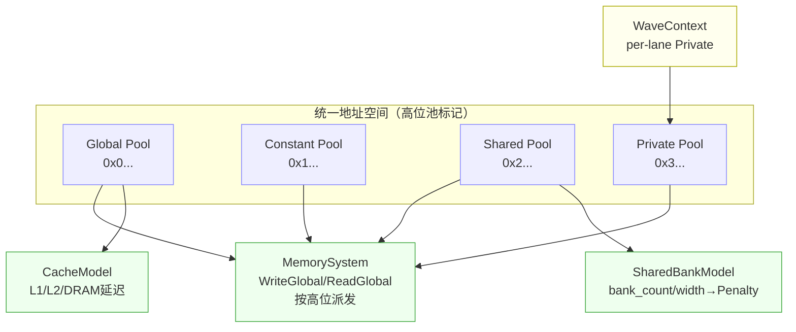

本页锚定于四类存储空间的语义基线：Global、Shared、Private、Constant。我们以地址标记（tagged address）与请求分类为第一性原理，建立统一的可观测语义：作用域与生命周期、寻址与地址映射、可见性与一致性、时序与等待、冲突与惩罚、以及在执行链中的度量与统计。目标读者为高级开发者，聚焦模型内的实现可证据化，不涉及其他页面范畴的细节实现。Sources: [memory_space.h](src/gpu_model/memory/memory_space.h#L5-L18)

## 概念总览：空间分类与请求类型
四类空间以 MemorySpace 枚举标定，配合 AccessKind 描述 Load/Store/Atomic/Async 行为，构成执行链的基础分类标签。该标签在 MemoryRequest 中与每次内存访问（含每 lane 的地址/宽度/值）绑定，用于统计、调度与可视化追踪。Sources: [memory_space.h](src/gpu_model/memory/memory_space.h#L5-L18), [memory_request.h](src/gpu_model/memory/memory_request.h#L20-L31)

## 统一地址空间与池（Pool）标记
模型使用 MemoryPoolKind 定义全局统一地址空间的“高位池标记”，每个池具有固定高位基址前缀：Global/Constant/Shared/Private/Managed/Kernarg/Code/RawData。池基址由 MemoryPoolBase 确定，高位前缀用于在读写路径中识别目标池；MemorySystem::WriteGlobal/ReadGlobal 会基于前缀自动分发到对应池，实现统一地址空间下的多池访问。Sources: [memory_pool.h](src/gpu_model/memory/memory_pool.h#L9-L18), [memory_pool.h](src/gpu_model/memory/memory_pool.h#L20-L45), [memory_system.cpp](src/memory/memory_system.cpp#L111-L144)

## 地址译码与边界检查
MemorySystem 以 kPoolTagMask 识别高位池标记，并通过 PoolOffset 取低位偏移；所有池内读写在写入前 EnsureSize 扩展容量，读出时若越界抛出 out_of_range。HasRange/HasGlobalRange 提供区间可用性判定。该机制保证不同空间的地址不会交叉污染，并能以统一接口进行安全访问。Sources: [memory_system.cpp](src/memory/memory_system.cpp#L10-L21), [memory_system.cpp](src/memory/memory_system.cpp#L43-L52), [memory_system.cpp](src/memory/memory_system.cpp#L70-L87), [memory_system.cpp](src/memory/memory_system.cpp#L93-L101)

## 执行态与私有存储承载
每个 WaveContext 持有 per-lane 的私有内存数组（private_memory），并维护 pending_global/shared/private/scalar_buffer 计数与等待原因，用以表示不同存储访问对可运行性的影响。私有空间在执行态中直接承载，无需通过全局 MemorySystem 进行分配。Sources: [wave_context.h](src/gpu_model/execution/wave_context.h#L52-L60), [wave_context.h](src/gpu_model/execution/wave_context.h#L63-L67)

## 指令到空间的映射入口
构建期提供明确的指令族到空间的映射：MLoad/Store/Atomic for Global/Shared/Private、MLoadConst 与 SBufferLoadDword for Constant。接口暴露了基址/索引/缩放与立即偏移参数，形成可验证的寻址结构；原子操作在 Global/Shared 上提供入口。Sources: [instruction_builder.h](src/gpu_model/isa/instruction_builder.h#L107-L121), [instruction_builder.h](src/gpu_model/isa/instruction_builder.h#L130-L149)

## 关系图：空间、地址池与执行态的连接
下图展示四类空间与关键结构的关系：MemoryPoolKind 提供地址前缀，MemorySystem 负责统一读写分发；Private 由 WaveContext 直连；Shared 可选 Bank 冲突模型；Constant 既可通过 MLoadConst 访问 kernel 常量段，也可通过 SBufferLoadDword 走常量池的标量缓冲路径。
Sources: [memory_pool.h](src/gpu_model/memory/memory_pool.h#L20-L45), [memory_system.cpp](src/memory/memory_system.cpp#L111-L133), [shared_bank_model.h](src/gpu_model/memory/shared_bank_model.h#L10-L18), [wave_context.h](src/gpu_model/execution/wave_context.h#L63-L67), [instruction_builder.h](src/gpu_model/isa/instruction_builder.h#L130-L149)

## Global 语义
- 地址与映射：Global 使用统一地址空间的 Global 前缀；同时 WriteGlobal/ReadGlobal 在检测到 Constant/Shared/Private 等前缀时，也会路由到相应池，体现“全局视图 + 池敏感”的地址空间模型。Sources: [memory_pool.h](src/gpu_model/memory/memory_pool.h#L20-L45), [memory_system.cpp](src/memory/memory_system.cpp#L111-L133)
- 时序与缓存：全局访问受 CacheModel 影响（L1/L2/DRAM 时延），可通过 ExecEngine 接口配置固定或分层延迟，执行统计包含 l1_hits/l2_hits/cache_misses。依赖同步可通过 s_waitcnt 等在指令语义中表达（见功能测试中对 waitcnt 的使用）。Sources: [cache_model.h](src/gpu_model/memory/cache_model.h#L11-L28), [exec_engine.h](src/gpu_model/runtime/exec_engine.h#L28-L46), [launch_request.h](src/gpu_model/runtime/launch_request.h#L38-L42), [shared_sync_functional_test.cpp](tests/functional/shared_sync_functional_test.cpp#L61-L68)
- 指令入口：MLoadGlobal / MStoreGlobal / MAtomicAddGlobal 提供向量化读写与原子操作接口，寻址由 base+index*scale+offset 组合。Sources: [instruction_builder.h](src/gpu_model/isa/instruction_builder.h#L107-L121)

## Shared 语义
- 作用域与配置：Shared 为 block 级，容量由 LaunchRequest.config.shared_memory_bytes 指定，典型指令包含 MLoadShared/MStoreShared/MAtomicAddShared。Sources: [launch_request.h](src/gpu_model/runtime/launch_request.h#L50-L54), [instruction_builder.h](src/gpu_model/isa/instruction_builder.h#L130-L138)
- Bank 冲突模型：可配置 bank_count 与 bank_width_bytes，冲突度量为每周期同一 bank 被访问的最大并发度减 1 的惩罚（ConflictPenalty），对总周期产生附加影响，测试通过 SetSharedBankConflictModel 验证。Sources: [gpu_arch_spec.h](src/gpu_model/arch/gpu_arch_spec.h#L29-L33), [shared_bank_model.cpp](src/memory/shared_bank_model.cpp#L13-L28), [exec_engine.h](src/gpu_model/runtime/exec_engine.h#L32-L33), [shared_bank_conflict_cycle_test.cpp](tests/cycle/shared_bank_conflict_cycle_test.cpp#L19-L34)
- 同步与原子：共享内存常与同步配合使用，功能/周期测试覆盖了 SyncBarrier/SyncWaveBarrier 与 MAtomicAddShared 的协同，结果写回全局以验证一致性。Sources: [shared_sync_functional_test.cpp](tests/functional/shared_sync_functional_test.cpp#L35-L54), [shared_sync_cycle_test.cpp](tests/cycle/shared_sync_cycle_test.cpp#L33-L47)

## Private 语义
- 作用域与承载：Private 为 lane 私有，数据直接驻留于 WaveContext::private_memory（每 lane 独立的字节向量）。Sources: [wave_context.h](src/gpu_model/execution/wave_context.h#L63-L67)
- 访问与时序：私有读写通过 memory_ops 提供的 Load/StorePrivateLaneValue 实现，按需扩展容量、字节拷贝，无异步到达事件；周期测试显示 scratch_load_dword 在发射提交时即完成（无 async arrive）。Sources: [memory_ops.cpp](src/execution/memory_ops.cpp#L83-L118), [private_memory_cycle_test.cpp](tests/cycle/private_memory_cycle_test.cpp#L37-L52)
- 功能验证：构造“私有回写再读出再写全局”的数据路径，验证每 lane 私有值的正确性。Sources: [private_memory_functional_test.cpp](tests/functional/private_memory_functional_test.cpp#L21-L31), [private_memory_functional_test.cpp](tests/functional/private_memory_functional_test.cpp#L57-L62)

## Constant 语义
- 常量段（kernel-embedded）：通过 InstructionBuilder.Build 时传入 ConstSegment，运行期以 MLoadConst 由各 lane 读取对应 index*scale+offset 的值。功能/周期测试显示该读取仅有固定发射开销，不引入全局访存等待。Sources: [constant_memory_functional_test.cpp](tests/functional/constant_memory_functional_test.cpp#L21-L36), [instruction_builder.h](src/gpu_model/isa/instruction_builder.h#L145-L149), [constant_memory_cycle_test.cpp](tests/cycle/constant_memory_cycle_test.cpp#L38-L51)
- 标量缓冲（scalar buffer）路径：SBufferLoadDword 从常量池按索引/缩放/立即偏移读取到标量寄存器，再按需广播到向量寄存器；测试覆盖了无偏移和立即偏移两种情形。Sources: [instruction_builder.h](src/gpu_model/isa/instruction_builder.h#L67-L71), [constant_memory_functional_test.cpp](tests/functional/constant_memory_functional_test.cpp#L38-L55), [constant_memory_functional_test.cpp](tests/functional/constant_memory_functional_test.cpp#L57-L74)

## 访问统计与观测
执行结果包含分空间的访问计数（global/shared/private/constant loads/stores、原子与屏障等）以及共享 bank 冲突惩罚统计，便于从实验数据回溯语义与热点。Sources: [launch_request.h](src/gpu_model/runtime/launch_request.h#L25-L42)

## 指令-空间对应与参数形态
- Global：MLoadGlobal(dest, base, index, scale, offset)，MStoreGlobal(base, index, src, scale, offset)，MAtomicAddGlobal(base, index, src, scale, offset)。Sources: [instruction_builder.h](src/gpu_model/isa/instruction_builder.h#L107-L121)
- Shared：MLoadShared(dest, index, scale)，MStoreShared(index, src, scale)，MAtomicAddShared(index, src, scale)。Sources: [instruction_builder.h](src/gpu_model/isa/instruction_builder.h#L130-L138)
- Private：MLoadPrivate(dest, index, scale)，MStorePrivate(index, src, scale)。Sources: [instruction_builder.h](src/gpu_model/isa/instruction_builder.h#L139-L144)
- Constant：MLoadConst(dest, index, scale, offset)，SBufferLoadDword(dest, index, scale, offset)。Sources: [instruction_builder.h](src/gpu_model/isa/instruction_builder.h#L145-L149), [instruction_builder.h](src/gpu_model/isa/instruction_builder.h#L67-L71)

## 空间对比表（语义基线）
下表汇总四类空间在作用域、寻址、高位前缀、承载/配置、时序特性与常见指令的对比，便于在实现和调试时快速定位语义差异。Sources: [memory_pool.h](src/gpu_model/memory/memory_pool.h#L20-L45), [wave_context.h](src/gpu_model/execution/wave_context.h#L63-L67), [exec_engine.h](src/gpu_model/runtime/exec_engine.h#L28-L46), [shared_bank_model.cpp](src/memory/shared_bank_model.cpp#L13-L28), [constant_memory_cycle_test.cpp](tests/cycle/constant_memory_cycle_test.cpp#L38-L51)

- Global
  - 作用域：设备统一地址空间（支持跨池路由）
  - 前缀：0x0...
  - 时序：受 CacheModel 影响，可配置固定或层级延迟
  - 指令：MLoad/Store/Atomic Global
  Sources: [memory_system.cpp](src/memory/memory_system.cpp#L111-L133), [cache_model.h](src/gpu_model/memory/cache_model.h#L11-L28), [exec_engine.h](src/gpu_model/runtime/exec_engine.h#L28-L46)

- Shared
  - 作用域：block 级
  - 前缀：0x2...
  - 时序：可叠加 Bank 冲突惩罚；与屏障/原子协作
  - 指令：MLoad/Store/Atomic Shared
  Sources: [gpu_arch_spec.h](src/gpu_model/arch/gpu_arch_spec.h#L29-L33), [shared_bank_model.cpp](src/memory/shared_bank_model.cpp#L13-L28), [shared_sync_functional_test.cpp](tests/functional/shared_sync_functional_test.cpp#L35-L54)

- Private
  - 作用域：lane 级（WaveContext 持有）
  - 前缀：0x3...
  - 时序：同步完成（无 async arrive）
  - 指令：MLoad/Store Private
  Sources: [wave_context.h](src/gpu_model/execution/wave_context.h#L63-L67), [memory_ops.cpp](src/execution/memory_ops.cpp#L83-L118), [private_memory_cycle_test.cpp](tests/cycle/private_memory_cycle_test.cpp#L37-L52)

- Constant
  - 作用域：kernel 常量段/常量池（标量缓冲）
  - 前缀：0x1...
  - 时序：常量段读取仅固定发射成本；标量缓冲按标量加载
  - 指令：MLoadConst、SBufferLoadDword
  Sources: [constant_memory_functional_test.cpp](tests/functional/constant_memory_functional_test.cpp#L21-L36), [constant_memory_cycle_test.cpp](tests/cycle/constant_memory_cycle_test.cpp#L38-L51), [instruction_builder.h](src/gpu_model/isa/instruction_builder.h#L67-L71)

## 设计意图与扩展点
- 统一地址视图通过高位标记将多池拼接在 64-bit 空间内，读写端只需调用 WriteGlobal/ReadGlobal 即可对任意池寻址，降低上层组件的分支复杂度。Sources: [memory_system.cpp](src/memory/memory_system.cpp#L111-L133)
- Shared 的 bank 冲突建模与 CacheModel 解耦，分别刻画 on-chip SRAM 冲突与 off-chip 层级缓存延迟，便于独立调参与归因。Sources: [shared_bank_model.h](src/gpu_model/memory/shared_bank_model.h#L10-L18), [cache_model.h](src/gpu_model/memory/cache_model.h#L18-L28)
- Private 的 per-lane 字节向量实现使得可变宽度 load/store 与零填充读扩展成为自然能力，同时保持同步完成的直观语义。Sources: [memory_ops.cpp](src/execution/memory_ops.cpp#L83-L96)

## 概念小结与导航
本页确立了 Global/Shared/Private/Constant 四类存储空间在本模型中的统一语义：地址标记与分发、作用域与生命周期、时序与等待、共享 bank 冲突与缓存延迟的分离建模、以及指令到空间的精确映射。若需进一步了解指针映射与设备内存管理，请继续阅读[设备内存管理与指针映射规则](16-she-bei-nei-cun-guan-li-yu-zhi-zhen-ying-she-gui-ze)；若需掌握 ExecEngine 如何在周期/功能模式下调度与计量，请参考[执行模式与 ExecEngine 工作流](11-zhi-xing-mo-shi-yu-execengine-gong-zuo-liu)。Sources: [memory_pool.h](src/gpu_model/memory/memory_pool.h#L20-L45), [launch_request.h](src/gpu_model/runtime/launch_request.h#L25-L42), [exec_engine.h](src/gpu_model/runtime/exec_engine.h#L57-L61)