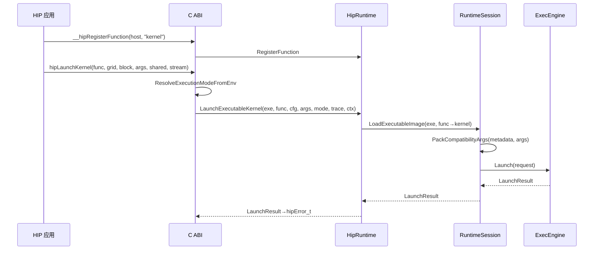

本页聚焦于 C 语言 ABI 兼容层如何对齐 HIP Runtime API：涵盖导出符号、错误语义、设备/内存/流与事件接口的支持现状、执行模式与环境变量注入、以及 kernel 启动路径与参数打包规则。实现要点：C 层 ABI 纯 C 接口转接到单例 HipRuntime，再由 RuntimeSession 落地资源与状态；kernel 启动通过 host 符号注册解析到可执行镜像与元数据，完成参数打包后进入 ExecEngine 执行。Sources: [hip_runtime_abi.cpp](src/runtime/hip_runtime_abi.cpp#L64-L67) [hip_runtime.cpp](src/runtime/hip_runtime.cpp#L143-L154) [runtime_session.cpp](src/runtime/core/runtime_session.cpp#L369-L399)

## 分层与职责边界（C ABI → HipRuntime → RuntimeSession）
C ABI 层导出 HIP 符号（如 hipMalloc/hipLaunchKernel 等），内部以静态单例 HipRuntime 承接；HipRuntime 作为外观转发到 RuntimeSession 管理映射内存、流/事件兼容态、内核符号表、参数打包与发射；RuntimeSession 再委托 ModelRuntime/ExecEngine 完成功能/周期级执行。Sources: [hip_runtime_abi.cpp](src/runtime/hip_runtime_abi.cpp#L64-L67) [hip_runtime.cpp](src/runtime/hip_runtime.cpp#L87-L106) [runtime_session.cpp](src/runtime/core/runtime_session.cpp#L37-L46)

```mermaid
flowchart LR
  subgraph C_ABI[C ABI (hip_runtime_abi.cpp)]
    A1[hipMalloc/hipMemcpy/hipLaunchKernel/...]
  end
  subgraph HR[HipRuntime]
    H1[Allocate/Free/Memcpy/Memset]
    H2[RegisterFunction/LaunchExecutableKernel]
    H3[Streams/Events/Error]
  end
  subgraph RS[RuntimeSession]
    S1[Compatibility allocations]
    S2[Kernel symbol table]
    S3[PackCompatibilityArgs]
    S4[LoadExecutableImage]
    S5[Launch(request)]
  end
  subgraph MR[ModelRuntime / ExecEngine]
    M1[MemorySystem]
    M2[Functional/Cycle execution modes]
  end
  A1 --> HR --> RS --> MR
```
上图对应实现：C ABI 通过 HipApi() 获取单例，调用 HipRuntime 的 Allocate/Launch/Stream 等，再由 RuntimeSession 完成解析与发射到 ExecEngine。Sources: [hip_runtime_abi.cpp](src/runtime/hip_runtime_abi.cpp#L593-L637) [hip_runtime.cpp](src/runtime/hip_runtime.cpp#L143-L154) [runtime_session.cpp](src/runtime/core/runtime_session.cpp#L369-L399)

## C ABI 符号覆盖与行为对齐
- 启动期注册：__hipRegisterFatBinary 返回 token，__hipRegisterFunction 将 host 函数地址与 device kernel 名建立映射，用于后续通过 host 指针解析 kernel 名。Sources: [hip_runtime_abi.cpp](src/runtime/hip_runtime_abi.cpp#L145-L158)  
- 配置入栈出栈：__hipPushCallConfiguration/__hipPopCallConfiguration 保存/取出 grid/block/shared 配置，作为后续 launch 的默认参数。Sources: [hip_runtime_abi.cpp](src/runtime/hip_runtime_abi.cpp#L160-L200)  
- 内存 API：实现 hipMalloc/hipMallocManaged/hipFree/hipMemcpy/hipMemcpyAsync/hipMemset/hipMemsetD8/D16/D32；Async 变种在当前流模型下退化为同步校验后调用对应同步实现。Sources: [hip_runtime_abi.cpp](src/runtime/hip_runtime_abi.cpp#L202-L255)  
- 设备管理：hipGetDeviceCount/hipGetDevice/hipSetDevice/hipDeviceSynchronize 均有实现，DeviceSynchronize 还会执行托管内存的 H↔D 同步。Sources: [hip_runtime_abi.cpp](src/runtime/hip_runtime_abi.cpp#L302-L330)  
- 设备属性：提供 hipGetDevicePropertiesR0600 字段映射，以及 hipDeviceGetAttribute 的属性枚举到内部属性的精确映射。Sources: [hip_runtime_abi.cpp](src/runtime/hip_runtime_abi.cpp#L332-L379) [hip_runtime_abi.cpp](src/runtime/hip_runtime_abi.cpp#L381-L489)  
- 错误查询：hipGetLastError/hipPeekAtLastError 使用线程本地 last_error_ 储存并消费，与 Remember() 协同设置返回码。Sources: [hip_runtime_abi.cpp](src/runtime/hip_runtime_abi.cpp#L110-L113) [hip_runtime_abi.cpp](src/runtime/hip_runtime_abi.cpp#L491-L497) [runtime_session.cpp](src/runtime/core/runtime_session.cpp#L85-L97)

表：HIP API → 内部路径概览
- hipMalloc/hipFree → HipRuntime::AllocateDevice/FreeDevice → RuntimeSession 兼容分配 → ModelRuntime 内存地址映射。Sources: [hip_runtime_abi.cpp](src/runtime/hip_runtime_abi.cpp#L202-L223) [hip_runtime.cpp](src/runtime/hip_runtime.cpp#L87-L101) [runtime_session.cpp](src/runtime/core/runtime_session.cpp#L190-L207)  
- hipMemcpy/Memset → HipRuntime::Memcpy*/Memset* → RuntimeSession 同步托管镜像。Sources: [hip_runtime_abi.cpp](src/runtime/hip_runtime_abi.cpp#L224-L300) [runtime_session.cpp](src/runtime/core/runtime_session.cpp#L213-L259)  
- hipLaunchKernel → 解析执行模式/trace → 解析 kernel 名 → Build load plan → Pack args → ExecEngine Launch。Sources: [hip_runtime_abi.cpp](src/runtime/hip_runtime_abi.cpp#L598-L637) [runtime_session.cpp](src/runtime/core/runtime_session.cpp#L360-L399)

## 内核启动对齐：从 host 符号到 ExecEngine
内核名解析通过注册表完成：__hipRegisterFunction(hostFunction, deviceName) 写入符号表；若未注册，LaunchExecutableKernel 明确返回错误“unregistered HIP host function”。此路径保证与 HIP 编译链的注册行为对齐。Sources: [hip_runtime_abi.cpp](src/runtime/hip_runtime_abi.cpp#L153-L158) [runtime_session.cpp](src/runtime/core/runtime_session.cpp#L360-L368) [runtime_session.cpp](src/runtime/core/runtime_session.cpp#L378-L385)

```mermaid
flowchart TD
  A[__hipRegisterFunction(host, deviceName)] --> B[符号表: host → kernel_name]
  C[hipLaunchKernel(func, grid, block, args, shared, stream)] --> D[构造 LaunchConfig]
  D --> E[ResolveExecutionModeFromEnv/Trace]
  E --> F[HipRuntime::LaunchExecutableKernel]
  F --> G[RuntimeSession::LoadExecutableImage(exe, kernel_name)]
  G --> H[PackCompatibilityArgs(metadata, args)]
  H --> I[ExecEngine::Launch(request)]
```
上述每步在实现中可定位：构造配置与执行模式解析、符号解析、元数据驱动的参数打包、到 ExecEngine 发射并返回 LaunchResult。Sources: [hip_runtime_abi.cpp](src/runtime/hip_runtime_abi.cpp#L598-L625) [runtime_session.cpp](src/runtime/core/runtime_session.cpp#L329-L358) [runtime_session.cpp](src/runtime/core/runtime_session.cpp#L389-L399)

表：参数打包（元数据驱动）
- GlobalBuffer：把 void* 设备指针解引用为设备地址（u64）入参（通过 ResolveDeviceAddress）；ByValue：按 size 拷贝 4/8 字节或原样字节序列。Sources: [runtime_session.h](src/gpu_model/runtime/runtime_session.h#L28-L36) [runtime_session.cpp](src/runtime/core/runtime_session.cpp#L315-L327) [runtime_session.cpp](src/runtime/core/runtime_session.cpp#L339-L357)

## 执行模式与环境变量
执行模式通过 GPU_MODEL_EXECUTION_MODE 解析：cycle 进入周期模型，其它值为功能模型；功能模型的并行度由 GPU_MODEL_FUNCTIONAL_MODE 与 GPU_MODEL_FUNCTIONAL_WORKERS 注入，配置在 ExecEngine 初始化时被采纳。Sources: [hip_runtime_abi.cpp](src/runtime/hip_runtime_abi.cpp#L47-L58) [runtime_env_config.cpp](src/runtime/config/runtime_env_config.cpp#L14-L42) [exec_engine.cpp](src/runtime/exec_engine.cpp#L115-L127)

Trace 控制由 GPU_MODEL_DISABLE_TRACE 环境变量决定，ABI 层在 launch 期间解析 TraceArtifactRecorder 并在结束时 flush，同时追加 launch_summary.txt 记录执行模式、功能模式与周期统计。Sources: [runtime_env_config.cpp](src/runtime/config/runtime_env_config.cpp#L14-L21) [hip_runtime_abi.cpp](src/runtime/hip_runtime_abi.cpp#L60-L67) [hip_runtime_abi.cpp](src/runtime/hip_runtime_abi.cpp#L626-L636)

## 设备属性与属性映射规则
hipGetDevicePropertiesR0600 将内部属性拷贝到 R0600 结构：包括 name、memory、并行度上限、时钟与缓存等，gcnArchName 固定返回 “mac500”。这为 HIP 程序中常用查询接口提供稳定返回。Sources: [hip_runtime_abi.cpp](src/runtime/hip_runtime_abi.cpp#L332-L379)

hipDeviceGetAttribute 使用显式 switch 将 HIP 枚举映射到内部 RuntimeDeviceAttribute；未覆盖枚举返回 hipErrorInvalidValue，未解析值同样作为错误返回。Sources: [hip_runtime_abi.cpp](src/runtime/hip_runtime_abi.cpp#L381-L489)

表：典型属性映射示例
- WarpSize/MaxThreadsPerBlock/MaxBlockDimX/Y/Z/MaxGridDimX/Y/Z → 对应内部属性单点查询；L2CacheSize/ClockRate/MemoryClockRate/MemoryBusWidth 等同理。Sources: [hip_runtime_abi.cpp](src/runtime/hip_runtime_abi.cpp#L391-L451)

## 流与事件兼容层
流模型为“单活跃流”策略：CreateStream 只允许创建一个流（返回 sentinel 值 0xFFFFFFFF），IsValidStream 验证传入句柄是否为当前活跃流或空，DestroyStream 清理该唯一流。Sources: [runtime_session.cpp](src/runtime/core/runtime_session.cpp#L110-L116) [runtime_session.cpp](src/runtime/core/runtime_session.cpp#L103-L108) [hip_runtime_abi.cpp](src/runtime/hip_runtime_abi.cpp#L499-L517)

StreamSynchronize/hipMemcpyAsync/hipMemsetAsync 先校验流句柄有效性，随后在当前兼容模型下退化为同步路径调用。Sources: [hip_runtime_abi.cpp](src/runtime/hip_runtime_abi.cpp#L245-L254) [hip_runtime_abi.cpp](src/runtime/hip_runtime_abi.cpp#L265-L270) [hip_runtime_abi.cpp](src/runtime/hip_runtime_abi.cpp#L519-L525)

事件为轻量兼容记录：Create/Destroy/Record/Sync/ElapsedTime 均受内部表管理；ElapsedTime 始终返回 0.0f（不记录真实时间）。StreamWaitEvent 仅做句柄校验，不产生调度语义。Sources: [hip_runtime_abi.cpp](src/runtime/hip_runtime_abi.cpp#L537-L591) [runtime_session.cpp](src/runtime/core/runtime_session.cpp#L138-L160)

## 托管内存与同步约束
DeviceSynchronize 会执行托管内存双向同步（H→D 前置与 D→H 回传），保证在兼容层语义下 host 与 device 可见性与期望对齐。Sources: [hip_runtime_abi.cpp](src/runtime/hip_runtime_abi.cpp#L302-L307) [runtime_session.cpp](src/runtime/core/runtime_session.cpp#L126-L136)

Memcpy/Memset 在托管内存上维护 host 映射镜像：H2D 会写入模型内存并在托管池更新映射；D2D 会在必要时回读/回写托管镜像；Memset D8/D16/D32 会同步更新托管镜像区。Sources: [runtime_session.cpp](src/runtime/core/runtime_session.cpp#L213-L227) [runtime_session.cpp](src/runtime/core/runtime_session.cpp#L237-L260) [runtime_session.cpp](src/runtime/core/runtime_session.cpp#L262-L305)

## 错误处理与线程局部状态
ABI 层通过 Remember() 写入 last_error，hipGetLastError 消费并清零，hipPeekAtLastError 只观测不清零；last_error_ 与 active_stream_id_ 均为 thread_local，保证多线程调用下的错误与流状态隔离。Sources: [hip_runtime_abi.cpp](src/runtime/hip_runtime_abi.cpp#L110-L113) [hip_runtime_abi.cpp](src/runtime/hip_runtime_abi.cpp#L491-L497) [runtime_session.cpp](src/runtime/core/runtime_session.cpp#L16-L18)

## 最小示例（测试验证路径）
单元测试演示了使用 hipcc 构建简单 HIP 可执行文件，手动注册 host 符号到 kernel 名后，分配/拷贝参数，调用 LaunchExecutableKernel 成功运行并校验结果，验证 ABI→API→执行链闭环。Sources: [hip_runtime_abi_test.cpp](tests/runtime/hip_runtime_abi_test.cpp#L117-L170)

## 约束与差异清单
- 仅支持单活跃流；多流创建返回失败，流校验严格等值匹配。Sources: [runtime_session.cpp](src/runtime/core/runtime_session.cpp#L110-L124)  
- 事件不记录真实时间，hipEventElapsedTime 固定 0.0f；StreamWaitEvent 不产生真实等待。Sources: [hip_runtime_abi.cpp](src/runtime/hip_runtime_abi.cpp#L581-L590) [hip_runtime_abi.cpp](src/runtime/hip_runtime_abi.cpp#L527-L535)  
- Async API 退化为同步行为；需要有效流句柄通过校验。Sources: [hip_runtime_abi.cpp](src/runtime/hip_runtime_abi.cpp#L245-L254)  
- 未注册 host 符号的 kernel 启动将被拒绝，返回明确错误。Sources: [runtime_session.cpp](src/runtime/core/runtime_session.cpp#L378-L385)  
- 设备标识与 gcnArchName 固定返回 “mac500”，用于内部架构选择。Sources: [hip_runtime_abi.cpp](src/runtime/hip_runtime_abi.cpp#L373-L376)

## 内核启动调用链（顺序图）

以上顺序图由具体实现支撑：环境解析、符号解析、元数据打包与执行调用点均已在代码中显式定义。Sources: [hip_runtime_abi.cpp](src/runtime/hip_runtime_abi.cpp#L598-L637) [runtime_session.cpp](src/runtime/core/runtime_session.cpp#L360-L399)

## 参考 API 对齐表（节选）
- 内存：hipMalloc/hipFree/hipMallocManaged/hipMemcpy/hipMemsetD{8,16,32} → 完整对齐，含托管同步。Sources: [hip_runtime_abi.cpp](src/runtime/hip_runtime_abi.cpp#L202-L300)  
- 设备：hipGetDeviceCount/hipGetDevice/hipSetDevice/hipDeviceSynchronize → 完整对齐。Sources: [hip_runtime_abi.cpp](src/runtime/hip_runtime_abi.cpp#L302-L330)  
- 查询：hipGetDevicePropertiesR0600/hipDeviceGetAttribute → 完整映射与错误处理。Sources: [hip_runtime_abi.cpp](src/runtime/hip_runtime_abi.cpp#L332-L379) [hip_runtime_abi.cpp](src/runtime/hip_runtime_abi.cpp#L381-L489)  
- 流/事件：hipStreamCreate/Destroy/Synchronize/WaitEvent 与 hipEvent* → 受限对齐（单流、无计时）。Sources: [hip_runtime_abi.cpp](src/runtime/hip_runtime_abi.cpp#L499-L591)

## 建议的后续阅读
如需了解 HipRuntime 背后的运行时外观与会话对象、以及设备属性查询路径，请继续阅读：[ModelRuntime 外观与会话生命周期](19-modelruntime-wai-guan-yu-hui-hua-sheng-ming-zhou-qi) 与 [设备属性与配置查询路径](20-she-bei-shu-xing-yu-pei-zhi-cha-xun-lu-jing)。Sources: [hip_runtime.cpp](src/runtime/hip_runtime.cpp#L143-L154) [runtime_session.h](src/gpu_model/runtime/runtime_session.h#L93-L110)
