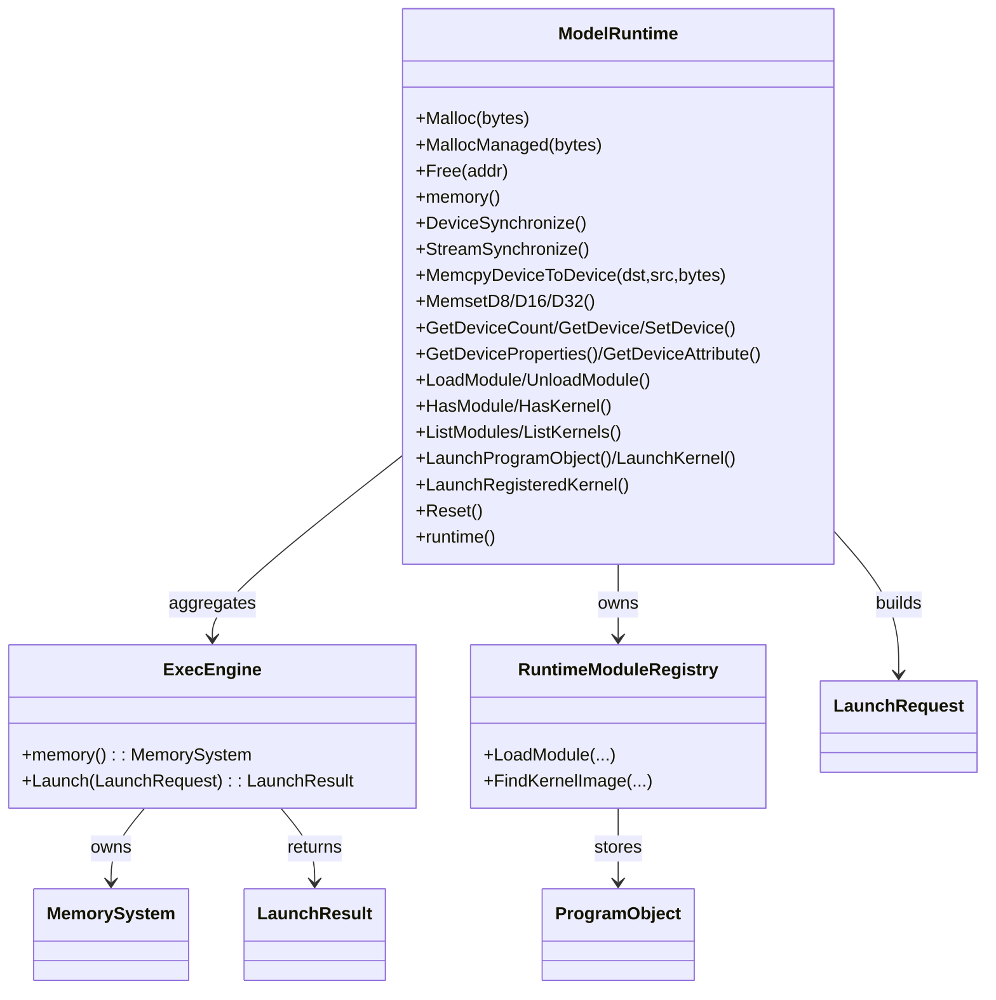
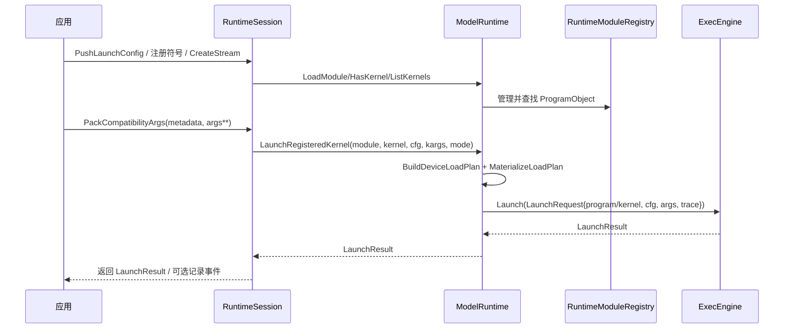

本页聚焦 ModelRuntime 作为 GPU 模型运行时的外观（Facade）与 RuntimeSession 的会话生命周期：它如何封装 ExecEngine、内存系统与模块注册表，提供设备查询、内存分配/搬运、模块装载与内核发射的一致入口；并说明在会话维度，如何管理流/事件/错误与兼容性打包。该页为解释型文档，读者可结合 [执行模式与 ExecEngine 工作流](11-zhi-xing-mo-shi-yu-execengine-gong-zuo-liu) 与 [HipRuntime C ABI 与 API 对齐](18-hipruntime-c-abi-yu-api-dui-qi) 获取上下文。Sources: [model_runtime.h](src/gpu_model/runtime/model_runtime.h#L18-L36) [model_runtime.cpp](src/runtime/core/model_runtime.cpp#L40-L43) [runtime_session.h](src/gpu_model/runtime/runtime_session.h#L38-L52)

## 外观模式与依赖关系总览
ModelRuntime 内部持有或引用 ExecEngine，并通过统一方法族暴露设备属性查询、内存 API、模块注册与内核发射；默认构造时拥有一个内置 ExecEngine，也可注入外部 ExecEngine 指针。其私有成员还包含 RuntimeModuleRegistry、分配表与最近一次设备装载结果缓存，体现“外观 + 资源编排”职责。Sources: [model_runtime.h](src/gpu_model/runtime/model_runtime.h#L18-L36) [model_runtime.h](src/gpu_model/runtime/model_runtime.h#L88-L98) [model_runtime.cpp](src/runtime/core/model_runtime.cpp#L40-L43)

为便于理解，下图给出主要类的关系与依赖（Mermaid 类图，方框为类型，箭头为使用/拥有关系）：
- 前置说明：ModelRuntime 聚合 ExecEngine；ExecEngine 提供 MemorySystem；RuntimeModuleRegistry 管理模块/内核元信息与 ProgramObject；LaunchRequest 作为发射桥接对象。Sources: [model_runtime.h](src/gpu_model/runtime/model_runtime.h#L84-L87) [model_runtime.cpp](src/runtime/core/model_runtime.cpp#L140-L142) [module_registry.h](src/gpu_model/runtime/module_registry.h#L14-L23)

Sources: [model_runtime.h](src/gpu_model/runtime/model_runtime.h#L61-L77) [model_runtime.cpp](src/runtime/core/model_runtime.cpp#L223-L241) [model_runtime.cpp](src/runtime/core/model_runtime.cpp#L244-L260) [module_registry.h](src/gpu_model/runtime/module_registry.h#L14-L33)

## 设备选择与属性查询
设备模型当前固定为单设备：GetDeviceCount 始终返回 1；仅允许 SetDevice(0)，否则返回 false；GetDevice 返回当前设备编号（默认 0）。这一策略将复杂性下沉至 ExecEngine 与架构规格层，外观层面保持稳定接口。Sources: [model_runtime.cpp](src/runtime/core/model_runtime.cpp#L116-L131)

设备属性由 BuildRuntimeDeviceProperties 从注册的 GpuArchSpec（默认为 mac500）构建，包含线程/多处理器规模、共享内存、L2、时钟与内存带宽等字段；GetDeviceProperties 将架构名固定解析为 "mac500" 并抛错处理非法 device_id。属性枚举到整数的映射由 GetDeviceAttribute 集中完成。Sources: [model_runtime.cpp](src/runtime/core/model_runtime.cpp#L16-L35) [model_runtime.cpp](src/runtime/core/model_runtime.cpp#L144-L153) [model_runtime.cpp](src/runtime/core/model_runtime.cpp#L155-L219)

建议在需要更细的属性/路径说明时，参阅[设备属性与配置查询路径](20-she-bei-shu-xing-yu-pei-zhi-cha-xun-lu-jing)。Sources: [model_runtime.cpp](src/runtime/core/model_runtime.cpp#L144-L153)

## 内存管理与数据搬运
ModelRuntime 暴露统一的设备内存接口：Malloc 走 Global 池；MallocManaged 走 Managed 池；MemcpyDeviceToDevice 使用中间缓冲区实现纯设备内拷；MemsetD8/D16/D32 以模式填充写入 Global 空间。注意 Free 仅从外观层面的 allocations_ 追踪表删除记录，底层 MemorySystem 的具体释放/复用由 ExecEngine 生命周期主导。Sources: [model_runtime.cpp](src/runtime/core/model_runtime.cpp#L44-L54) [model_runtime.cpp](src/runtime/core/model_runtime.cpp#L56-L66) [model_runtime.cpp](src/runtime/core/model_runtime.cpp#L76-L101) [model_runtime.h](src/gpu_model/runtime/model_runtime.h#L95-L97)

HtoD/DtoH 的模板便捷函数直接调用 MemorySystem 的 ReadGlobal/WriteGlobal，实现零拷贝视图到字节序列的桥接；这符合外观“薄封装”的定位。Sources: [model_runtime.h](src/gpu_model/runtime/model_runtime.h#L39-L46)

同步语义方面，DeviceSynchronize 与 StreamSynchronize 在外观层为空实现（无附加设备异步队列）；实际执行完成与等待由 ExecEngine 的 Launch 调度保证。Sources: [model_runtime.cpp](src/runtime/core/model_runtime.cpp#L68-L74) [model_runtime.cpp](src/runtime/core/model_runtime.cpp#L140-L142)

## 模块注册与内核发射
ModelRuntime 持有 RuntimeModuleRegistry，支持模块加载/卸载、查询模块与内核、列举模块与内核名称；LaunchRegisteredKernel 通过模块注册表解析内核镜像，再委托 LaunchProgramObject 完成发射。Sources: [model_runtime.cpp](src/runtime/core/model_runtime.cpp#L262-L287) [model_runtime.cpp](src/runtime/core/model_runtime.cpp#L289-L312) [module_registry.h](src/gpu_model/runtime/module_registry.h#L14-L33)

发射路径有三：直接提供 LaunchRequest；传入 ExecutableKernel 走 LaunchKernel；传入 ProgramObject 走 LaunchProgramObject。后者还会构建 DeviceLoadPlan，并在 MaterializeLoadPlan 后缓存 last_load_result，以便 ExecEngine 可以持有加载产物参与发射。Sources: [model_runtime.cpp](src/runtime/core/model_runtime.cpp#L140-L142) [model_runtime.cpp](src/runtime/core/model_runtime.cpp#L223-L241) [model_runtime.cpp](src/runtime/core/model_runtime.cpp#L244-L260) [model_runtime.cpp](src/runtime/core/model_runtime.cpp#L314-L316)

last_load_result 提供最近一次加载结果的查询接口；当前实现忽略 context_id 参数，体现“单上下文”假设。Sources: [model_runtime.h](src/gpu_model/runtime/model_runtime.h#L78-L83)

## 会话生命周期（RuntimeSession）
RuntimeSession 聚合 ModelRuntime 与 DeviceMemoryManager，并对上提供“兼容层能力”：内核符号注册/解析、流/事件的轻量管理、错误码记忆与消费、兼容形参布局解析与打包、可执行镜像加载与发射，以及 Host/Device/Managed 的互拷与同步，形成“会话级”的状态容器。Sources: [runtime_session.h](src/gpu_model/runtime/runtime_session.h#L112-L124) [runtime_session.h](src/gpu_model/runtime/runtime_session.h#L53-L61) [runtime_session.h](src/gpu_model/runtime/runtime_session.h#L65-L91) [runtime_session.h](src/gpu_model/runtime/runtime_session.h#L93-L105)

会话中可通过 model_runtime() 访问底层外观统一入口，memory() 则直达 MemorySystem；事件与流的 ID 以可选整数形式建模，提供创建/销毁/记录与校验方法，用于兼容常见 GPU 运行时范式。Sources: [runtime_session.h](src/gpu_model/runtime/runtime_session.h#L47-L52) [runtime_session.h](src/gpu_model/runtime/runtime_session.h#L65-L75)

下图给出典型会话内一次内核发射的顺序（Mermaid 时序图）：
- 前置说明：该流程演示 RuntimeSession 如何整合 ModelRuntime、ModuleRegistry 与 ExecEngine；其中同步为空实现，由 ExecEngine 发射完成即视为完成。Sources: [model_runtime.cpp](src/runtime/core/model_runtime.cpp#L68-L74) [model_runtime.cpp](src/runtime/core/model_runtime.cpp#L223-L241)

Sources: [runtime_session.h](src/gpu_model/runtime/runtime_session.h#L93-L105) [model_runtime.cpp](src/runtime/core/model_runtime.cpp#L289-L312) [module_registry.h](src/gpu_model/runtime/module_registry.h#L20-L33) [model_runtime.cpp](src/runtime/core/model_runtime.cpp#L314-L316)

## API 摘要与副作用说明
下表总结 ModelRuntime 关键 API 的意图、主要参数与副作用，便于在会话中快速查阅与编排。Sources: [model_runtime.h](src/gpu_model/runtime/model_runtime.h#L22-L37) [model_runtime.h](src/gpu_model/runtime/model_runtime.h#L61-L77)

- Malloc/MallocManaged(bytes): 设备/托管内存分配；记录 allocations_；底层池分别为 Global/Managed。副作用：修改 MemorySystem 与分配表。Sources: [model_runtime.cpp](src/runtime/core/model_runtime.cpp#L44-L54) [model_runtime.h](src/gpu_model/runtime/model_runtime.h#L95-L97)
- Free(addr): 从分配表移除记录；不直接调用底层释放接口。副作用：仅影响 allocations_。Sources: [model_runtime.cpp](src/runtime/core/model_runtime.cpp#L56-L58)
- MemcpyDeviceToDevice/MemsetD8/D16/D32: 纯设备端拷贝/填充。副作用：写入 Global 空间。Sources: [model_runtime.cpp](src/runtime/core/model_runtime.cpp#L76-L101)
- GetDeviceCount/GetDevice/SetDevice: 单设备模型，device_id 必须为 0。副作用：更新 current_device_。Sources: [model_runtime.cpp](src/runtime/core/model_runtime.cpp#L116-L131)
- GetDeviceProperties/GetDeviceAttribute: 基于 "mac500" 架构规格映射生成。副作用：无；非法 device_id 抛出异常。Sources: [model_runtime.cpp](src/runtime/core/model_runtime.cpp#L144-L153) [model_runtime.cpp](src/runtime/core/model_runtime.cpp#L155-L219)
- LoadModule/UnloadModule/HasModule/HasKernel/ListModules/ListKernels: 通过 RuntimeModuleRegistry 完成。副作用：更新注册表状态。Sources: [model_runtime.cpp](src/runtime/core/model_runtime.cpp#L262-L287) [module_registry.h](src/gpu_model/runtime/module_registry.h#L20-L38)
- Launch/LaunchKernel/LaunchProgramObject/LaunchRegisteredKernel: 构造 LaunchRequest 并委托 ExecEngine。副作用：发射执行；可能写入 last_load_result_。Sources: [model_runtime.cpp](src/runtime/core/model_runtime.cpp#L140-L142) [model_runtime.cpp](src/runtime/core/model_runtime.cpp#L223-L241) [model_runtime.cpp](src/runtime/core/model_runtime.cpp#L244-L260) [model_runtime.cpp](src/runtime/core/model_runtime.cpp#L289-L312)
- DeviceSynchronize/StreamSynchronize: 外观级空实现，用于对齐 API；依赖 ExecEngine 发射完成。Sources: [model_runtime.cpp](src/runtime/core/model_runtime.cpp#L68-L74)
- Reset: 重新设备化 ExecEngine 或复位设备周期计数，清空分配表、模块注册表与 last_load_result_，device 复位为 0。Sources: [model_runtime.cpp](src/runtime/core/model_runtime.cpp#L103-L114)

## 设计取舍与边界
- 单设备与单上下文假设：GetDeviceCount 固定 1，SetDevice 仅接受 0；last_load_result 的 context_id 形参被忽略，均指向统一缓存。这简化了外观层的资源模型。Sources: [model_runtime.cpp](src/runtime/core/model_runtime.cpp#L116-L131) [model_runtime.h](src/gpu_model/runtime/model_runtime.h#L78-L83)
- 同步最小化：外观层的 Device/Stream 同步为 no-op，将一致性保证交由 ExecEngine 的发射与完成时序；便于更换后端执行模式（Functional/Cycle 等）。Sources: [model_runtime.cpp](src/runtime/core/model_runtime.cpp#L68-L74) [model_runtime.h](src/gpu_model/runtime/model_runtime.h#L47-L60)
- 释放策略：Free 仅维护分配表，不直接触及底层释放；内存生命周期由 ExecEngine/MemorySystem 管理，确保会话 Reset 能整体回收。Sources: [model_runtime.cpp](src/runtime/core/model_runtime.cpp#L56-L58) [model_runtime.cpp](src/runtime/core/model_runtime.cpp#L103-L114)

## 会话编排建议与后续阅读
- 若需对齐 HIP/ROC API 的调用体验与语义，请阅读 [HipRuntime C ABI 与 API 对齐](18-hipruntime-c-abi-yu-api-dui-qi)，理解 RuntimeSession 如何桥接主机侧 ABI 到 ModelRuntime。Sources: [runtime_session.h](src/gpu_model/runtime/runtime_session.h#L93-L105)
- 若需理解不同执行模式（Functional/周期）与发射时序，请参考 [执行模式与 ExecEngine 工作流](11-zhi-xing-mo-shi-yu-execengine-gong-zuo-liu)。Sources: [model_runtime.cpp](src/runtime/core/model_runtime.cpp#L223-L241)
- 若关注设备属性的来源与一致性，请转向 [设备属性与配置查询路径](20-she-bei-shu-xing-yu-pei-zhi-cha-xun-lu-jing)。Sources: [model_runtime.cpp](src/runtime/core/model_runtime.cpp#L144-L153)
