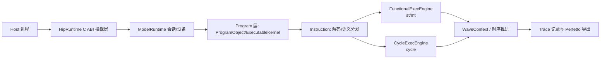
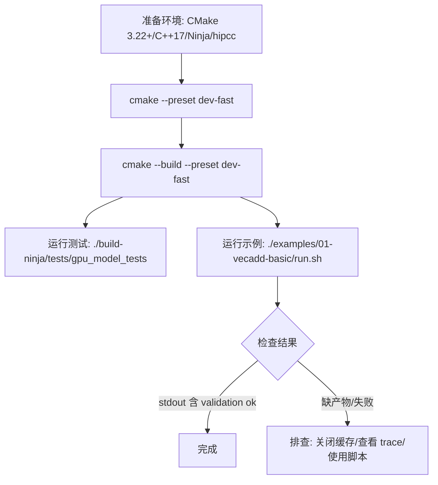

本页目标：用最少步骤把项目在本机编译、运行测试、跑通第一个示例，并建立对执行模式与关键产物的最小心智模型，便于继续阅读后续章节与开展实验。Sources: [README.md](README.md#L7-L19)

## 架构速览（从宏观到最小可跑通路径）
项目采用“runtime → program → instruction → execution → arch/wave”的分层，面向 AMD/GCN 风格 GPU 内核，既支持功能执行，也提供 naive cycle 模型；三种执行模式分别为 st/mt/cycle，默认示例运行 mt，带 trace/timeline 输出便于分析。Sources: [README.md](README.md#L34-L52)

Sources: [README.md](README.md#L41-L53)

## 环境要求
- CMake 3.22+ 与 C++17 编译器（GCC/Clang），生成器建议 Ninja；提供 dev-fast 预设用于 Debug 快速构建。Sources: [README.md](README.md#L21-L25) [CMakePresets.json](CMakePresets.json#L10-L16)
- hipcc 用于编译 HIP 源（模型执行不依赖真实 GPU）；可通过本仓工具脚本加速 example 编译缓存。Sources: [README.md](README.md#L26-L27) [examples/README.md](examples/README.md#L9-L13)

## 一次性构建
- 配置与构建（Ninja 预设）：  
  cmake --preset dev-fast  
  cmake --build --preset dev-fast  
完成后，二进制默认位于 build-ninja/ 下。Sources: [README.md](README.md#L9-L16) [CMakePresets.json](CMakePresets.json#L10-L16)

## 运行内置测试
- 直接运行测试可验证基础路径：  
  ./build-ninja/tests/gpu_model_tests  
测试目标名为 gpu_model_tests，由 CMake 显式定义。Sources: [README.md](README.md#L14-L16) [tests/CMakeLists.txt](tests/CMakeLists.txt#L1-L2)

## 跑通第一个示例（VecAdd）
- 建议先从最小例子开始：  
  ./examples/01-vecadd-basic/run.sh  
该例子验证 hipcc 编译、LD_PRELOAD 拦截、st/mt/cycle 三模式与 trace/timeline 产物是否完备。Sources: [README.md](README.md#L17-L19) [examples/01-vecadd-basic/README.md](examples/01-vecadd-basic/README.md#L5-L13)

- 成功标准（检查结果目录与关键产物）：  
  - results/st|mt|cycle/ 下应包含 stdout.txt、trace.txt、trace.jsonl、timeline.perfetto.json、launch_summary.txt  
  - stdout.txt 含 “vecadd validation ok”；launch_summary.txt 中 ok=1  
这些规则与路径命名在示例文档与示例总览中明确给出。Sources: [examples/01-vecadd-basic/README.md](examples/01-vecadd-basic/README.md#L43-L71) [examples/README.md](examples/README.md#L49-L58)

## 执行模式与默认策略
- 模式定义与含义：  
  - st：单线程功能执行（确定性语义参考）  
  - mt：多线程功能执行（Marl fiber 并行）  
  - cycle：naive cycle 模型（带时间线估算）  
默认规则：非对比型示例只跑 mt；对比/可视化示例保留 st/mt/cycle；专项示例可指定单一模式。Sources: [examples/README.md](examples/README.md#L16-L21) [examples/README.md](examples/README.md#L7-L13)

- 示例运行脚本会为不同模式设置统一的环境变量（含执行模式、功能模式、Trace 开关、日志等），并确保生成 trace/timeline/summary 等产物，失败会中止。Sources: [examples/common.sh](examples/common.sh#L119-L133) [examples/common.sh](examples/common.sh#L138-L159)

## 常用环境变量（最小可用子集）
下表列出快速开始阶段最有用的开关，全部可在运行示例时通过环境变量覆盖：

- GPU_MODEL_USE_HIPCC_CACHE：是否启用 hipcc 编译缓存（默认 1，设置 0 可关闭）。Sources: [examples/common.sh](examples/common.sh#L30-L38)
- GPU_MODEL_EXECUTION_MODE：functional 或 cycle（示例脚本按 st/mt/cycle 自动派生）。Sources: [examples/common.sh](examples/common.sh#L93-L107)
- GPU_MODEL_FUNCTIONAL_MODE：st 或 mt（functional 模式下生效）。Sources: [examples/common.sh](examples/common.sh#L119-L123)
- GPU_MODEL_FUNCTIONAL_WORKERS：mt 工作者线程数（默认 4）。Sources: [examples/common.sh](examples/common.sh#L100-L103)
- GPU_MODEL_CYCLE_FUNCTIONAL_MODE：cycle 下用于语义参考的 functional 模式（默认 st）。Sources: [examples/common.sh](examples/common.sh#L104-L107)
- GPU_MODEL_DISABLE_TRACE：是否关闭 trace（0 开，1 关），初学者建议保留默认 0。Sources: [examples/common.sh](examples/common.sh#L121-L125)

## 快速故障排查（从易到难）
- 构建是否完成：  
  cmake --build --preset dev-fast  
如失败，优先修复编译问题。Sources: [examples/README.md](examples/README.md#L61-L63)

- 测试最小子集是否通过：  
  ./build-ninja/tests/gpu_model_tests --gtest_filter=*VecAdd*  
有助于定位是否为单例或解码路径问题。Sources: [examples/README.md](examples/README.md#L64-L66)

- 单示例直跑与产物核查：  
  ./examples/01-vecadd-basic/run.sh  
  cat examples/01-vecadd-basic/results/mt/stdout.txt  
必要时关闭编译缓存以排除缓存干扰：GPU_MODEL_USE_HIPCC_CACHE=0 ./examples/01-vecadd-basic/run.sh。Sources: [examples/README.md](examples/README.md#L67-L73)

- 一键健康检查脚本（可选）：  
  ./scripts/run_exec_checks.sh  
适合在提交前做最小执行验证。Sources: [scripts/README.md](scripts/README.md#L40-L42)

## 项目结构速览（初学者最常用位置）
- 源码与实现：src/（分层与核心模块实现）与 tests/（完整测试覆盖与用例集合）。Sources: [tests/CMakeLists.txt](tests/CMakeLists.txt#L1-L7)
- 示例：examples/（按难度编号，推荐从 01 开始）。Sources: [examples/README.md](examples/README.md#L22-L30)
- 脚本：scripts/（构建/回归/门禁等辅助脚本）。Sources: [scripts/README.md](scripts/README.md#L5-L13)
- 文档索引：docs/（现行规范与阅读顺序指引）。Sources: [docs/README.md](docs/README.md#L7-L18)

## 典型工作流（流程图）

Sources: [README.md](README.md#L9-L19) [examples/README.md](examples/README.md#L49-L58)

## 下一步阅读建议
- 如需更细的依赖与环境说明，请继续阅读：[环境与依赖](3-huan-jing-yu-yi-lai)。Sources: [README.md](README.md#L21-L27)
- 想系统化运行更多示例和验证路径，请看：[运行示例与验证](4-yun-xing-shi-li-yu-yan-zheng)。Sources: [examples/README.md](examples/README.md#L41-L48)
- 若要理解和可视化时间线与事件轨迹，请前往：[可视化 Trace（Perfetto）](5-ke-shi-hua-trace-perfetto)。Sources: [README.md](README.md#L38-L40)
- 完成上述后，可按目录导航继续深入，但请始终以 docs 主文档为当前事实来源：[docs/README.md](docs/README.md)。Sources: [docs/README.md](docs/README.md#L7-L18)