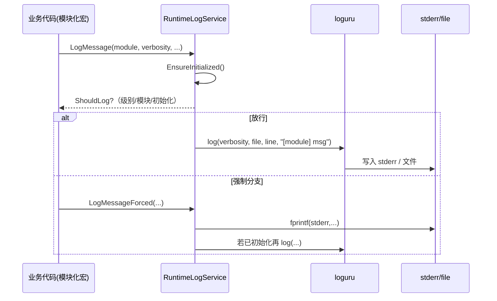

本页聚焦于项目的“日志主线”：从环境变量到 RuntimeLogService 的初始化、到 loguru 的输出行为、再到模块化筛选与开发者侧宏的使用约定，帮助初学者快速建立“如何打开/查看/筛选日志”的完整心智模型，并提供最常用的排障对策与实践范式。Sources: [runtime_log_service.cpp](src/runtime/logging/runtime_log_service.cpp#L150-L176) [runtime_config.h](src/gpu_model/runtime/runtime_config.h#L16-L29) [logging.h](src/gpu_model/util/logging.h#L5-L18)

## 架构总览与主线
日志主线由四个关键部件构成：环境变量层→配置/策略解析→日志服务初始化→输出与筛选。启动时按需（懒加载）调用 logging::EnsureInitialized，RuntimeLogService 读取一组 GPU_MODEL_* 环境变量，确定是否启用 loguru、标准错误输出的详细度、文件日志路径与级别、以及模块级筛选策略；随后在首次初始化中设置 loguru 全局前言、开启文件输出并记下已启用的模块清单。Sources: [runtime_log_service.cpp](src/runtime/logging/runtime_log_service.cpp#L150-L176) [runtime_log_service.cpp](src/runtime/logging/runtime_log_service.cpp#L33-L48) [runtime_log_service.cpp](src/runtime/logging/runtime_log_service.cpp#L50-L65) [runtime_log_service.cpp](src/runtime/logging/runtime_log_service.cpp#L81-L89) [runtime_log_service.cpp](src/runtime/logging/runtime_log_service.cpp#L95-L104) [runtime_log_service.cpp](src/runtime/logging/runtime_log_service.cpp#L106-L141)

Mermaid 架构图（先读图例：方框为组件，菱形为判定节点，注释为关键环境变量与默认值）:
```mermaid
flowchart TD
  Env[环境变量\nGPU_MODEL_DISABLE_LOGURU\nGPU_MODEL_LOG_LEVEL\nGPU_MODEL_LOG_FILE_LEVEL\nGPU_MODEL_LOG_FILE\nGPU_MODEL_LOG_MODULES\nGPU_MODEL_LOG_PROGRAM] --> Init{ShouldDisableLoguru?}
  Init -- 是(true，默认) --> Skip[跳过 loguru 初始化\n仅强制日志可见]
  Init -- 否(false) --> RLS[RuntimeLogService.EnsureInitialized]
  RLS --> SetG[设置 loguru 全局前言\nstderr 详细度(g_stderr_verbosity)]
  RLS --> File[计算日志文件路径并 add_file\n默认 logs/<prog>.<pid>.log]
  RLS --> Mods[解析模块白名单\nGPU_MODEL_LOG_MODULES]
  Dev[开发者侧日志宏\nGPU_MODEL_LOG_*] --> Should[ShouldLog(module, verbosity)]
  Mods --> Should
  SetG --> Should
  Skip --> Force[LogMessageForced\nstderr 永远可见]
  Should -->|true| Out[loguru::log 输出到 stderr / file]
  Should -->|false| Drop[忽略]
```
Sources: [runtime_log_service.cpp](src/runtime/logging/runtime_log_service.cpp#L150-L176) [runtime_log_service.cpp](src/runtime/logging/runtime_log_service.cpp#L161-L168) [runtime_log_service.cpp](src/runtime/logging/runtime_log_service.cpp#L95-L104) [runtime_log_service.cpp](src/runtime/logging/runtime_log_service.cpp#L106-L141) [runtime_log_service.cpp](src/runtime/logging/runtime_log_service.cpp#L183-L200) [logging.h](src/gpu_model/util/logging.h#L5-L18)

## 初始化触发与默认行为
日志初始化采用“懒加载”，在 ExecEngineImpl 构造时调用 logging::EnsureInitialized，仅在未禁用 loguru 的条件下执行 loguru::init、设定 g_stderr_verbosity、配置输出前言字段，并为文件输出创建父目录后 add_file 挂载文件通道。Sources: [exec_engine.cpp](src/runtime/exec_engine.cpp#L115-L127) [runtime_log_service.cpp](src/runtime/logging/runtime_log_service.cpp#L150-L176) [runtime_log_service.cpp](src/runtime/logging/runtime_log_service.cpp#L161-L168) [runtime_log_service.cpp](src/runtime/logging/runtime_log_service.cpp#L170-L175)

是否启用 loguru 由 GPU_MODEL_DISABLE_LOGURU 控制：未设置或空值时默认禁用；显式设置为“0”才启用。该策略在 ShouldDisableLoguru 判定与 RuntimeConfig 的注释中一致对齐。Sources: [runtime_log_service.cpp](src/runtime/logging/runtime_log_service.cpp#L81-L89) [runtime_config.h](src/gpu_model/runtime/runtime_config.h#L43-L49)

标准错误输出的日志级别由 GPU_MODEL_LOG_LEVEL 决定，支持 error/warning/info/debug/trace，未设置时默认 WARNING。详细度被赋给 loguru::g_stderr_verbosity。Sources: [runtime_log_service.cpp](src/runtime/logging/runtime_log_service.cpp#L33-L48) [runtime_log_service.cpp](src/runtime/logging/runtime_log_service.cpp#L161-L162)

文件输出路径优先取 GPU_MODEL_LOG_FILE，否则默认生成 logs/<程序名stem>.<pid>.log；程序名优先使用 /proc/self/exe 的文件名，或回退到 GPU_MODEL_LOG_PROGRAM，再退化为 gpu_model。首次初始化会确保创建父目录。文件日志级别由 GPU_MODEL_LOG_FILE_LEVEL 控制，未设置时默认 INFO。Sources: [runtime_log_service.cpp](src/runtime/logging/runtime_log_service.cpp#L67-L79) [runtime_log_service.cpp](src/runtime/logging/runtime_log_service.cpp#L95-L104) [runtime_log_service.cpp](src/runtime/logging/runtime_log_service.cpp#L170-L175) [runtime_log_service.cpp](src/runtime/logging/runtime_log_service.cpp#L50-L65)

loguru 的初始化与通道行为与其官方用法一致：init(argc, argv) 启动；add_file 挂载文件通道并指定详细度；g_stderr_verbosity 控制 stderr 的可见级别。Sources: [README.md](third_party/loguru/README.md#L96-L107) [README.md](third_party/loguru/README.md#L100-L107)

## 模块与筛选策略（ShouldLog）
日志筛选基于两层策略：级别门控与模块白名单。首先，所有 WARNING 及以上级别（<= Verbosity_WARNING）的日志总是通过（无论模块与初始化状态），用于关键告警与错误的强可见性。其次，若未设置模块白名单且模块被判定为“话痨模块”，将抑制其 INFO/DEBUG/TRACE；其他模块则依据当前 stderr 详细度决定可见性。Sources: [runtime_log_service.cpp](src/runtime/logging/runtime_log_service.cpp#L183-L200) [runtime_log_service.cpp](src/runtime/logging/runtime_log_service.cpp#L91-L94)

“话痨模块”固定包含 encoded_exec 与 encoded_mt；指定 GPU_MODEL_LOG_MODULES（逗号分隔、不区分大小写、去空白）后，仅白名单中的模块会输出 INFO/DEBUG/TRACE。Sources: [runtime_log_service.cpp](src/runtime/logging/runtime_log_service.cpp#L91-L94) [runtime_log_service.cpp](src/runtime/logging/runtime_log_service.cpp#L106-L141)

开发者侧通过模块名实现语义分区，例如 runtime、hip_runtime_abi、instruction、encoded_mt、encoded_exec 等，分别在关键路径产生日志。示例包括 ExecEngine 的启动与共享内存调整、HIP ABI 的调试开关探测、指令解析与并行波的调度细节。Sources: [exec_engine.cpp](src/runtime/exec_engine.cpp#L122-L129) [exec_engine.cpp](src/runtime/exec_engine.cpp#L224-L237) [hip_runtime_abi.cpp](src/runtime/hip_runtime_abi.cpp#L31-L35) [instruction_object.cpp](src/instruction/encoded/instruction_object.cpp#L129-L143) [program_object_exec_engine.cpp](src/execution/program_object_exec_engine.cpp#L1957-L1962)

## 开发者使用宏与模式
统一使用 GPU_MODEL_LOG_* 宏发日志：INFO/DEBUG/WARNING/ERROR 四档，以及 INFO_FORCED（强制输出）。宏封装 RuntimeLogService::LogMessage / LogMessageForced，前者受 ShouldLog 策略控制，后者必写到 stderr 且若已初始化再写入 loguru。Sources: [logging.h](src/gpu_model/util/logging.h#L5-L18) [runtime_log_service.cpp](src/runtime/logging/runtime_log_service.cpp#L203-L214) [runtime_log_service.cpp](src/runtime/logging/runtime_log_service.cpp#L216-L230)

建议用法模式：
- 常规信息/调试：GPU_MODEL_LOG_INFO/DEBUG("module", "message ...")，与 GPU_MODEL_LOG_LEVEL/GPU_MODEL_LOG_MODULES 协同控制。Sources: [logging.h](src/gpu_model/util/logging.h#L5-L10) [runtime_log_service.cpp](src/runtime/logging/runtime_log_service.cpp#L33-L48)
- 关键告警/错误：GPU_MODEL_LOG_WARNING/ERROR，始终可见（不受模块白名单影响）。Sources: [logging.h](src/gpu_model/util/logging.h#L11-L15) [runtime_log_service.cpp](src/runtime/logging/runtime_log_service.cpp#L183-L188)
- 早期初始化或必须可见的信息：GPU_MODEL_LOG_INFO_FORCED，保证 stderr 可见，初始化完成后同时写入文件/控制台。Sources: [logging.h](src/gpu_model/util/logging.h#L17-L18) [runtime_log_service.cpp](src/runtime/logging/runtime_log_service.cpp#L216-L230)

Mermaid 流程（开发者调用到最终输出）:
```mermaid
flowchart LR
  DevCall[GPU_MODEL_LOG_*(module,msg)] --> RLSvc[RuntimeLogService::LogMessage]
  RLSvc --> Gate{ShouldLog?}
  Gate -- 否 --> Ignore[忽略]
  Gate -- 是 --> Log[loguru::log(verbosity,...)]
  Force[GPU_MODEL_LOG_INFO_FORCED] --> Stderr[fprintf(stderr,...)]
  Stderr --> Maybe[IsInitialized()?]
  Maybe -- 是 --> Log
```
Sources: [runtime_log_service.cpp](src/runtime/logging/runtime_log_service.cpp#L183-L200) [runtime_log_service.cpp](src/runtime/logging/runtime_log_service.cpp#L203-L230)

## 环境变量与默认值（速览表）
- 控制开关与级别（默认禁用 loguru；stderr 默认 WARNING；file 默认 INFO；话痨模块默认抑制）可通过以下变量配置：GPU_MODEL_DISABLE_LOGURU、GPU_MODEL_LOG_LEVEL、GPU_MODEL_LOG_FILE_LEVEL、GPU_MODEL_LOG_FILE、GPU_MODEL_LOG_MODULES、GPU_MODEL_LOG_PROGRAM。Sources: [runtime_log_service.cpp](src/runtime/logging/runtime_log_service.cpp#L33-L48) [runtime_log_service.cpp](src/runtime/logging/runtime_log_service.cpp#L50-L65) [runtime_log_service.cpp](src/runtime/logging/runtime_log_service.cpp#L67-L89) [runtime_log_service.cpp](src/runtime/logging/runtime_log_service.cpp#L95-L141)

表格概览：
- GPU_MODEL_DISABLE_LOGURU: "0" 启用，其它/未设禁用；默认禁用。示例：export GPU_MODEL_DISABLE_LOGURU=0。Sources: [runtime_log_service.cpp](src/runtime/logging/runtime_log_service.cpp#L81-L89)
- GPU_MODEL_LOG_LEVEL: error/warning/info/debug/trace → g_stderr_verbosity；默认 WARNING。示例：export GPU_MODEL_LOG_LEVEL=info。Sources: [runtime_log_service.cpp](src/runtime/logging/runtime_log_service.cpp#L33-L48) [runtime_log_service.cpp](src/runtime/logging/runtime_log_service.cpp#L161-L162)
- GPU_MODEL_LOG_FILE_LEVEL: 同上用于文件；默认 INFO。示例：export GPU_MODEL_LOG_FILE_LEVEL=debug。Sources: [runtime_log_service.cpp](src/runtime/logging/runtime_log_service.cpp#L50-L65) [runtime_log_service.cpp](src/runtime/logging/runtime_log_service.cpp#L174-L175)
- GPU_MODEL_LOG_FILE: 文件路径（会自动创建父目录）。示例：export GPU_MODEL_LOG_FILE=/tmp/gpu.log。Sources: [runtime_log_service.cpp](src/runtime/logging/runtime_log_service.cpp#L95-L104) [runtime_log_service.cpp](src/runtime/logging/runtime_log_service.cpp#L170-L175)
- GPU_MODEL_LOG_MODULES: 逗号分隔白名单，大小写不敏感，去空白。示例：export GPU_MODEL_LOG_MODULES="runtime,encoded_mt"。Sources: [runtime_log_service.cpp](src/runtime/logging/runtime_log_service.cpp#L106-L141) [runtime_log_service.cpp](src/runtime/logging/runtime_log_service.cpp#L189-L200)
- GPU_MODEL_LOG_PROGRAM: 程序名回退项。示例：export GPU_MODEL_LOG_PROGRAM=my_runner。Sources: [runtime_log_service.cpp](src/runtime/logging/runtime_log_service.cpp#L67-L79)

## 典型模块命名与使用示例
- runtime：执行引擎运行期信息，如功能模式与线程数、Kernel 启动参数、共享内存调整等。Sources: [exec_engine.cpp](src/runtime/exec_engine.cpp#L122-L129) [exec_engine.cpp](src/runtime/exec_engine.cpp#L224-L237) [exec_engine.cpp](src/runtime/exec_engine.cpp#L283-L290)
- hip_runtime_abi：HIP C ABI 层调试探针，按 ShouldLog("hip_runtime_abi", INFO) 动态启用。Sources: [hip_runtime_abi.cpp](src/runtime/hip_runtime_abi.cpp#L31-L35)
- instruction：指令解析阶段的 DEBUG 粒度统计。Sources: [instruction_object.cpp](src/instruction/encoded/instruction_object.cpp#L129-L143)
- encoded_mt：并行波调度器的 INFO/DEBUG 明细（默认视为“话痨”受白名单控制）。Sources: [program_object_exec_engine.cpp](src/execution/program_object_exec_engine.cpp#L1957-L1962) [runtime_log_service.cpp](src/runtime/logging/runtime_log_service.cpp#L91-L94)
- encoded_exec：指令语义执行的细粒度调试；也可通过 GPU_MODEL_ENCODED_EXEC_DEBUG 快速开启。Sources: [encoded_handler_utils.h](src/gpu_model/execution/internal/encoded_handler_utils.h#L22-L37) [runtime_log_service.cpp](src/runtime/logging/runtime_log_service.cpp#L91-L94)

## 日志级别与细节层次
级别解析遵循字符串到整数的映射：error→Verbosity_ERROR，warning/warn→Verbosity_WARNING，info→Verbosity_INFO，debug→1，trace→2；stderr 与 file 分别由 GPU_MODEL_LOG_LEVEL 与 GPU_MODEL_LOG_FILE_LEVEL 控制，二者可分离设置以实现“控制台更干净、文件更详细”的组合。Sources: [runtime_log_service.cpp](src/runtime/logging/runtime_log_service.cpp#L33-L48) [runtime_log_service.cpp](src/runtime/logging/runtime_log_service.cpp#L50-L65)

ShouldLog 的门控顺序为：先放行 WARNING 及以上；若未设白名单且为话痨模块则直接抑制；否则依据是否已初始化以及 g_stderr_verbosity 比较决定；当设置了 GPU_MODEL_LOG_MODULES 时，仅白名单模块输出 INFO/DEBUG/TRACE。Sources: [runtime_log_service.cpp](src/runtime/logging/runtime_log_service.cpp#L183-L200)

## 实操范式：快速打开关键日志
- 最小化启用：仅打开 info 到 stderr 与文件，保留默认模块策略
  - export GPU_MODEL_DISABLE_LOGURU=0; export GPU_MODEL_LOG_LEVEL=info; export GPU_MODEL_LOG_FILE_LEVEL=info。Sources: [runtime_log_service.cpp](src/runtime/logging/runtime_log_service.cpp#L81-L89) [runtime_log_service.cpp](src/runtime/logging/runtime_log_service.cpp#L33-L48) [runtime_log_service.cpp](src/runtime/logging/runtime_log_service.cpp#L50-L65)
- 深入执行路径：对白名单模块放开 debug
  - export GPU_MODEL_DISABLE_LOGURU=0; export GPU_MODEL_LOG_LEVEL=debug; export GPU_MODEL_LOG_FILE_LEVEL=debug; export GPU_MODEL_LOG_MODULES="runtime,encoded_mt"。Sources: [runtime_log_service.cpp](src/runtime/logging/runtime_log_service.cpp#L81-L89) [runtime_log_service.cpp](src/runtime/logging/runtime_log_service.cpp#L33-L48) [runtime_log_service.cpp](src/runtime/logging/runtime_log_service.cpp#L50-L65) [runtime_log_service.cpp](src/runtime/logging/runtime_log_service.cpp#L106-L141)
- 语义执行专项：快速开启 encoded_exec 调试
  - export GPU_MODEL_DISABLE_LOGURU=0; export GPU_MODEL_ENCODED_EXEC_DEBUG=1。Sources: [runtime_log_service.cpp](src/runtime/logging/runtime_log_service.cpp#L81-L89) [encoded_handler_utils.h](src/gpu_model/execution/internal/encoded_handler_utils.h#L22-L37)

## 故障排查速查
- 没有任何日志输出：确认已 export GPU_MODEL_DISABLE_LOGURU=0；若仍无输出，使用 GPU_MODEL_LOG_INFO_FORCED 宏验证 stderr；或将级别调至 info/debug。Sources: [runtime_log_service.cpp](src/runtime/logging/runtime_log_service.cpp#L81-L89) [logging.h](src/gpu_model/util/logging.h#L17-L18) [runtime_log_service.cpp](src/runtime/logging/runtime_log_service.cpp#L216-L230)
- 文件未生成：若未显式设置 GPU_MODEL_LOG_FILE，将默认输出到 logs/<prog>.<pid>.log，初始化会自动创建父目录；请确保进程具备写权限。Sources: [runtime_log_service.cpp](src/runtime/logging/runtime_log_service.cpp#L95-L104) [runtime_log_service.cpp](src/runtime/logging/runtime_log_service.cpp#L170-L175)
- 看到过多 encoded_mt/encoded_exec 日志：这两个模块为“话痨模块”，默认需通过 GPU_MODEL_LOG_MODULES 白名单启用其 INFO/DEBUG/TRACE。Sources: [runtime_log_service.cpp](src/runtime/logging/runtime_log_service.cpp#L91-L94) [runtime_log_service.cpp](src/runtime/logging/runtime_log_service.cpp#L189-L200)
- 仅想在文件里更详细：将 GPU_MODEL_LOG_FILE_LEVEL 设为 debug/trace，同时保持 GPU_MODEL_LOG_LEVEL 为 warning 或 info。Sources: [runtime_log_service.cpp](src/runtime/logging/runtime_log_service.cpp#L50-L65)

## 类/模块交互关系图
下图展示“调用者宏 → 日志服务 → loguru → 输出通道”的交互，以及 HIP ABI 与 ExecEngine 在何处触发初始化与日志写入。Sources: [logging.h](src/gpu_model/util/logging.h#L5-L18) [exec_engine.cpp](src/runtime/exec_engine.cpp#L115-L127) [hip_runtime_abi.cpp](src/runtime/hip_runtime_abi.cpp#L31-L35)

Sources: [runtime_log_service.cpp](src/runtime/logging/runtime_log_service.cpp#L150-L176) [runtime_log_service.cpp](src/runtime/logging/runtime_log_service.cpp#L183-L200) [runtime_log_service.cpp](src/runtime/logging/runtime_log_service.cpp#L203-L230)

## 建议的阅读顺序
- 若需要理解 trace 的字段与开关，请继续阅读 [Trace 格式、字段与开关策略](22-trace-ge-shi-zi-duan-yu-kai-guan-ce-lue)。Sources: [runtime_config.h](src/gpu_model/runtime/runtime_config.h#L39-L47)
- 若要系统把握调试与采集指标，参阅 [时间线统计与执行指标采集](23-shi-jian-xian-tong-ji-yu-zhi-xing-zhi-biao-cai-ji)。Sources: [exec_engine.cpp](src/runtime/exec_engine.cpp#L122-L129)