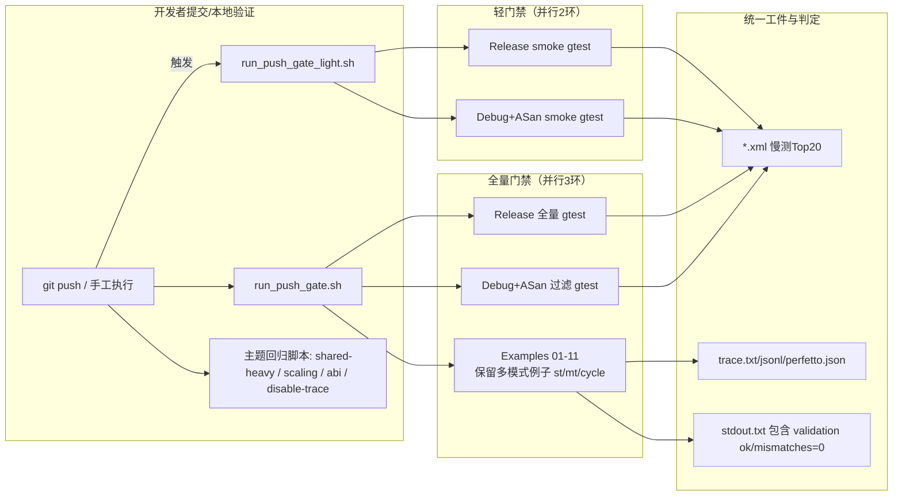
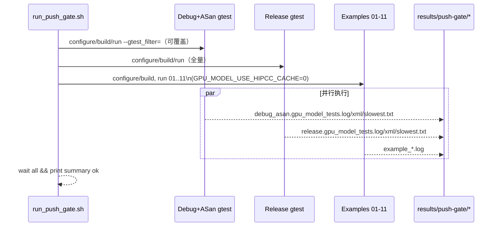
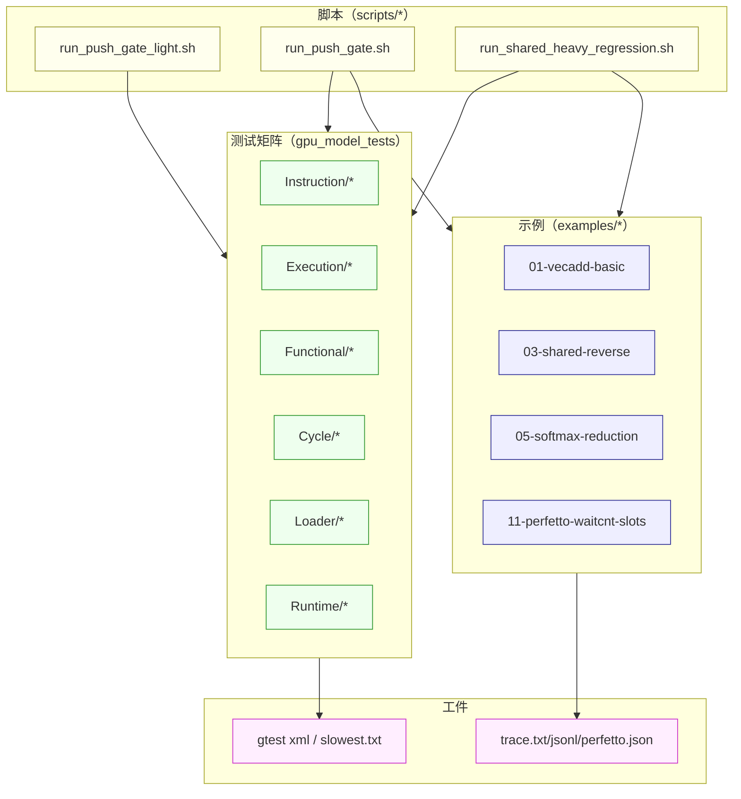

本页定位于解释“示例 examples”与“测试 gpu_model_tests（gtest）”如何在回归体系内协同，形成可重复、可解释、覆盖互补的质量闭环；并给出门禁脚本分工、模式覆盖、工件校验和故障定位路径，帮助开发者在提交前后快速收敛回归风险。[You are currently here] Sources: [README.md](docs/README.md#L9-L18)

## 体系总览（AIDA：从门禁到闭环）
协同回归由三层构成：1) 以 gtest 为主的功能/ABI/运行时/加载器/周期模型测试矩阵；2) 以可执行 HIP 核心示例为主的端到端验证与多模式对比；3) 脚本化门禁与主题回归（轻量/全量/专项），并将示例与测试组合运行、并行化编排与统一产物校验。该三层结构分别由 tests/CMake 列表、examples 目录约定与 scripts 下的门禁/回归脚本实现。Sources: [CMakeLists.txt](tests/CMakeLists.txt#L1-L13) [README.md](examples/README.md#L22-L33) [README.md](scripts/README.md#L11-L21)

以下关系图梳理“提交→门禁→测试环→示例环→工件与判定”的关键路径。

Sources: [run_push_gate_light.sh](scripts/run_push_gate_light.sh#L26-L37) [run_push_gate.sh](scripts/run_push_gate.sh#L113-L121) [README.md](scripts/README.md#L20-L33) [README.md](examples/README.md#L49-L57)

## 构成要素与职责边界
- 测试矩阵（gpu_model_tests）：覆盖指令格式/解码、执行语义、运行时 ABI/会话、Trace/时间线、加载器与程序对象等，按目录维度组织，包括 instruction/execution/functional/cycle/loader/program/runtime 等子域，构成最稳定的功能与接口回归基线。Sources: [CMakeLists.txt](tests/CMakeLists.txt#L12-L23) [CMakeLists.txt](tests/CMakeLists.txt#L36-L44) [CMakeLists.txt](tests/CMakeLists.txt#L95-L106)

- 示例集（examples）：提供可执行 HIP kernel 的端到端路径，按编号由浅入深；定义“模式”与默认覆盖策略：非对比型默认只跑 mt；对比/可视化型显式保留 st/mt/cycle；专项例子可仅跑单一模式；并规定统一成功标准与 Trace 产物清单，便于外部可视化与人工审阅。Sources: [README.md](examples/README.md#L7-L13) [README.md](examples/README.md#L16-L21) [README.md](examples/README.md#L49-L57) [README.md](examples/README.md#L75-L84)

- 门禁与主题回归（scripts）：轻门禁仅跑 smoke gtest；全量门禁并行三环（Release 全量 gtest、Debug+ASan 过滤 gtest、全部 examples 01-11）；专项回归用于特定子域快速稳定（shared-heavy、scaling、real-hip-kernel、ABI、disable-trace）。Sources: [README.md](scripts/README.md#L11-L19) [README.md](scripts/README.md#L20-L33) [README.md](scripts/README.md#L40-L61)

## 协同策略与覆盖矩阵
示例负责“端到端可视化与多模式对比”，测试负责“接口/语义的细粒度证明”，门禁脚本将两者编排为并行环，既保证回归速度又保证可解释性。非对比例子默认只在 mt 模式产出工件，而对比/可视化例子保留 st/mt/cycle 以横向对齐时间线与统计；全量门禁中显式关闭 hipcc 缓存保证可重复。Sources: [README.md](examples/README.md#L7-L13) [run_push_gate.sh](scripts/run_push_gate.sh#L92-L100) [run_push_gate.sh](scripts/run_push_gate.sh#L108-L111)

覆盖矩阵（节选）：
- Gate Light：Release/Debug+ASan smoke gtest（不跑 examples）→快速卡口。Sources: [run_push_gate_light.sh](scripts/run_push_gate_light.sh#L31-L37) [README.md](scripts/README.md#L11-L19)

- Gate Full：Release 全量 gtest、Debug+ASan 过滤 gtest、Examples 01-11（多模式策略按例子类型）→提交前强约束。Sources: [run_push_gate.sh](scripts/run_push_gate.sh#L53-L66) [run_push_gate.sh](scripts/run_push_gate.sh#L68-L82) [run_push_gate.sh](scripts/run_push_gate.sh#L84-L111)

- Shared-heavy 回归：以 shared/barrier/动态共享等为锚点，串联 focused gtests、CTS 和 03/05/09/10 四个示例的端到端校验，收敛共享相关回归。Sources: [run_shared_heavy_regression.sh](scripts/run_shared_heavy_regression.sh#L36-L53) [run_shared_heavy_regression.sh](scripts/run_shared_heavy_regression.sh#L42-L52)

## 全量门禁执行流与并行化
全量门禁脚本在同一入口中配置三套独立 build 目录，分别执行 Release gtest、Debug+ASan gtest 与 Examples 环，并行启动三条流水线，结束后统一汇总 OK；同时对 gtest 日志提取 Top 20 最慢用例，帮助定位长尾。Sources: [README.md](scripts/README.md#L20-L33) [run_push_gate.sh](scripts/run_push_gate.sh#L6-L13) [run_push_gate.sh](scripts/run_push_gate.sh#L113-L121)

并行化与结果收敛示意：

Sources: [run_push_gate.sh](scripts/run_push_gate.sh#L27-L51) [run_push_gate.sh](scripts/run_push_gate.sh#L61-L66) [run_push_gate.sh](scripts/run_push_gate.sh#L75-L82) [run_push_gate.sh](scripts/run_push_gate.sh#L108-L111)

## 示例模式策略与判定标准
模式语义统一为 st（单线程功能参照）、mt（多线程功能并行）、cycle（朴素周期模型附时间线），对比/可视化类例子保留三模式横向对比，其他例子默认只跑 mt。跑例时强制产出 trace.txt、trace.jsonl、timeline.perfetto.json 并校验结构化字段与 launch_index，以保证回归可视化与可解析性一致。Sources: [README.md](examples/README.md#L16-L21) [README.md](examples/README.md#L32-L39) [common.sh](examples/common.sh#L138-L154)

示例成功标准基于 stdout 提示（validation ok / mismatches=0）与 Trace SUMMARY 字段中的 kernel_status=PASS 且存在 launch_index，非对比型例子的产物默认落在 results/mt/ 下。Sources: [README.md](examples/README.md#L49-L57) [README.md](examples/README.md#L56-L57) [common.sh](examples/common.sh#L156-L161)

## 回归工件与可视化
所有示例模式运行均写入 GPU_MODEL_TRACE_DIR 指定目录，附带 loguru 模块级日志开关；若带 ASAN 的 so 被依赖，则通过 LD_PRELOAD 顺序注入并自动拼接 libasan 与 ABI so，确保本地与 CI 的一致性；同时在 ROCm 库目录存在时自动注入 LD_LIBRARY_PATH。Sources: [common.sh](examples/common.sh#L119-L127) [common.sh](examples/common.sh#L62-L71) [common.sh](examples/common.sh#L131-L134)

Trace 工件结构统一，文本与 JSON Lines 便于程序读取，Chrome Trace 便于 Perfetto/浏览器可视化；在 st/mt 与 cycle 下分别使用 logical_unbounded 与 resident_fixed 槽位语义，便于跨模式对齐等待/发射/屏障等时间轴事件。Sources: [README.md](examples/README.md#L75-L84) [README.md](examples/README.md#L81-L84)

## 变量与开关总览
下表列出常用环境变量及其作用域与默认值，便于在本地重放 CI 条件或做定向实验（节选）。

- 示例执行通道：GPU_MODEL_EXECUTION_MODE、GPU_MODEL_FUNCTIONAL_MODE、GPU_MODEL_FUNCTIONAL_WORKERS、GPU_MODEL_DISABLE_TRACE、GPU_MODEL_TRACE_DIR、GPU_MODEL_LOG_MODULES、GPU_MODEL_LOG_LEVEL、LD_PRELOAD、LD_LIBRARY_PATH（自动探测 ROCm）。Sources: [common.sh](examples/common.sh#L119-L134) [common.sh](examples/common.sh#L51-L60)

- 编译缓存：GPU_MODEL_USE_HIPCC_CACHE=1 默认开启，门禁 Example 环显式关闭以保证可重复。Sources: [README.md](examples/README.md#L12-L13) [run_push_gate.sh](scripts/run_push_gate.sh#L108-L111)

- 门禁过滤器：GPU_MODEL_GATE_LIGHT_GTEST_FILTER、GPU_MODEL_GATE_DEBUG_ASAN_GTEST_FILTER，可精确控制 smoke/asan 测试集合。Sources: [README.md](scripts/README.md#L18-L19) [run_push_gate.sh](scripts/run_push_gate.sh#L11-L12)

## 常见故障定位路径
本地检查建议：先构建，再跑有代表性的 gtest 过滤用例，随后执行单个示例并查看 results/mt/stdout.txt；如需对比是否受 hipcc 缓存影响，可临时关闭缓存重跑示例。Sources: [README.md](examples/README.md#L60-L73)

若示例失败，确认 stdout 是否包含 validation ok/mismatches=0，再检查 trace.txt 中 SUMMARY 段是否存在 kernel_status=PASS 与 launch_index，若结构化产物缺失/字段不全，优先排查执行模式开关与路径注入。Sources: [README.md](examples/README.md#L49-L57) [common.sh](examples/common.sh#L138-L154)

CI 门禁若失败，查看 results/push-gate/ 下的 release/debug_asan 构建与测试日志，结合 slowest.txt 优先优化/定位耗时与 flakiness；若仅 Examples 环失败，聚焦 example_*.log 与对应模式目录下的 trace 产物。Sources: [README.md](scripts/README.md#L33-L39) [run_push_gate.sh](scripts/run_push_gate.sh#L64-L66)

## 扩展与纳入协同回归
新增 gtest 用例将自动进入 Release 全量回归，且会被 Debug+ASan 环以默认过滤策略覆盖；若需纳入/排除到 Asan 过滤，可通过环境变量 GPU_MODEL_GATE_DEBUG_ASAN_GTEST_FILTER 调整。Sources: [run_push_gate.sh](scripts/run_push_gate.sh#L61-L66) [run_push_gate.sh](scripts/run_push_gate.sh#L75-L79)

新增示例若需进入全量门禁的 Examples 环，请将目录名加入 run_push_gate.sh 的 examples 数组；如属于对比/可视化类，应在各自 run.sh 中保留 st/mt/cycle 覆盖并遵循统一成功标准与工件校验。Sources: [run_push_gate.sh](scripts/run_push_gate.sh#L93-L105) [README.md](examples/README.md#L32-L39) [README.md](examples/README.md#L49-L57)

若新增主题专项（如 shared-heavy 的变体），可参照 run_shared_heavy_regression.sh 的结构：先聚焦一组 gtest 过滤，再串联相关示例，最后对 stdout 与 gtest “PASSED” 进行 grep 断言并生成 summary。Sources: [run_shared_heavy_regression.sh](scripts/run_shared_heavy_regression.sh#L36-L53) [run_shared_heavy_regression.sh](scripts/run_shared_heavy_regression.sh#L54-L67)

## 概念关系图（示例-测试-脚本-工件）
为清晰化协同边界，下图给出概念关系与交互切面。

Sources: [CMakeLists.txt](tests/CMakeLists.txt#L12-L23) [README.md](examples/README.md#L22-L39) [README.md](scripts/README.md#L11-L21) [run_push_gate.sh](scripts/run_push_gate.sh#L84-L111) [run_shared_heavy_regression.sh](scripts/run_shared_heavy_regression.sh#L42-L52)

## 建议的阅读与操作路径
想进一步理解测试资产的分层与范围，请继续阅读[测试布局与类别（功能/周期/加载器等）](24-ce-shi-bu-ju-yu-lei-bie-gong-neng-zhou-qi-jia-zai-qi-deng)；若需查看 Trace 字段与开关策略，前往[Trace 格式、字段与开关策略](22-trace-ge-shi-zi-duan-yu-kai-guan-ce-lue)；若需衡量 ISA 覆盖现状与生成方法，参考[ISA 覆盖率生成与报告解读](26-isa-fu-gai-lu-sheng-cheng-yu-bao-gao-jie-du)；若在周期模型标定与性能对比上进一步深入，请跳转[周期模型标定与性能对比方法](28-zhou-qi-mo-xing-biao-ding-yu-xing-neng-dui-bi-fang-fa)。Sources: [README.md](docs/README.md#L21-L27) [README.md](examples/README.md#L75-L84)