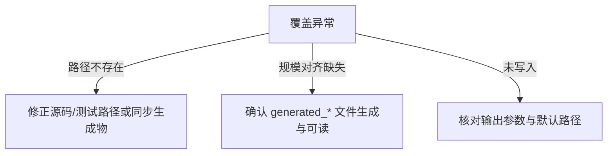

本页位于“测试与质量保障 → ISA 覆盖率生成与报告解读”[You are currently here]，面向中级开发者，目标是教你如何在本仓库生成 ISA 覆盖率报告，并精准解读报告中的各项统计口径与版块结构，从而识别支持空洞与测试盲区，指导增量补测与能力对齐。生成与解读均以仓库内脚本与数据源为据，避免经验性猜测，确保可复现与可核验。Sources: [report_isa_coverage.py](scripts/report_isa_coverage.py#L242-L249)

## 度量范围与数据源（口径定义）
覆盖率统计的“基准全集”来自 GCN 指令数据库 instructions.yaml 的 mnemonic 唯一集合；脚本先读取该文件，形成 known 集合，随后在选定的源码/测试文件中用正则提取被双引号包裹的 mnemonic，计算交集命中率；此外，为便于对齐 LLVM 后端的完备集合，脚本还读取生成的 full opcode 表（generated_encoded_gcn_full_opcode_table.cpp），用于统计总行数与唯一 mnemonic 的规模，但覆盖率百分比口径以 instructions.yaml 的 unique 数量为分母。Sources: [report_isa_coverage.py](scripts/report_isa_coverage.py#L71-L81)

- 指令数据库路径：src/spec/gcn_db/instructions.yaml；条目包含 id、format、mnemonic、semantic_family 等字段，作为基准全集的来源。Sources: [instructions.yaml](src/spec/gcn_db/instructions.yaml#L1-L11)
- full opcode 表路径：src/instruction/encoded/internal/generated_encoded_gcn_full_opcode_table.cpp；内含 1575 行 opcode 描述符与 20 个 OpType 基本信息。Sources: [generated_encoded_gcn_full_opcode_table.cpp](src/instruction/encoded/internal/generated_encoded_gcn_full_opcode_table.cpp#L8-L13)
- 报告覆盖集：通过解析源码/测试文件中出现的 "mnemonic" 字面量（带或不带 _e32/_e64），建立多个 coverage set，并按 family/format 进行分组统计与展示。Sources: [report_isa_coverage.py](scripts/report_isa_coverage.py#L20-L32)

```mermaid
flowchart TD
  A[instructions.yaml<br/>mnemonic全集] -->|known| B{覆盖集提取}
  C[源码/测试文件<br/>\"mnemonic\"] --> B
  D[generated_full_opcode_table.cpp] --> E[规模对齐统计<br/>(full rows/unique)]
  B --> F[覆盖集 union/分组]
  F --> G[按 semantic_family 汇总]
  F --> H[按 format_class 汇总]
  G --> I[markdown 报告]
  H --> I
  F --> J[JSON 报告]
```
上图给出了“基准全集 → 覆盖集提取 → 分组汇总 → 输出”的数据流，右侧以 full opcode 表进行规模参照，但不参与覆盖率分母计算。Sources: [report_isa_coverage.py](scripts/report_isa_coverage.py#L141-L159)

## 一键生成：命令与流程
脚本提供命令行入口与三项参数：--repo-root 指定仓库根目录（默认脚本上级目录），--markdown-out 与 --json-out 分别指定输出路径（默认写入 docs/isa_coverage_report.md 与 docs/isa_coverage_report.json）；执行后同时打印 Markdown 概览并落盘两份制品。Sources: [report_isa_coverage.py](scripts/report_isa_coverage.py#L242-L271)

```mermaid
flowchart LR
  S[Start] --> P[解析参数<br/>--repo-root/--markdown-out/--json-out]
  P --> B[build_report(repo_root)]
  B --> M[生成 Markdown 文本]
  B --> J[生成 JSON 结构]
  M --> W1[写入 docs/isa_coverage_report.md]
  J --> W2[写入 docs/isa_coverage_report.json]
  W1 --> E[打印路径并退出]
  W2 --> E
```
上述流程对应 main() 中参数解析、构建报告、写入与回显的顺序逻辑，默认输出路径也在此处确定。Sources: [report_isa_coverage.py](scripts/report_isa_coverage.py#L262-L275)

参数说明表（默认值与作用）：
- --repo-root：仓库根目录；默认为脚本路径的上级目录。Sources: [report_isa_coverage.py](scripts/report_isa_coverage.py#L244-L249)
- --markdown-out：Markdown 输出路径；默认 docs/isa_coverage_report.md。Sources: [report_isa_coverage.py](scripts/report_isa_coverage.py#L251-L269)
- --json-out：JSON 输出路径；默认 docs/isa_coverage_report.json。Sources: [report_isa_coverage.py](scripts/report_isa_coverage.py#L257-L269)

## 报告结构与示例解读
生成的 Markdown 报告包含四个核心板块：Coverage scope（规模口径），Tracked-subset coverage（关键集合覆盖率），Per Semantic Family/Per Encoding（分组命中率），以及两类名单（Supported But Untested 与 Missing Raw Object Support）。以下为仓库内示例：Sources: [isa_coverage_report.md](docs/isa_coverage_report.md#L1-L10)

- Coverage scope 展示了 tracked entries/unique（来自 instructions.yaml）与 full opcode rows/unique（来自 generated 表）：例如 1575 行 opcode、1559 唯一 mnemonic。Sources: [isa_coverage_report.md](docs/isa_coverage_report.md#L6-L10)
- Tracked-subset coverage 展示了各覆盖集的命中数与百分比，如 any tests 达到 100%。Sources: [isa_coverage_report.md](docs/isa_coverage_report.md#L11-L17)
- 按语义族与编码格式的分组表格，可定位结构性短板（如 loader tests 覆盖率较低的族/格式）。Sources: [isa_coverage_report.md](docs/isa_coverage_report.md#L18-L30)

JSON 报告给出了同构的结构化信息（含每个覆盖集的 mnemonic 列表），便于自动化消费与二次分析；生成时间、口径总量、覆盖集明细均可直接读取。Sources: [isa_coverage_report.json](docs/isa_coverage_report.json#L1-L7)

## 覆盖集语义与来源（如何被计算）
覆盖集通过在指定源码/测试文件中提取被双引号包裹的 mnemonic 构成，并对部分集合做并集归并：exec_test_union = 若干执行相关测试之并集；all_test_union = 解码/执行/加载器测试之并集。若文件不存在，提取集为空（路径存在性已检查）。Sources: [report_isa_coverage.py](scripts/report_isa_coverage.py#L92-L107)

- raw_object_support：来自对象/绑定层源码，对应“模型原生支持”的证据集合。Sources: [report_isa_coverage.py](scripts/report_isa_coverage.py#L82-L90)
- decode_unit_tests：解码单元测试中的覆盖集合。Sources: [report_isa_coverage.py](scripts/report_isa_coverage.py#L82-L90)
- exec_test_union：执行相关单测的并集。Sources: [report_isa_coverage.py](scripts/report_isa_coverage.py#L97-L102)
- loader_integration_tests：加载器集成测试覆盖集合。Sources: [report_isa_coverage.py](scripts/report_isa_coverage.py#L82-L90)
- all_test_union：所有测试类覆盖集合的并集，反映“被任何测试触达”的上限。Sources: [report_isa_coverage.py](scripts/report_isa_coverage.py#L103-L107)

提取算法通过正则匹配 "mnemonic" 并自动补全 _e32/_e64 变体，确保对常见编码后缀的等价计入；这一步决定了覆盖集合的“计数口径”。Sources: [report_isa_coverage.py](scripts/report_isa_coverage.py#L20-L32)

## 统计分组与口径计算
脚本按 semantic_family 与 format（encoding class）两条维度分组聚合，分别统计 unique mnemonic 个数与各覆盖集在该分组上的命中数量/比例；比例均以该分组 unique 总量为分母、命中 unique 交集为分子。Sources: [report_isa_coverage.py](scripts/report_isa_coverage.py#L109-L134)

- family 汇总生成与 Markdown 渲染：家族名、unique 总量与各覆盖集命中/百分比列。Sources: [report_isa_coverage.py](scripts/report_isa_coverage.py#L115-L125)
- format 汇总生成与 Markdown 渲染：格式类名、unique 总量与覆盖列。Sources: [report_isa_coverage.py](scripts/report_isa_coverage.py#L125-L134)

百分比计算的统一口径由 percent() 提供；当分母为 0 时返回 0.0%，其余情况四舍五入到 0.1%。Sources: [report_isa_coverage.py](scripts/report_isa_coverage.py#L35-L39)

## 特殊名单：未支持与“有支持但未测试”
脚本给出两份极具行动指引价值的名单：unsupported_raw_object_mnemonics = known - raw_object_support；supported_without_any_tests = raw_object_support - all_test_union。前者指导“新增模型支持”，后者指导“补充测试覆盖”。Sources: [report_isa_coverage.py](scripts/report_isa_coverage.py#L136-L140)

在 Markdown 中，这两份名单会显示总数并列出最多前 40 项，便于直接分配到迭代任务中落实补测/补实现。Sources: [report_isa_coverage.py](scripts/report_isa_coverage.py#L215-L237)

## 示例对照：规模统计一致性
full opcode 表声明了 1575 个 GcnIsaOpcodeDescriptor 项目，而示例报告同样统计到 1575 行与 1559 唯一 mnemonic，验证了“规模参照”与生成逻辑对齐；需要注意这部分不参与覆盖率分母计算，仅作总体对比参考。Sources: [generated_encoded_gcn_full_opcode_table.cpp](src/instruction/encoded/internal/generated_encoded_gcn_full_opcode_table.cpp#L31-L33)

示例 Markdown 的 Coverage scope 中，tracked unique（instructions.yaml）为 82，而 full unique（generated 表）为 1559，反映了当前跟踪子集相对于 LLVM 后端全集的范围关系。Sources: [isa_coverage_report.md](docs/isa_coverage_report.md#L6-L10)

## 常见问题与排查
- 提取集全为 0 或显著偏低：首先检查脚本内配置的源码/测试路径在当前仓库是否存在；脚本对 path.exists() 做了保护，不存在则记为空集，导致覆盖偏低。Sources: [report_isa_coverage.py](scripts/report_isa_coverage.py#L92-L96)
- 生成失败或规模统计缺失：确认 generated_encoded_gcn_full_opcode_table.cpp 是否存在、可读；该文件用于 full rows/unique 的规模统计。Sources: [report_isa_coverage.py](scripts/report_isa_coverage.py#L73-L81)
- 输出未落盘或路径不符：检查 --markdown-out/--json-out 与默认写入逻辑；默认输出至 docs/isa_coverage_report.md 与 docs/isa_coverage_report.json，并在控制台打印写入路径。Sources: [report_isa_coverage.py](scripts/report_isa_coverage.py#L267-L275)


上述排查图将常见问题映射到脚本中的关键断点：路径存在性、生成物可用性与输出写入逻辑。Sources: [report_isa_coverage.py](scripts/report_isa_coverage.py#L92-L96)

## 提升覆盖率的可操作指引
由于覆盖集合基于源码/测试中出现的 "mnemonic" 字面量统计，要提升“any tests”或特定集合的覆盖，只需在相应测试类别中纳入缺失 mnemonic 的测试用例（或在现有用例中显式包含该 mnemonic），即可拉升对应集合与分组的命中；名单 supported_without_any_tests 为首选补测清单。Sources: [report_isa_coverage.py](scripts/report_isa_coverage.py#L20-L32)

当模型已支持但“缺测试”，命中差距体现为 raw_object_support > all_test_union；相反，若 unsupported_raw_object_mnemonics 非空，则优先安排模型实现与绑定侧支持，再补充测试，形成闭环。Sources: [report_isa_coverage.py](scripts/report_isa_coverage.py#L136-L140)

## 语义与格式分组的背景依据
分组统计依赖 instructions.yaml 中的 semantic_family 与 format 字段；示例条目包含 s_endpgm（branch_or_sync）、s_load_dword（scalar_memory）、s_and_b32（scalar_alu）等，体现了数据驱动的分组基础，保证了统计配置的可维护性与一致性。Sources: [instructions.yaml](src/spec/gcn_db/instructions.yaml#L1-L21)

脚本将 instructions.yaml 加载后按 semantic_family 与 format 建立两个索引字典，再对每个分组计算覆盖命中与百分比，最终渲染到 Markdown 表格中。Sources: [report_isa_coverage.py](scripts/report_isa_coverage.py#L109-L134)

## 报告字段与输出格式（JSON/Markdown）
JSON 顶层字段包括 generated_at、tracked_instruction_entries、tracked_instruction_unique_total、full_opcode_rows、full_opcode_unique_total、coverage、by_semantic_family、by_format_class、unsupported_raw_object_mnemonics、supported_without_any_tests；coverage 下每个集合包含 covered、percent、mnemonics 三部分。Sources: [report_isa_coverage.py](scripts/report_isa_coverage.py#L141-L159)

Markdown 则以文字与表格呈现同样的信息架构，先是总体规模与关键集合覆盖率，再是按 family/format 的表格，最后列出两份关键名单，方便人工审阅与任务拆解。Sources: [report_isa_coverage.py](scripts/report_isa_coverage.py#L161-L177)

## 参考示例与现场核验
示例报告显示 tracked unique 与各覆盖集均为 82 且百分比 100%，而 loader integration tests 仅 22.0%，这提示加载路径的覆盖不足，是优先补测的方向；该判断完全来自示例报告数据本身。Sources: [isa_coverage_report.md](docs/isa_coverage_report.md#L11-L17)

JSON 报告中列出了各集合的 mnemonic 清单，例如 raw_object_support 下包含 s_endpgm、s_load_dword、v_add_u32_e32 等，适合直接筛选差异与回归目标。Sources: [isa_coverage_report.json](docs/isa_coverage_report.json#L8-L16)

## 延伸阅读与后续行动
- 若要系统理解“解码/描述符/语义处理链”如何产出 mnemonic 并影响覆盖，请阅读 [GCN ISA 解码、描述符与语义处理链](15-gcn-isa-jie-ma-miao-shu-fu-yu-yu-yi-chu-li-lian)。Sources: [report_isa_coverage.py](scripts/report_isa_coverage.py#L71-L76)
- 若要将覆盖指标纳入测试布局与持续回归，建议结合 [测试布局与类别（功能/周期/加载器等）](24-ce-shi-bu-ju-yu-lei-bie-gong-neng-zhou-qi-jia-zai-qi-deng) 制定补测计划。Sources: [isa_coverage_report.md](docs/isa_coverage_report.md#L11-L17)