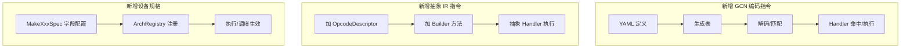

本页面向高级开发者，系统化阐明在本项目中扩展两条“指令语义链路”（编码 GCN 指令与抽象 IR 指令）以及新增/调整“设备架构规格”（GpuArchSpec）的工作方法、验证路径与影响面评估。目标是以最小改动安全拉通：从规格数据源（YAML/Spec）→ 生成/解码 → 语义处理器 → 执行/调度与资源模型。Sources: [instruction_system_design.md](docs/architecture/instruction_system_design.md#L1-L80)

## 架构假设与核验（从第一性原则出发）
- 假设A：指令处理有两条并行执行路径，分别服务于真实 AMDGPU 二进制（编码指令路径）与项目内部抽象 IR（抽象指令路径）；两者在“语义处理器注册与 O(1) 查找”机制上同构。经设计文档与实现核验，存在 EncodedSemanticHandlerRegistry/ISemanticHandler 体系与双路径执行引擎。Sources: [instruction_system_design.md](docs/architecture/instruction_system_design.md#L140-L220)
- 假设B：ISA 编码支持来源于结构化 YAML（src/spec/gcn_db），通过生成脚本产出静态表，为解码器/匹配器/语义分派提供权威“编码描述”。经生成脚本与格式说明核验可证。Sources: [gen_gcn_isa_db.py](scripts/gen_gcn_isa_db.py#L1-L60) [gcn-isa-db-format.md](src/spec/gcn-isa-db-format.md#L1-L70)
- 假设C：设备规格独立于 ISA，通过 GpuArchSpec 注入波规模、缓存/共享银行、发射/切换时序、可驻留/可发射资源上界与调度政策；ArchRegistry 以名称查表返回规格。经头文件与 c500 实例、注册表实现核验。Sources: [gpu_arch_spec.h](src/gpu_model/arch/gpu_arch_spec.h#L1-L60) [c500_spec.cpp](src/arch/c500_spec.cpp#L1-L49) [arch_registry.cpp](src/arch/arch_registry.cpp#L1-L29)

## 关键关系图（概念层）
下图描述从 ISA 数据源到执行与调度的端到端路径，标示两条指令链路以及与设备规格的耦合点。Sources: [instruction_system_design.md](docs/architecture/instruction_system_design.md#L80-L140) [gcn-isa-db-format.md](src/spec/gcn-isa-db-format.md#L70-L120)

```mermaid
flowchart LR
  subgraph Spec["规格与生成"]
    Yaml[src/spec/gcn_db/*.yaml]
    Gen[脚本 scripts/gen_gcn_isa_db.py<br/>生成 Encoded 定义/表]
  end
  subgraph Decode["解码/描述符"]
    EncDef[EncodedGcnEncodingDef<br/>(generated)]
    Decoder[GCN 解码/匹配<br/>(words→mnemonic/operands)]
  end
  subgraph ExecEncoded["执行：编码指令路径"]
    RegEnc[EncodedSemanticHandlerRegistry]
    HandlersEnc[Encoded Handlers<br/>BaseHandler/VectorLaneHandler/Waitcnt/Barrier...]
  end
  subgraph ExecAbstract["执行：抽象 IR 路径"]
    OpDesc[OpcodeDescriptor<br/>(Opcode↔mnemonic↔类别)]
    Builder[InstructionBuilder<br/>(ProgramObject 构建)]
    RegAbs[SemanticHandlerRegistry]
  end
  subgraph Arch["设备架构规格"]
    ArchSpec[GpuArchSpec<br/>wave/caches/issue/slots/timing]
    ArchReg[ArchRegistry(name→spec)]
  end

  Yaml --> Gen --> EncDef --> Decoder
  Decoder --> RegEnc --> HandlersEnc
  OpDesc --> Builder --> RegAbs
  ArchReg --> ArchSpec
  ArchSpec -. 资源/延迟/调度 .-> HandlersEnc
  ArchSpec -. 资源/延迟/调度 .-> RegAbs
```

本关系图锚定两条语义链路与单一规格注入点，对应 O(1) Handler 查找、CRTP 向量 lane 执行、统一 PC 递进与 Trace 回调骨架。Sources: [encoded_semantic_handler.cpp](src/execution/encoded_semantic_handler.cpp#L1-L120) [instruction_system_design.md](docs/architecture/instruction_system_design.md#L200-L320) [gpu_arch_spec.h](src/gpu_model/arch/gpu_arch_spec.h#L60-L98)

## 扩展目标对照（选择正确入口）
为避免耦合扩散，首先判断扩展目标落在何类入口。Sources: [instruction_system_design.md](docs/architecture/instruction_system_design.md#L140-L220)

| 扩展目标 | 入口模块 | 主要改动物件 | 关键校验点 |
|---|---|---|---|
| 新增/补齐 GCN 编码指令 | src/spec/gcn_db + 生成脚本 + 解码/Handler | YAML 指令/操作数/flags → 生成表；必要时扩写 Encoded Handler | 解码匹配成功；Handler 命中；执行/Trace/PC 递进正确 |
| 新增抽象 IR 指令（ProgramObject） | src/isa/opcode_descriptor.cpp + instruction_builder.cpp | 新 OpcodeDescriptor 行；Builder 添便捷构造 | 类别/语义家族正确；执行路径可命中 |
| 新增/变更设备架构规格 | src/arch/*.cpp + ArchRegistry | 新 MakeXxxSpec() 与字段；注册 name→spec | 发射/驻留/调度/缓存/共享银行等行为变化符预期 |

表格以“入口最小原则”确保修改集中：编码链路尽量只改 YAML+Handler，抽象 IR 只改 Opcode/Builder，设备规格只改 Spec/Registry。Sources: [opcode_descriptor.cpp](src/isa/opcode_descriptor.cpp#L1-L60) [instruction_builder.cpp](src/isa/instruction_builder.cpp#L1-L60) [arch_registry.cpp](src/arch/arch_registry.cpp#L1-L29) [c500_spec.cpp](src/arch/c500_spec.cpp#L1-L49)

## 扩展编码 GCN 指令（Raw Object 路径）
- 数据源与生成：在 src/spec/gcn_db/*.yaml 定义 profile/format/opcode/operands/flags/semantic_family；通过 scripts/gen_gcn_isa_db.py 生成 EncodedGcnEncodingDef/InstDefs/FormatDefs 等静态表，供解码/匹配与语义分派使用。Sources: [gcn-isa-db-format.md](src/spec/gcn-isa-db-format.md#L120-L200) [gen_gcn_isa_db.py](scripts/gen_gcn_isa_db.py#L140-L200)
- 语义关联：解码产物 DecodedInstruction 通过 Registry O(1) 命中 IEncodedSemanticHandler；BaseHandler 统一开始/结束 Trace 与 PC 自增；VectorLaneHandler 以 exec mask 仅遍历活跃 lanes。新增指令若落入既有“语义家族”（如 vector_alu/scalar_memory/lds 等），可复用模板化 Handler；否则需新增专用 Handler。Sources: [instruction_system_design.md](docs/architecture/instruction_system_design.md#L220-L320) [encoded_semantic_handler.cpp](src/execution/encoded_semantic_handler.cpp#L60-L160)

```mermaid
flowchart TD
  A[编辑 src/spec/gcn_db/instructions.yaml] --> B[运行生成脚本<br/>产出静态表/编码定义]
  B --> C[Decoder/Matcher 识别 mnemonic/operands]
  C --> D[EncodedSemanticHandlerRegistry::Get(mnemonic)]
  D --> E[Handler.Execute(): Trace→ExecuteImpl→PC+=size]
  E --> F[WaveContext/掩码/寄存器与内存状态更新]
```

上述流程的关键不变量：解码-分派-执行三段严格分层；Handler 使用 CRTP/模板减少重复且不破坏统一骨架。Sources: [instruction_system_design.md](docs/architecture/instruction_system_design.md#L300-L380) [encoded_semantic_handler.cpp](src/execution/encoded_semantic_handler.cpp#L100-L200)

常见改动点与校验：
- 新增 YAML 指令：确保 format_class/opcode/operand schema/implicit-reg/flags 完整；semantic_family 指向正确家族。Sources: [gcn-isa-db-format.md](src/spec/gcn-isa-db-format.md#L200-L320)
- 复用模板 Handler：如 BinaryU32Handler/UnaryU32Handler 等，避免重复类；确保操作数解析走 ResolveScalarLike/ResolveVectorLane 等统一入口。Sources: [encoded_semantic_handler.cpp](src/execution/encoded_semantic_handler.cpp#L160-L200)
- 校验覆盖：参考 docs/isa_coverage_report.md 的“Tracked-subset coverage”分族/分格式统计，保证 Raw/Decode/Exec 至少与 tracked 子集对齐。Sources: [isa_coverage_report.md](docs/isa_coverage_report.md#L1-L40)

## 扩展抽象 IR 指令（ProgramObject 路径）
- 指令标识与类别：在 src/isa/opcode_descriptor.cpp 增加一行 OpcodeDescriptor（Opcode 枚举→mnemonic→OpcodeCategory，同时标注访存/原子/屏障标志）；类别用于执行/发射统计与策略。Sources: [opcode_descriptor.cpp](src/isa/opcode_descriptor.cpp#L1-L80)
- 构建 API：在 src/isa/instruction_builder.cpp 添加便捷方法（如 SAdd/SMov/VAdd 等已存在的同类函数），保持 ProgramObject 侧的构造一致性与可读性。Sources: [instruction_builder.cpp](src/isa/instruction_builder.cpp#L1-L120)
- 执行路径对接：抽象路径的 Registry 与 Handler 关系见架构文档“抽象指令执行路径”；新增 Opcode 后需确认对应 Handler 类可命中。Sources: [instruction_system_design.md](docs/architecture/instruction_system_design.md#L360-L440)

```mermaid
flowchart TD
  A[新增 OpcodeDescriptor 行] --> B[在 InstructionBuilder 添加便捷方法]
  B --> C[ProgramObject/Instruction 构建]
  C --> D[SemanticHandlerRegistry::Get()]
  D --> E[抽象 Handler 执行/状态更新]
```

这一链路与编码链路解耦，仅共享“语义家族/类别”概念，以便统一统计与策略。Sources: [instruction_system_design.md](docs/architecture/instruction_system_design.md#L360-L420)

## 新增/调整设备架构规格（GpuArchSpec）
- 定义字段：GpuArchSpec 定义 wave_size、计算阵列布局（dpc/ap/peu）、可驻留/可发射波上界、默认发射周期、特性开关（l1/l2/mma等）、缓存/共享银行模型、launch 时序、发射上限与策略、可选按操作类/操作符的周期覆盖。Sources: [gpu_arch_spec.h](src/gpu_model/arch/gpu_arch_spec.h#L1-L98)
- 规格实例：以 c500 为例，设置 wave_size=64、cache model 延迟/行宽/容量、eligible_wave_selection_policy=RoundRobin、issue policy 由 limits 推导等；这是“无侵入注入”的参考实现。Sources: [c500_spec.cpp](src/arch/c500_spec.cpp#L1-L49)
- 注册与获取：拦截名-规约映射在 ArchRegistry，“c500”→MakeC500Spec()，可按需添加新命名并返回 shared_ptr<const GpuArchSpec>。Sources: [arch_registry.cpp](src/arch/arch_registry.cpp#L1-L29)

影响面要点：
- 发射/调度：issue_limits/issue_policy/eligible_wave_selection_policy 影响可发射波集合与选择顺序。Sources: [gpu_arch_spec.h](src/gpu_model/arch/gpu_arch_spec.h#L60-L98)
- 存储层级：cache_model 与 shared_bank_model 影响访存指令的命中延迟与银行冲突行为（编码/抽象两链路共享）。Sources: [gpu_arch_spec.h](src/gpu_model/arch/gpu_arch_spec.h#L20-L60)
- 时序开销：launch_timing/warp_switch_cycles/arg_load_cycles 影响时间线统计与 Trace。Sources: [gpu_arch_spec.h](src/gpu_model/arch/gpu_arch_spec.h#L34-L60)

## 语义处理器骨架与可复用模式
- 统一执行骨架：BaseHandler::Execute 负责 Debug→Trace(start)→ExecuteImpl→Trace(end)→PC+=size_bytes，避免处理器间样板重复。Sources: [encoded_semantic_handler.cpp](src/execution/encoded_semantic_handler.cpp#L80-L120)
- 向量 lane 模式：VectorLaneHandler 仅遍历 exec 活跃 lane；CRTP 将 per-lane 逻辑下沉到 Impl::ExecuteLane，兼顾性能与清晰度。Sources: [encoded_semantic_handler.cpp](src/execution/encoded_semantic_handler.cpp#L120-L180)
- 模板化算子：BinaryU32Handler/UnaryU32Handler 等以 Op lambda 传入，覆盖 add/sub/and/or/xor 等高重复族，减少新指令接入成本。Sources: [instruction_system_design.md](docs/architecture/instruction_system_design.md#L240-L320)

这些模式为“新增 Handler 或扩展家族”提供最小增量路径，优先复用模板与工具方法（如 ResolveVectorLane/RequireScalarIndex 等）。Sources: [encoded_semantic_handler.cpp](src/execution/encoded_semantic_handler.cpp#L1-L80)

## 实操流程（How-to）
1) 新增一条编码 GCN 指令（例如新增一个 vop2 整数二元指令）
- 步骤
  - 在 src/spec/gcn_db/instructions.yaml 添加该指令：填充 mnemonic、format_class、opcode、operands、implicit、flags、semantic_family。Sources: [gcn-isa-db-format.md](src/spec/gcn-isa-db-format.md#L200-L320)
  - 运行生成脚本，确保生成 EncodedGcnEncodingDef/InstDef 表，并被解码器识别（words→mnemonic/operands）。Sources: [gen_gcn_isa_db.py](scripts/gen_gcn_isa_db.py#L100-L200)
  - 若属现有“二元整型族”，以 BinaryU32Handler 复用；否则在 Encoded 处理器中新增 Handler 并在 Registry 注册（O(1)）。Sources: [instruction_system_design.md](docs/architecture/instruction_system_design.md#L240-L320)
  - 执行用例并查看 Trace：应看到 start/end 回调与 PC 递进正确。Sources: [encoded_semantic_handler.cpp](src/execution/encoded_semantic_handler.cpp#L80-L120)
- 验证
  - 对照 docs/isa_coverage_report.md，确认该 mnemonic 计入 Raw/Decode/Exec 覆盖。Sources: [isa_coverage_report.md](docs/isa_coverage_report.md#L1-L40)

2) 新增一条抽象 IR 指令（例如新增系统寄存器读取）
- 步骤
  - 在 src/isa/opcode_descriptor.cpp 增加 OpcodeDescriptor 一行，指定类别（System/VectorAlu/…）与是否访存/原子/屏障。Sources: [opcode_descriptor.cpp](src/isa/opcode_descriptor.cpp#L1-L60)
  - 在 src/isa/instruction_builder.cpp 添加构建函数，保证 ProgramObject 端构造一致性。Sources: [instruction_builder.cpp](src/isa/instruction_builder.cpp#L1-L80)
  - 确认抽象路径 Handler 可命中（参照设计文档“抽象指令执行路径”）。Sources: [instruction_system_design.md](docs/architecture/instruction_system_design.md#L380-L440)

3) 新增一个设备架构规格（例如“c600”）
- 步骤
  - 参考 c500_spec.cpp 建立 MakeC600Spec()：配置 wave_size / cache_model / shared_bank_model / launch_timing / cycle_resources（issue_limits、eligible_wave_selection_policy 等）。Sources: [c500_spec.cpp](src/arch/c500_spec.cpp#L1-L49) [gpu_arch_spec.h](src/gpu_model/arch/gpu_arch_spec.h#L1-L98)
  - 在 ArchRegistry 注册 {"c600", MakeC600Spec()}。Sources: [arch_registry.cpp](src/arch/arch_registry.cpp#L1-L29)
- 验证
  - 对比时间线/调度表现（驻留/可发射波数、访存延迟）与预期一致。Sources: [gpu_arch_spec.h](src/gpu_model/arch/gpu_arch_spec.h#L60-L98)



上述三条操作流分别最小化入侵面并各自可独立回归。Sources: [instruction_system_design.md](docs/architecture/instruction_system_design.md#L140-L220) [arch_registry.cpp](src/arch/arch_registry.cpp#L1-L29)

## 故障排查（Troubleshooting）
- 解码失败或指令落入 placeholder：检查 YAML 的 format/opcode/operand schema 与 semantic_family 是否一致，必要时比对生成表；确认 Registry 能返回对应 Handler。Sources: [gcn-isa-db-format.md](src/spec/gcn-isa-db-format.md#L120-L200) [instruction_system_design.md](docs/architecture/instruction_system_design.md#L200-L280)
- 抽象指令未命中 Handler：检查 opcode_descriptor.cpp 是否添加、类别是否正确，Builder 是否暴露构造方法。Sources: [opcode_descriptor.cpp](src/isa/opcode_descriptor.cpp#L1-L60) [instruction_builder.cpp](src/isa/instruction_builder.cpp#L1-L80)
- 设备名查无规格：确认 ArchRegistry 中已注册；规格字段是否遗漏导致默认值不合预期（如 slots/limits）。Sources: [arch_registry.cpp](src/arch/arch_registry.cpp#L1-L29) [gpu_arch_spec.h](src/gpu_model/arch/gpu_arch_spec.h#L60-L98)

## 变更影响面评估（Patterns/Pros&Cons）
- 指令侧：新增编码 GCN 指令通常仅影响“解码表+Handler”；若复用模板 Handler，执行正确性风险最小；新语义族则需增量处理器并补测试。Sources: [encoded_semantic_handler.cpp](src/execution/encoded_semantic_handler.cpp#L120-L180) [instruction_system_design.md](docs/architecture/instruction_system_design.md#L240-L320)
- 架构侧：GpuArchSpec 字段调整会影响发射/调度与访存延迟，应结合 Trace/时间线与覆盖报告观察变化，避免对现有回归产生系统性偏差。Sources: [gpu_arch_spec.h](src/gpu_model/arch/gpu_arch_spec.h#L20-L60) [isa_coverage_report.md](docs/isa_coverage_report.md#L1-L40)

## 度量与覆盖
覆盖报告聚合 tracked 指令在 Raw/Decode/Exec/Loader 维度的覆盖率，并按 family 与 format class 透视；扩展后建议对照该报告确认无回退。Sources: [isa_coverage_report.md](docs/isa_coverage_report.md#L1-L58)

## 建议后续阅读
- 若需要深入解码—分派—执行链，请阅读[GCN ISA 解码、描述符与语义处理链](15-gcn-isa-jie-ma-miao-shu-fu-yu-yu-yi-chu-li-lian)。Sources: [instruction_system_design.md](docs/architecture/instruction_system_design.md#L1-L80)
- 若需要核对运行时对设备规格查询与暴露，请阅读[设备属性与配置查询路径](20-she-bei-shu-xing-yu-pei-zhi-cha-xun-lu-jing)。Sources: [gpu_arch_spec.h](src/gpu_model/arch/gpu_arch_spec.h#L1-L20)
- 若需要对扩展后进行系统化量化与回归，请阅读[ISA 覆盖率生成与报告解读](26-isa-fu-gai-lu-sheng-cheng-yu-bao-gao-jie-du)。Sources: [isa_coverage_report.md](docs/isa_coverage_report.md#L1-L20)