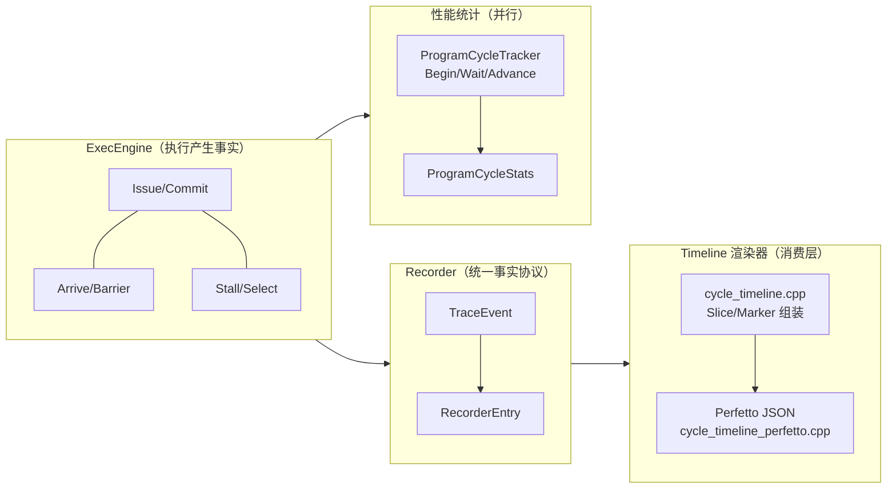
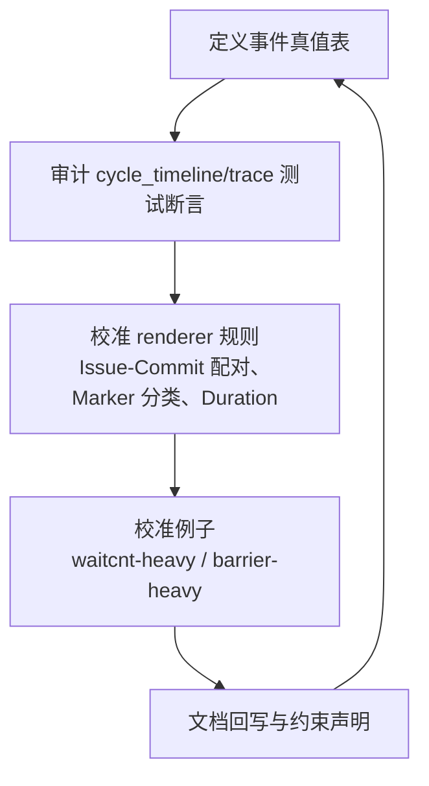

本页定位于给出周期级执行模型的“标定闭环”和“性能对比”可操作方法，目标是让 issue/commit/arrive/stall 等时间线语义在消费层（trace/timeline）稳定、可回归，并建立以 ProgramCycleStats 为核心的对比评估路径；你当前正处于导航中的“扩展与贡献指南 > 周期模型标定与性能对比方法”[You are currently here]。Sources: [cycle-timeline-accuracy-plan.md](docs/cycle-timeline-accuracy-plan.md#L1-L23) [cycle-timeline-accuracy-plan.refined.md](docs/cycle-timeline-accuracy-plan.refined.md#L1-L22)

## 原则与边界：只消费事实、严格使用 modeled cycle
- trace/timeline 仅消费生产者事实，不得推断业务语义；cycle 一律是“模型时间”，非宿主机时钟；WaveResume 仅表示“ready/eligible”，不得等价于 issue。Sources: [trace-structured-output.md](docs/trace-structured-output.md#L5-L26)
- 标定阶段聚焦“表达校准”，不改动执行模型，不引入新 Perfetto 主格式；文档需明确 issue/commit/arrive/stall 的正式含义与限制。Sources: [cycle-timeline-accuracy-plan.md](docs/cycle-timeline-accuracy-plan.md#L9-L23) [cycle-timeline-accuracy-plan.md](docs/cycle-timeline-accuracy-plan.md#L74-L100)

## 体系结构视图：执行→记录→渲染的单向事实流
下图描述从执行引擎到时间线的单向事实流：ExecEngine 产生活动事件，Recorder 汇聚为可渲染数据，CycleTimeline/Perfetto 渲染器仅做消费层的切片与标记，ProgramCycleTracker 则并行汇总周期统计用于性能对比。Sources: [trace-structured-output.md](docs/trace-structured-output.md#L28-L49) [cycle-timeline-truth-table.md](docs/cycle-timeline-truth-table.md#L60-L110) [program_cycle_tracker.cpp](src/runtime/program_cycle_tracker.cpp#L1-L40)

Sources: [cycle-timeline-truth-table.md](docs/cycle-timeline-truth-table.md#L1-L18) [cycle-timeline-accuracy-plan.refined.md](docs/cycle-timeline-accuracy-plan.refined.md#L102-L144) [program_cycle_tracker.cpp](src/runtime/program_cycle_tracker.cpp#L61-L119)

## 标定闭环工作流（How-to）
标定闭环遵循“真值表 → 测试审计 → 渲染器校准 → 代表性样例 → 文档回写”的里程碑推进，并以 TDD 的正/反向用例确定性校验。Sources: [cycle-timeline-accuracy-plan.md](docs/cycle-timeline-accuracy-plan.md#L102-L171) [cycle-timeline-accuracy-plan.refined.md](docs/cycle-timeline-accuracy-plan.refined.md#L146-L219)

Sources: [cycle-timeline-accuracy-plan.refined.md](docs/cycle-timeline-accuracy-plan.refined.md#L146-L219) [cycle-timeline-accuracy-plan.md](docs/cycle-timeline-accuracy-plan.md#L137-L210)

## 真值表提要（概念与约束）
- InstructionIssue/Commit 仅对“确实提交”的可执行指令生成 slice；arrive/stall/barrier/lifecycle 一律以 marker 表达；禁止为缺失的 Commit 补造 slice。Sources: [cycle-timeline-truth-table.md](docs/cycle-timeline-truth-table.md#L19-L42)
- scheduler 的 IssueSelect 只能表达“selected”，与真实 issue 严格区分；ready != selected != issue。Sources: [cycle-timeline-truth-table.md](docs/cycle-timeline-truth-table.md#L43-L71) [cycle-timeline-accuracy-plan.md](docs/cycle-timeline-accuracy-plan.md#L52-L73)

对照摘要（从真值表抽取关键点）：
- Slice：Issue→Commit 成对闭合；s_waitcnt 等不生成 slice。Marker：Arrive/Barrier/Stall/WaveLifecycle/IssueSelect。RuntimeEvent：Launch/Block* 等进入 runtime 轨道，不挂载到 wave slot。Sources: [cycle-timeline-truth-table.md](docs/cycle-timeline-truth-table.md#L60-L110)

## 渲染规则与字段（实现口径）
- Slice 生成：遇到 InstructionIssue 推入队列；遇到 Commit 闭合最早未闭合 issue；s_waitcnt 不生成 slice；issue_cycle=begin_cycle，commit_cycle=commit.event.cycle；render_duration_cycles 取来源于事件范围或量化规则。Sources: [cycle-timeline-truth-table.md](docs/cycle-timeline-truth-table.md#L60-L90)
- Marker 生成：Arrive/Barrier/WaveExit/WaveLaunch/WaveGenerate/WaveDispatch/SlotBind/IssueSelect/Stall 以 canonical 符号/分类稳定输出，不混淆为 slice。Sources: [cycle-timeline-truth-table.md](docs/cycle-timeline-truth-table.md#L90-L110)

## 校准验证锚点（测试与可视）
- Perfetto 渲染结构：traceEvents、ph:"X"、slot 线程命名与排序稳定，确保轨道布局与指令 slice 可见。Sources: [cycle_timeline_test.cpp](tests/runtime/cycle_timeline_test.cpp#L81-L128)
- Slot ID 连续性与分组：tid 使用 0 基索引，支持按 Block 分组视图。Sources: [cycle_timeline_test.cpp](tests/runtime/cycle_timeline_test.cpp#L130-L171) [cycle_timeline_test.cpp](tests/runtime/cycle_timeline_test.cpp#L173-L200)
- 负向用例警戒：禁止把 arrive 画成 resume issue、禁止无 Commit 的 slice、禁止 selection 冒充 issue。Sources: [cycle-timeline-accuracy-plan.md](docs/cycle-timeline-accuracy-plan.md#L24-L73)

## 性能对比方法：以 ProgramCycleStats 为核心
- 统计口径：ProgramCycleTracker 在 tick 推进时按 step_class 累加 work_weight 到各类周期计数（scalar/vector/tensor/shared/scalar_mem/global/private/barrier/wait）。Sources: [program_cycle_tracker.cpp](src/runtime/program_cycle_tracker.cpp#L1-L40)
- 生命周期与推进：BeginWaveWork/MarkWaveWaiting 赋予 Active 工作（带 cost_cycles、work_weight），AdvanceOneTick 累加并在剩余为 0 时置 Runnable。Sources: [program_cycle_tracker.cpp](src/runtime/program_cycle_tracker.cpp#L61-L119)

指标映射（节选）：
- total_cycles：全局 tick 计数；total_issued_work_cycles：所有工作累计；barrier_cycles/wait_cycles 对应同步与等待开销；其余为不同执行/存储子类。Sources: [program_cycle_tracker.cpp](src/runtime/program_cycle_tracker.cpp#L1-L40)

## 获取统计与对比的实践用例
- 在功能/周期两种模式下验证统计一致性与可用性：Functional 模式下也可生成 ProgramCycleStats；Cycle 模式下保证统计与 total_cycles 对齐。Sources: [execution_stats_test.cpp](tests/runtime/execution_stats_test.cpp#L66-L118)
- 关闭 trace 不影响周期与结果：显式传入 TraceSink 时事件可捕获；禁用 trace 时结果与总周期保持一致，用于排除 trace 干扰的对比测量。Sources: [execution_stats_test.cpp](tests/runtime/execution_stats_test.cpp#L120-L200) [trace-structured-output.md](docs/trace-structured-output.md#L5-L26)

## 对比评估流程（How-to）
- 统一数据源：用相同内核、相同运行配置（grid/block/shared）在基线与候选实现上各运行一遍，导出 ProgramCycleStats 与 Perfetto。Sources: [execution_stats_test.cpp](tests/runtime/execution_stats_test.cpp#L1-L65)
- 周期侧对比：重点关注 total_cycles、各类 step_class 周期（如 global_mem_cycles、barrier_cycles、wait_cycles）的相对差异。Sources: [program_cycle_tracker.cpp](src/runtime/program_cycle_tracker.cpp#L1-L40)
- 时间线侧对比：校验 issue/commit 顺序、slice 间隔、arrive/stall/selection 的 canonical 命名与顺序稳定性，利用现有测试断言做回归。Sources: [cycle_timeline_test.cpp](tests/runtime/cycle_timeline_test.cpp#L81-L128)
- 批量回归：使用 scaling 回归脚本跑规模/并行度变化以观察趋势与退化。Sources: [run_scaling_regression.sh](scripts/run_scaling_regression.sh#L1-L14)

## 常见问题排查（Troubleshooting）
- s_waitcnt 被渲染成普通 slice：校正为 marker，不参与 Issue→Commit 配对。Sources: [cycle-timeline-accuracy-plan.md](docs/cycle-timeline-accuracy-plan.md#L24-L52)
- arrive/resume 混淆：arrive 必须使用真实到达时点；禁止用 consumer resume 的 issue cycle 代替；区分 still_blocked 与 resume。Sources: [cycle-timeline-accuracy-plan.md](docs/cycle-timeline-accuracy-plan.md#L53-L73)
- ready/selected/issue 边界混淆：selection 仅作 marker，不得画成 issue；ready != selected != issue，有序出现。Sources: [cycle-timeline-accuracy-plan.md](docs/cycle-timeline-accuracy-plan.md#L52-L73)
- 为“好看”补画虚假 stall 或 slice：渲染器禁止推断补齐，缺事件即缺表达。Sources: [cycle-timeline-truth-table.md](docs/cycle-timeline-truth-table.md#L12-L18)

## 标定覆盖与代表性样例
- 至少选取一组 waitcnt-heavy 与一组 barrier-heavy 用例，确保 timeline 与模型事实无语义冲突，导出的 timeline.perfetto.json 与 focused tests 的命名/字段一致。Sources: [cycle-timeline-accuracy-plan.md](docs/cycle-timeline-accuracy-plan.md#L74-L100)
- 结合 ISA 覆盖报告与代表性指令族，确保对比样例覆盖 vector/scalar ALU、shared/global/private memory、barrier/wait 等主路径。Sources: [isa_coverage_report.md](docs/isa_coverage_report.md#L1-L58)

## 交付清单与质量门禁
- 通过 AC-1..AC-6 的正/反向用例；更新 cycle_timeline 渲染规则与字段稳定性；在文档中明确周期语义与限制。Sources: [cycle-timeline-accuracy-plan.md](docs/cycle-timeline-accuracy-plan.md#L24-L100)
- 同步回写主设计与模块状态，保持 trace 仅消费事实、cycle 非物理时钟的一致性声明。Sources: [cycle-timeline-accuracy-plan.refined.md](docs/cycle-timeline-accuracy-plan.refined.md#L219-L233) [trace-structured-output.md](docs/trace-structured-output.md#L5-L26)

## 建议后续阅读
- 时间线统计与执行指标采集：[时间线统计与执行指标采集](23-shi-jian-xian-tong-ji-yu-zhi-xing-zhi-biao-cai-ji)（与 ProgramCycleStats 的分析方法对齐）。Sources: [execution_stats_test.cpp](tests/runtime/execution_stats_test.cpp#L66-L118)
- Trace 格式、字段与开关策略：[Trace 格式、字段与开关策略](22-trace-ge-shi-zi-duan-yu-kai-guan-ce-lue)（了解结构化 trace 合约与禁用策略）。Sources: [trace-structured-output.md](docs/trace-structured-output.md#L28-L49)
- 算子/编译器 codegen 对比工作流：[算子/编译器 codegen 对比工作流](29-suan-zi-bian-yi-qi-codegen-dui-bi-gong-zuo-liu)（将本页方法用于跨编译产物的系统对比）。Sources: [cycle-timeline-accuracy-plan.md](docs/cycle-timeline-accuracy-plan.md#L171-L210)