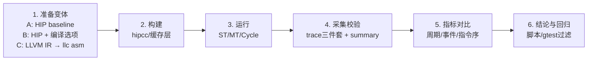

本页给出一套可复现、可度量的算子/编译器 codegen 对比工作流：以同一算子在多种实现或编译选项下生成的目标代码为对象，通过模型的 ST/MT/Cycle 三种执行路径采集统一 Trace 工件，进行 ISA/指令级差异与整体周期指标对比，支撑算子选型、编译策略评估与回归自动化。Sources: [trace-structured-output.md](docs/trace-structured-output.md#L12-L21), [common.sh](examples/common.sh#L84-L136)

## 工作流总览（从源到度量）
以下流程图展示了从“准备对比对象”到“产物采集与指标对比”的全链路，核心节点包括编译（hipcc/llc）、运行（ST/MT/Cycle）、Trace 萃取与对比结论产出。Sources: [emit_amdgpu_asm.sh](scripts/emit_amdgpu_asm.sh#L4-L6), [common.sh](examples/common.sh#L96-L113)

```mermaid
flowchart TD
  A[选择算子与变体<br/> • 算子实现A/B/C<br/> • 编译选项/内核参数] --> B[构建产物<br/> • hipcc 生成可执行/HSACO<br/> • 可选: LLVM IR → llc → AMDGPU asm]
  B --> C[运行与拦截<br/> • ST/MT/Cycle 模式<br/> • 统一环境变量<br/> • LD_PRELOAD ABI 拦截]
  C --> D[采集工件<br/> • trace.txt / trace.jsonl / timeline.perfetto.json<br/> • launch_summary.txt]
  D --> E[指标对比<br/> • 总周期/事件计数/波前步进<br/> • 指令级差异(waitcnt/访存序)]
  E --> F[结论复核与回归<br/> • 例12/13对比模板<br/> • 集成到脚本与gtest过滤]
```

该流程依赖统一的运行包装与工件约定：通过 GPU_MODEL_* 环境变量控制执行模式、线程度，并保证三类 Trace 工件稳定生成与校验。Sources: [common.sh](examples/common.sh#L119-L136), [trace-structured-output.md](docs/trace-structured-output.md#L16-L21)

## 准备对比对象（算子实现与 codegen 变体）
- 路径1：以 HIP 源码为主，使用 hipcc 生成对比变体（如不同并行度、不同内存策略），示例可参考“调度策略对比”和“算法对比”的两组模板结果表。Sources: [examples/12-schedule-strategy-comparison/README.md](examples/12-schedule-strategy-comparison/README.md#L19-L25), [examples/13-algorithm-comparison/README.md](examples/13-algorithm-comparison/README.md#L40-L46)
- 路径2：以 LLVM IR 为起点，通过 llc 导出 AMDGPU 汇编，便于精确观察/注入 waitcnt、寄存器使用与指令序。使用脚本：emit_amdgpu_asm.sh <input.ll> <output.s> [gfx_target]。Sources: [emit_amdgpu_asm.sh](scripts/emit_amdgpu_asm.sh#L4-L6), [emit_amdgpu_asm.sh](scripts/emit_amdgpu_asm.sh#L23-L24)
- 路径3：直接提供 GCN 文本汇编以绕过前端，用 AsmParser 进入执行链，支持标签解析、waitcnt 语法与功能运行，适合验证“编译器选择不同但语义等价”的低差异对比。Sources: [asm_parser_test.cpp](tests/loader/asm_parser_test.cpp#L37-L56), [asm_parser_test.cpp](tests/loader/asm_parser_test.cpp#L118-L132)

以上三条路径可组合使用：例如以 HIP 基准实现为 A，再基于 llc 的 asm 导出或手工精修的 asm 作为 B/C 变体，最终在统一执行与 Trace 口径下比较。Sources: [asm_parser_test.cpp](tests/loader/asm_parser_test.cpp#L58-L113), [trace-structured-output.md](docs/trace-structured-output.md#L26-L33)

## 构建与产物生成（稳定与可复现）
- 推荐通过工具封装编译：examples/common.sh 的 gpu_model_compile_hip_source 支持 hipcc 编译与可选缓存层，从而避免相同输入反复编译带来的噪声；缓存键包含 hipcc 版本、参数与输入文件哈希。Sources: [common.sh](examples/common.sh#L30-L38), [hipcc_cache.sh](tools/hipcc_cache.sh#L57-L70)
- 缓存命中直接复用产物；未命中则编译到临时路径后原子移动至缓存并回写到目标输出，保证构建可重复、结果可追溯。Sources: [hipcc_cache.sh](tools/hipcc_cache.sh#L84-L89), [hipcc_cache.sh](tools/hipcc_cache.sh#L107-L112)
- 项目自带执行检查与 ABI 聚焦回归脚本，确保“构建-运行-验证”环节在进入 codegen 对比前已经是健康状态。Sources: [run_exec_checks.sh](scripts/run_exec_checks.sh#L12-L20), [run_abi_regression.sh](scripts/run_abi_regression.sh#L11-L18)

当需要从 LLVM IR 观察编译器后端决策时，可使用 llc 导出 AMDGPU 汇编，指定目标如 gfx900/gfx90a，以控制波前/指令集特征。Sources: [emit_amdgpu_asm.sh](scripts/emit_amdgpu_asm.sh#L11-L15), [emit_amdgpu_asm.sh](scripts/emit_amdgpu_asm.sh#L23-L24)

## 运行与 Trace 采集（ST/MT/Cycle 统一规范）
- 通过 gpu_model_run_interposed_mode 将可执行在三种模式下运行：功能 ST、功能 MT（可控工作线程数）、Cycle 周期模型（可选功能后端为 ST/MT）；运行过程设置统一环境变量并拦截 HIP Runtime ABI。Sources: [common.sh](examples/common.sh#L96-L107), [common.sh](examples/common.sh#L119-L130)
- 运行完成后，应生成结构化的三类工件：trace.txt（分段结构化文本）、trace.jsonl（类型化事件流）与 timeline.perfetto.json（Perfetto 时间线）；examples/common.sh 内置断言校验工件完整性与关键字段。Sources: [trace-structured-output.md](docs/trace-structured-output.md#L16-L21), [common.sh](examples/common.sh#L138-L151)
- 典型示例脚本会在各模式目录下保存 stdout、trace 与 launch_summary.txt，方便回看对比；softmax 样例展示了“三模式一致性”作为基本正确性闸门。Sources: [05-softmax-reduction/README.md](examples/05-softmax-reduction/README.md#L45-L47), [05-softmax-reduction/README.md](examples/05-softmax-reduction/README.md#L58-L65)

Trace 的“分段文本/类型化 JSON/Perfetto”三件套遵循同一事实源（Recorder），各自只改变呈现而不改变语义，便于在 codegen 差异下比对执行事实与时序。Sources: [trace-structured-output.md](docs/trace-structured-output.md#L22-L33), [trace-structured-output.md](docs/trace-structured-output.md#L64-L75)

## 指标与维度（怎么比）
- 宏观：总周期（gpu_tot_sim_cycle）、波前步数（WaveStep 数）、栈顶指令族分布、访存/同步事件计数，适用于策略/算法对比（例12/13）。Sources: [12-schedule-strategy-comparison/README.md](examples/12-schedule-strategy-comparison/README.md#L19-L25), [13-algorithm-comparison/README.md](examples/13-algorithm-comparison/README.md#L40-L46)
- 中观：每 kernel 的 grid/block 配置、活跃波前与 barrier 分段密度、waitcnt 栅栏序等，在“多阶段共享内存归约/同步”类算子中尤为关键。Sources: [05-softmax-reduction/README.md](examples/05-softmax-reduction/README.md#L69-L77), [trace-structured-output.md](docs/trace-structured-output.md#L26-L33)
- 微观：指令级序列差异（含 s_waitcnt 的参数位、buffer/flat/ds 指令穿插）、PC 递增与 label 分辨率，适合编译器细节变体的精细核对。Sources: [asm_parser_test.cpp](tests/loader/asm_parser_test.cpp#L118-L126), [asm_parser_test.cpp](tests/loader/asm_parser_test.cpp#L47-L56)

示例 KPI 表（可直接复用为对比模板）如下，展示策略/算法两类常见维度。Sources: [12-schedule-strategy-comparison/README.md](examples/12-schedule-strategy-comparison/README.md#L19-L25), [13-algorithm-comparison/README.md](examples/13-algorithm-comparison/README.md#L40-L46)

| 对比面 | 变体 | 关键配置 | 总周期 |
|---|---|---|---|
| 调度策略（例12） | low_parallelism | grid=1x1x1, block=64 | 5608 |
| 调度策略（例12） | moderate_parallelism | grid=8x1x1, block=128 | 808 |
| 调度策略（例12） | optimal_parallelism | grid=16x1x1, block=256 | 524 |
| 算法（例13） | transpose_naive | 直接全局访存 | 1197 |
| 算法（例13） | transpose_shared | 动态 shared | 1353 |
| 算法（例13） | transpose_diagonal | 补齐无 bank 冲突 | 1365 |
Sources: [12-schedule-strategy-comparison/README.md](examples/12-schedule-strategy-comparison/README.md#L19-L25), [13-algorithm-comparison/README.md](examples/13-algorithm-comparison/README.md#L40-L46)

## 低层级 codegen 差异检查（汇编与语义）
- llc 导出 AMDGPU 汇编后，可直接审阅/注入 waitcnt、寄存器搬运与 buffer/flat 访存序，辅助定位编译器策略差异；脚本接口固定且易于切换目标架构。Sources: [emit_amdgpu_asm.sh](scripts/emit_amdgpu_asm.sh#L4-L6), [emit_amdgpu_asm.sh](scripts/emit_amdgpu_asm.sh#L23-L24)
- AsmParser 路径支持 label 解析与 PC 递增（8B 对齐），并可在功能执行引擎下直接 Launch 校验正确性，适合“同功能、不同序列”的微差比对。Sources: [asm_parser_test.cpp](tests/loader/asm_parser_test.cpp#L37-L56), [asm_parser_test.cpp](tests/loader/asm_parser_test.cpp#L58-L113)
- 等待/栅栏语法（如 s_waitcnt vmcnt/lgkmcnt）被准确解析为语义操作数，便于在 trace.jsonl 中回溯执行事实而非文本匹配。Sources: [asm_parser_test.cpp](tests/loader/asm_parser_test.cpp#L118-L126), [asm_parser_test.cpp](tests/loader/asm_parser_test.cpp#L127-L132)

指令覆盖率报告可用于判断某类指令差异是否在“模型可解释”范围内，降低把“模型不支持”误判为“编译器退化”的风险。Sources: [isa_coverage_report.md](docs/isa_coverage_report.md#L18-L30), [isa_coverage_report.md](docs/isa_coverage_report.md#L33-L48)

## 操作步骤（可直接落地）

- 构建：优先调用 gpu_model_compile_hip_source，默认开启 hipcc 缓存以提高重复性与速度。Sources: [common.sh](examples/common.sh#L30-L38), [hipcc_cache.sh](tools/hipcc_cache.sh#L57-L70)
- 运行：使用 gpu_model_run_interposed_mode 依次跑 st/mt/cycle，必要时调整 GPU_MODEL_FUNCTIONAL_WORKERS 与功能后端。Sources: [common.sh](examples/common.sh#L96-L107), [common.sh](examples/common.sh#L119-L130)
- 校验：用 gpu_model_assert_trace_artifacts 验证三件套、关键段落与 launch_index 等字段存在。Sources: [common.sh](examples/common.sh#L138-L151), [common.sh](examples/common.sh#L152-L154)
- 参考：可先执行 exec-check/abi/real-hip 三类脚本做冒烟，确保环境与 ABI 路径健康。Sources: [run_exec_checks.sh](scripts/run_exec_checks.sh#L12-L20), [run_abi_regression.sh](scripts/run_abi_regression.sh#L29-L36)

## 产物与检查清单
| 工件 | 来源与含义 | 校验要点 |
|---|---|---|
| trace.txt | 分段结构化文本视图 | [RUN]/[KERNEL]/[EVENTS]/[SUMMARY] 均出现 |
| trace.jsonl | 类型化事实流 | run/kernel/model/summary snapshot 条目 |
| timeline.perfetto.json | Perfetto 时间线 | traceEvents 存在，可加载 |
| launch_summary.txt | 运行摘要 | ok=1/状态字段 |
该清单与校验点可由内置断言自动完成，失败即视为流程不健康。Sources: [trace-structured-output.md](docs/trace-structured-output.md#L26-L33), [common.sh](examples/common.sh#L138-L151)

## 排错指北（常见阻塞与定位）
- 工具缺失：hipcc/llc 未安装会在入口脚本即失败；按提示安装或调整 PATH 后重试。Sources: [emit_amdgpu_asm.sh](scripts/emit_amdgpu_asm.sh#L18-L21), [run_abi_regression.sh](scripts/run_abi_regression.sh#L11-L13)
- ROCm 动态库路径：运行时会自动拼接 LD_LIBRARY_PATH 指向 /opt/rocm/lib(|64)，必要时显式导出。Sources: [common.sh](examples/common.sh#L114-L133)
- 只通过/不生成 Trace：确保 GPU_MODEL_DISABLE_TRACE=0；exec 检查脚本也会验证关键输出存在。Sources: [trace-structured-output.md](docs/trace-structured-output.md#L12-L13), [run_exec_checks.sh](scripts/run_exec_checks.sh#L15-L20)

当定位到 codegen 微差但功能正确时，优先比较 waitcnt 与访存/同步序列是否合理，再回看总周期与阶段密度，避免单看总周期得出“策略退化”的过度结论。Sources: [asm_parser_test.cpp](tests/loader/asm_parser_test.cpp#L118-L132), [13-algorithm-comparison/README.md](examples/13-algorithm-comparison/README.md#L48-L54)

## 回归集成（让对比自动发生）
- 真实 HIP 环回归：包含原子归约与样例 04，覆盖“注册主机函数路径”和“原始 GCN 路径”，适合作为 codegen 对比前置健康线。Sources: [run_real_hip_kernel_regression.sh](scripts/run_real_hip_kernel_regression.sh#L16-L25), [run_real_hip_kernel_regression.sh](scripts/run_real_hip_kernel_regression.sh#L27-L33)
- ABI 聚焦回归：面向 hidden-args、builtin-ids、by-value 聚合等关键 ABI 形态，降低接口侧变动对 codegen 结论的干扰。Sources: [run_abi_regression.sh](scripts/run_abi_regression.sh#L16-L28), [run_abi_regression.sh](scripts/run_abi_regression.sh#L29-L36)
- 规模与形状：可用 scaling 回归在多形状/线程数下做抽样，检验对比结论的形状稳定性。Sources: [run_scaling_regression.sh](scripts/run_scaling_regression.sh#L11-L13)

上述脚本输出包含“ok”摘要或 gtest PASSED 信号，可直接作为 CI 门禁；建议将算子/编译器变体的对比套件接入相同风格输出，提升一致性。Sources: [run_real_hip_kernel_regression.sh](scripts/run_real_hip_kernel_regression.sh#L34-L39), [run_exec_checks.sh](scripts/run_exec_checks.sh#L21-L24)

## 注意事项与边界
- 周期模型的存储系统抽象较简化，某些内存受限算子上“最优策略”的排名可能与真实硬件不一致，对该类场景应结合更丰富的内存建模或外部实机数据。Sources: [13-algorithm-comparison/README.md](examples/13-algorithm-comparison/README.md#L48-L54)
- 在对比关注“指令语义支持度”的场景，可参照 ISA 覆盖报告评估差异解释力，避免把“不支持”误作“退化”。Sources: [isa_coverage_report.md](docs/isa_coverage_report.md#L18-L30), [isa_coverage_report.md](docs/isa_coverage_report.md#L49-L58)

## 建议下一步
- 若需要理解执行模式对总周期的影响与 Trace 生成，请继续阅读[执行模式与 ExecEngine 工作流](11-zhi-xing-mo-shi-yu-execengine-gong-zuo-liu)。Sources: [trace-structured-output.md](docs/trace-structured-output.md#L16-L21)
- 若要下钻指令解码到语义处理链，支撑指令级对比，请参考[GCN ISA 解码、描述符与语义处理链](15-gcn-isa-jie-ma-miao-shu-fu-yu-yu-yi-chu-li-lian)。Sources: [asm_parser_test.cpp](tests/loader/asm_parser_test.cpp#L126-L132)
- 如果关注对比结果的外部标定与性能方法学，请前往[周期模型标定与性能对比方法](28-zhou-qi-mo-xing-biao-ding-yu-xing-neng-dui-bi-fang-fa)。Sources: [12-schedule-strategy-comparison/README.md](examples/12-schedule-strategy-comparison/README.md#L19-L25)