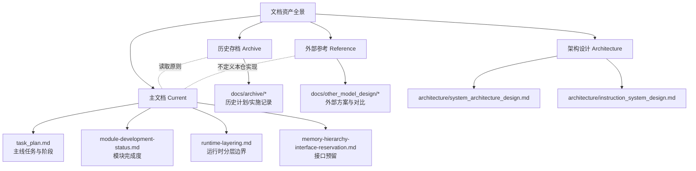
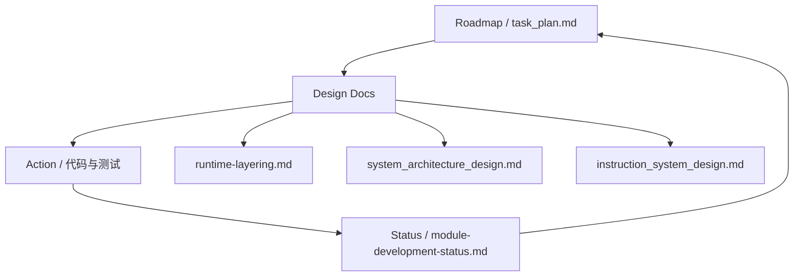

本页是“扩展与贡献指南”分区的入口索引，面向初学者提供一站式的路线图（Roadmap）与设计文档地图（Design Docs Map），帮助你快速定位“当前主线做什么、哪些文档为准、历史材料怎么看”，并指出后续阅读路径与参与方式。你当前所在位置：路线图与设计文档索引 [You are currently here]。Sources: [README.md](docs/README.md#L1-L95)

## 你将从本页获得什么
- 路线图总览：阶段划分、当前阶段与主线任务清单的索引。  
- 设计文档索引：系统架构、指令系统、运行时分层等核心设计文档的快捷入口。  
- 阅读与行动路径：从索引到具体页面的建议阅读顺序与贡献起点。  
以上内容统一基于仓库内现行主文档与状态页，确保“以正式文档与当前代码事实为准”。Sources: [README.md](docs/README.md#L1-L95)

## 文档资产全景（分层与索引）
下图给出文档资产的四象限分层：主文档（当前事实）、历史存档（演进记录）、外部参考（对比材料）、架构设计（结构化设计），用于避免混淆“现行规范 vs 历史资料”。



以上分层与文件定位依据 docs/README 的分类说明与“清理原则”，并补充链接到架构设计目录。Sources: [README.md](docs/README.md#L1-L95), [system_architecture_design.md](docs/architecture/system_architecture_design.md#L1-L200), [instruction_system_design.md](docs/architecture/instruction_system_design.md#L1-L200), [runtime-layering.md](docs/runtime-layering.md#L1-L200)

## 路线图总览（阶段与状态）
项目采用阶段化推进，当前处于“阶段 4：验证与资产整理”（in_progress）。核心目标始终以 cycle time / cycle model 准确性优先，其他能力按需补齐。Sources: [task_plan.md](task_plan.md#L1-L80)

- 阶段与状态概览（摘录）
  - 阶段 1：正式任务收口（complete）
  - 阶段 2：正式设计收口（complete）
  - 阶段 3：主线实现推进（complete）
  - 阶段 4：验证与资产整理（in_progress）
  - 阶段 5：交付与维护（pending）  
以上状态与命名直接来源于任务计划文件。Sources: [task_plan.md](task_plan.md#L20-L120)


阶段推进图用于帮助新同学定位“当前应关注的任务面”，不替代 task_plan.md 的正式定义。Sources: [task_plan.md](task_plan.md#L1-L80)

## 当前主线任务索引（8 条 Track）
主线只保留 8 条任务轨道，确保关注集中与语义一致；其中 cycle accuracy 与观测面（ProgramCycleStats、trace）构成核心。Sources: [module-development-status.md](docs/module-development-status.md#L1-L120), [task_plan.md](task_plan.md#L120-L200)

- 任务轨道（摘录索引）
  1) semantic calibration / cycle accuracy  
  2) ProgramCycleStats + cycle observability  
  3) trace canonical event model  
  4) trace unified entry + disable-trace boundary  
  5) unified logging  
  6) runtime API closure（按需）  
  7) memory pool / mmap residency + ISA validation（按需）  
  8) docs / status tracking  
上述条目与表述与“模块开发状态”与“任务计划”一致，用于快速反向定位原文档。Sources: [module-development-status.md](docs/module-development-status.md#L60-L120), [task_plan.md](task_plan.md#L120-L200)

| 任务轨道 | 关联主文档 | 典型产出 |
|---|---|---|
| Cycle accuracy | task_plan.md | 阶段目标与校准范围 |
| ProgramCycleStats | task_plan.md | 指令/内存计数、派生指标 |
| Trace/Logging | module-development-status.md | canonical/unified/disable-trace 边界 |
| Runtime API（按需） | runtime-layering.md | C ABI 到 ModelRuntime 边界 |
| Memory/ISA（按需） | task_plan.md | mmap-backed Pool、Buffer/Flat L/S 验证 |
该表格仅作索引导航，详细语义以引用文档为准。Sources: [task_plan.md](task_plan.md#L120-L200), [module-development-status.md](docs/module-development-status.md#L1-L120), [runtime-layering.md](docs/runtime-layering.md#L1-L120)

## 架构设计文档索引（Architecture）
- 系统架构设计：描述运行时、程序对象、指令、执行、内存与架构五层关系与职责边界，含结构图与关键类示例。建议先读以建立整体视图。Sources: [system_architecture_design.md](docs/architecture/system_architecture_design.md#L1-L120)
- 指令系统设计：覆盖解析/绑定/执行链路、Handler Registry/Factory 模式与执行流程，适合扩展 ISA 语义的同学。Sources: [instruction_system_design.md](docs/architecture/instruction_system_design.md#L1-L120)
- 运行时分层：明确 HipRuntime 与 ModelRuntime 的职责、ExecEngine 的定位，以及 memory 主线与 kernel launch 主线的交互。Sources: [runtime-layering.md](docs/runtime-layering.md#L1-L200)


关系图体现“运行时分层驱动整体架构、指令系统向执行层供给语义”的阅读顺序。Sources: [system_architecture_design.md](docs/architecture/system_architecture_design.md#L1-L200), [instruction_system_design.md](docs/architecture/instruction_system_design.md#L1-L200), [runtime-layering.md](docs/runtime-layering.md#L1-L200)

## 文档目录速览（可视化）
```
docs/
├── README.md                         ← 文档入口与分层/清理原则
├── module-development-status.md      ← 模块完成度/主线术语/范围
├── runtime-layering.md               ← HipRuntime / ModelRuntime / ExecEngine 分层
├── task_plan.md                      ← 阶段与任务主线
├── architecture/
│   ├── system_architecture_design.md ← 系统架构设计
│   └── instruction_system_design.md  ← 指令系统设计
├── archive/                          ← 历史计划与实施记录（已归档）
└── other_model_design/               ← 外部参考与对比材料
```
该目录速览依据 docs/README 的分层说明与架构子目录实际文件，用于快速建立“看什么、何时看”的心智模型。Sources: [README.md](docs/README.md#L1-L95), [system_architecture_design.md](docs/architecture/system_architecture_design.md#L1-L50), [instruction_system_design.md](docs/architecture/instruction_system_design.md#L1-L50)

## 推荐阅读路径（从索引到行动）
- 第一步：阅读分层与职责边界，明确 Runtime/Program/Execution 的系统性关系：[分层与职责边界总览](10-fen-ceng-yu-zhi-ze-bian-jie-zong-lan)。Sources: [runtime-layering.md](docs/runtime-layering.md#L1-L120)
- 第二步：了解执行模式与 ExecEngine 工作流，建立从 ProgramObject 到 Wave 的执行迁移认知：[执行模式与 ExecEngine 工作流](11-zhi-xing-mo-shi-yu-execengine-gong-zuo-liu)。Sources: [system_architecture_design.md](docs/architecture/system_architecture_design.md#L60-L120)
- 第三步：聚焦 Program/ISA 链路，阅读加载/镜像与指令系统设计：[加载器与镜像格式支持（AMDGPU object/HIP fatbin）](14-jia-zai-qi-yu-jing-xiang-ge-shi-zhi-chi-amdgpu-object-hip-fatbin)，[GCN ISA 解码、描述符与语义处理链](15-gcn-isa-jie-ma-miao-shu-fu-yu-yu-yi-chu-li-lian)。Sources: [instruction_system_design.md](docs/architecture/instruction_system_design.md#L1-L120)
- 第四步：回到路线图，跟踪阶段/任务/完成度变更：[任务计划](task_plan.md)，[模块开发状态](docs/module-development-status.md)。Sources: [task_plan.md](task_plan.md#L1-L120), [module-development-status.md](docs/module-development-status.md#L1-L120)

## 维护与清理规则（如何判断“哪份文档为准”）
- 以主文档为准：README 中“当前主文档”列表定义现行事实（task_plan / my_design / runtime-layering / module-development-status 等）。Sources: [README.md](docs/README.md#L1-L60)
- 历史存档仅作背景：archive 中材料默认不代表当前实现；如有冲突，以当前代码与主文档为准。Sources: [README.md](docs/README.md#L60-L95)
- 外部参考不定义实现：other_model_design 用于思路对比，不要求与代码同步。Sources: [README.md](docs/README.md#L80-L95)

## 版本与更新提示（如何持续对齐）
- 当添加/修改功能，请先更新“模块开发状态”，再回写设计文档，最后在“任务计划”调整阶段/轨道，维持全链一致。Sources: [module-development-status.md](docs/module-development-status.md#L1-L40), [task_plan.md](task_plan.md#L120-L200)
- 运行时与边界变化以 runtime-layering 为准；涉及分层/接口/职责时，优先更新该文档并据此调整代码。Sources: [runtime-layering.md](docs/runtime-layering.md#L1-L200)

## 附：路线图—文档—行动闭环图

该闭环图展示“计划-设计-实现-状态”的循环关系，确保从任务主线出发，回写至状态与设计文档，保持一致性。Sources: [task_plan.md](task_plan.md#L1-L200), [module-development-status.md](docs/module-development-status.md#L1-L200), [runtime-layering.md](docs/runtime-layering.md#L1-L200), [system_architecture_design.md](docs/architecture/system_architecture_design.md#L1-L200), [instruction_system_design.md](docs/architecture/instruction_system_design.md#L1-L200)