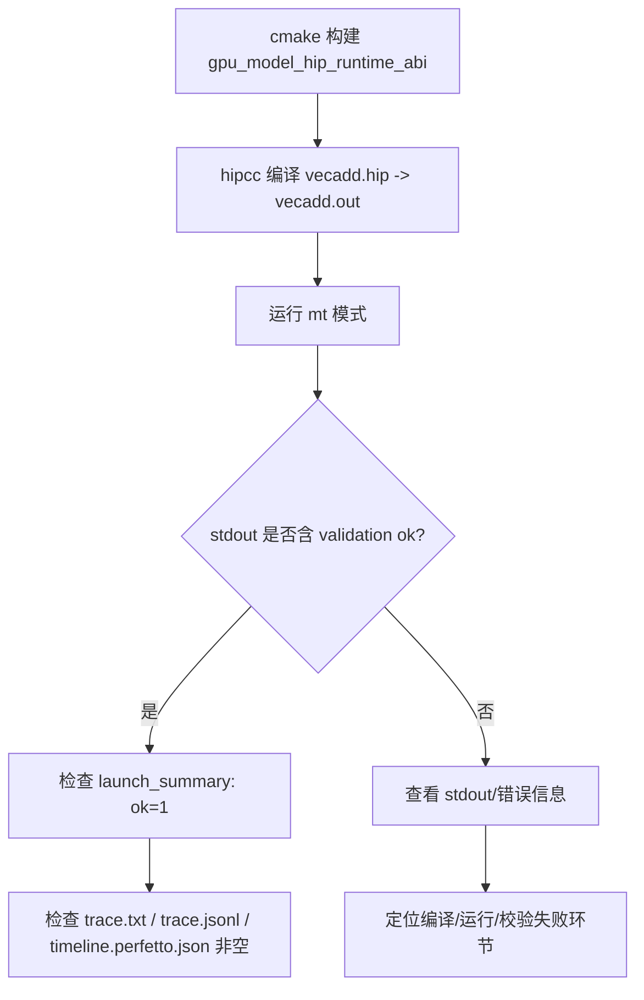

本页面向初学者，带你用最小路径跑通内置示例、判定成功标准，并给出常见问题的快速排查方法；你将学会如何一键运行、查找结果产物、理解执行模式与常用开关，为后续的 Trace 可视化和真实 HIP 程序运行打好基础。Sources: [README.md](README.md#L7-L19) [examples/README.md](examples/README.md#L49-L57)

## 一键跑通第一个示例（VecAdd）
首次推荐路线：先构建，再运行 01 号示例。构建与运行命令如下（默认使用 Ninja 预设和示例脚本）：Sources: [README.md](README.md#L9-L19)
```bash
# 构建（推荐 Ninja 预设）
cmake --preset dev-fast
cmake --build --preset dev-fast

# 运行最小示例
./examples/01-vecadd-basic/run.sh
```
脚本会自动检测并使用 hipcc 编译示例 HIP 源码、加载模型运行时并执行，默认只跑多线程功能模式 mt；这是仓库的最小端到端连通性验证。Sources: [examples/01-vecadd-basic/run.sh](examples/01-vecadd-basic/run.sh#L12-L25) [examples/README.md](examples/README.md#L9-L13) [README.md](README.md#L21-L27)

## 示例执行链路（架构速览）
下图概览 run.sh 的执行链路与关键工件：从 hipcc 编译到运行时拦截，再到执行引擎与 Trace 落盘。理解这条链路有助于定位问题。Sources: [examples/01-vecadd-basic/run.sh](examples/01-vecadd-basic/run.sh#L12-L25) [examples/common.sh](examples/common.sh#L30-L38) [examples/common.sh](examples/common.sh#L84-L136)
```mermaid
flowchart LR
    A[vecadd.hip] --> B[hipcc 编译 -> vecadd.out]
    B --> C[LD_PRELOAD: libgpu_model_hip_runtime_abi.so]
    C --> D{选择执行模式}
    D -->|mt(默认)| E[FunctionalExecEngine 多线程]
    D -->|st| F[FunctionalExecEngine 单线程]
    D -->|cycle| G[CycleExecEngine 周期模型]
    E --> H[Trace 记录器]
    F --> H
    G --> H
    H --> I[results/<mode>/trace.txt]
    H --> J[results/<mode>/trace.jsonl]
    H --> K[results/<mode>/timeline.perfetto.json]
    C --> L[results/<mode>/launch_summary.txt]
```
如图，示例脚本会设置必要环境变量并调用被拦截的 HIP 程序，执行完成后在每个模式目录下生成统一的验证产物。Sources: [examples/common.sh](examples/common.sh#L119-L136) [examples/common.sh](examples/common.sh#L138-L152)

## 成功标准与结果产物
判断“跑通”的最低标准如下：stdout 含有通过标记，launch_summary 标记 ok=1，且三类 Trace 产物非空（VecAdd 默认仅生成 mt 模式目录）。Sources: [examples/README.md](examples/README.md#L49-L57) [examples/01-vecadd-basic/README.md](examples/01-vecadd-basic/README.md#L64-L73)
- stdout.txt 包含 “… validation ok”（VecAdd 为“vecadd validation ok”）Sources: [examples/01-vecadd-basic/README.md](examples/01-vecadd-basic/README.md#L64-L71)
- launch_summary.txt 包含 ok=1Sources: [examples/README.md](examples/README.md#L51-L54)
- trace.txt / trace.jsonl / timeline.perfetto.json 非空Sources: [examples/README.md](examples/README.md#L55-L57) [examples/README.md](examples/README.md#L75-L84)

典型结果目录结构（以 01-vecadd-basic 为例），每个模式目录包含统一的五件核心产物：Sources: [examples/01-vecadd-basic/README.md](examples/01-vecadd-basic/README.md#L45-L60)
- results/vecadd.out（示例可执行文件）Sources: [examples/01-vecadd-basic/README.md](examples/01-vecadd-basic/README.md#L47-L48)
- results/mt/{stdout.txt, trace.txt, trace.jsonl, timeline.perfetto.json, launch_summary.txt}Sources: [examples/01-vecadd-basic/README.md](examples/01-vecadd-basic/README.md#L53-L60)

为了便于程序化校验，脚本还会检查这些关键信号：trace.txt 内含 “GPU_MODEL TRACE”“[EVENTS]”“[SUMMARY]”，trace.jsonl 内含 "run_snapshot"/"summary_snapshot"，timeline.perfetto.json 内含 "traceEvents"。Sources: [examples/common.sh](examples/common.sh#L138-L152)

## 运行模式与默认策略
示例分三种执行模式，默认策略是“非对比型仅跑 mt，对比/可视化例子保留 st/mt/cycle”。初学者建议先接受默认，再在对比型示例里观察不同模式差异。Sources: [examples/README.md](examples/README.md#L7-L13) [examples/README.md](examples/README.md#L16-L21)
- st（SingleThreaded）：单线程功能执行，确定性参考。Sources: [examples/README.md](examples/README.md#L16-L21)
- mt（MultiThreaded）：多线程功能执行，基于 Marl 并行，默认模式。Sources: [examples/README.md](examples/README.md#L16-L21)
- cycle（Cycle）：naive 周期模型，输出时间线估算。Sources: [examples/README.md](examples/README.md#L16-L21)

想要体验多模式对比，优先运行保留 st/mt/cycle 的编号：07、11、12、13；它们专门用于写法/调度/算法对比与可视化。Sources: [examples/README.md](examples/README.md#L22-L39)

## 常用开关（环境变量）
示例脚本在内部设置了执行模式和 Trace 输出相关环境变量，用户通常只需要掌握少量可覆盖的“拨码开关”。下表给出常用项及其作用：Sources: [examples/common.sh](examples/common.sh#L84-L136) [README.md](README.md#L34-L39)
- GPU_MODEL_USE_HIPCC_CACHE（默认 1）：是否复用 hipcc 编译缓存；置 0 可强制干净编译示例。示例命令：GPU_MODEL_USE_HIPCC_CACHE=0 ./examples/01-vecadd-basic/run.shSources: [examples/README.md](examples/README.md#L12-L13) [examples/README.md](examples/README.md#L71-L73) [examples/common.sh](examples/common.sh#L30-L38)
- GPU_MODEL_MT_WORKERS（可选）：覆盖 mt 模式的工作线程数，默认 4。仅当以 mt 运行时生效。Sources: [examples/common.sh](examples/common.sh#L96-L104) [examples/common.sh](examples/common.sh#L128-L133)
- GPU_MODEL_CYCLE_FUNCTIONAL_MODE（可选）：在 cycle 下指定底层功能路径使用 st 或 mt。用于保留对比型示例的组合评测。Sources: [examples/common.sh](examples/common.sh#L104-L107)

脚本会自动设置如下键值，无需手工配置：GPU_MODEL_EXECUTION_MODE、GPU_MODEL_FUNCTIONAL_MODE、GPU_MODEL_DISABLE_TRACE=0、GPU_MODEL_TRACE_DIR、GPU_MODEL_LOG_*，并通过 LD_PRELOAD 注入运行时以拦截 HIP API。Sources: [examples/common.sh](examples/common.sh#L119-L136)

## 分步运行与验证（流程图）
下面的流程图展示了“构建 → 编译示例 → 运行 → 验证”的最小闭环，适合对照执行与排错：Sources: [README.md](README.md#L9-L19) [examples/01-vecadd-basic/run.sh](examples/01-vecadd-basic/run.sh#L12-L25) [examples/common.sh](examples/common.sh#L138-L159)

建议在首次运行时，重点只看 3 个文件：results/mt/stdout.txt、results/mt/launch_summary.txt、results/mt/trace.txt；它们能快速确认最小链路是否连通。Sources: [examples/01-vecadd-basic/README.md](examples/01-vecadd-basic/README.md#L82-L95)

## 示例目录与阅读顺序
示例按难度编号组织，01-05 为基础功能、06 为 MFMA 探针、07 为写法对比、08-10 为复杂同步、11-13 为可视化/对比。你可以沿此顺序逐步扩展验证覆盖面。Sources: [examples/README.md](examples/README.md#L22-L39) [examples/README.md](examples/README.md#L41-L48)

其中 01-vecadd-basic 是最小基线：确认 HIP 源编译、运行时拦截、三模式可通（脚本默认只跑 mt）、trace/timeline 落盘完整。若它不稳定，建议先不要继续更复杂示例。Sources: [examples/01-vecadd-basic/README.md](examples/01-vecadd-basic/README.md#L3-L13) [examples/01-vecadd-basic/run.sh](examples/01-vecadd-basic/run.sh#L21-L25)

## 故障排查（最短路径）
遇到失败，按如下顺序处理：Sources: [examples/README.md](examples/README.md#L58-L73)
- 构建是否成功：cmake --build --preset dev-fastSources: [examples/README.md](examples/README.md#L60-L63)
- 测试或最小例子能否跑通：先运行单个示例并检查 stdoutSources: [examples/README.md](examples/README.md#L67-L70)
- 如需禁用示例编译缓存进行排查：GPU_MODEL_USE_HIPCC_CACHE=0 ./examples/01-vecadd-basic/run.shSources: [examples/README.md](examples/README.md#L71-L73)

进一步核对 trace 产物结构化信号：trace.txt 中是否包含 “GPU_MODEL TRACE”“[EVENTS]”“[SUMMARY]”；trace.jsonl 是否包含 "run_snapshot"/"summary_snapshot"；timeline.perfetto.json 是否包含 "traceEvents" 字段。Sources: [examples/common.sh](examples/common.sh#L138-L152)

## 批量运行与验证（可选）
需要一次性覆盖更多示例与测试时，可使用仓库脚本：run_exec_checks.sh 用于最小基础执行检查；run_push_gate.sh 则并行跑完整门禁（包含全部示例 01-11，按对比策略选择模式），默认关闭示例编译缓存以保证结果可重复。结果日志将统一落到 results/push-gate/ 下。Sources: [scripts/README.md](scripts/README.md#L40-L42) [scripts/README.md](scripts/README.md#L20-L39)

如果你只关心非 Trace 的快速语义验证，可用 run_disable_trace_smoke.sh，脚本会统一设置 GPU_MODEL_DISABLE_TRACE=1 并执行一套冒烟集合。Sources: [scripts/README.md](scripts/README.md#L54-L61)

## 参考对照与延伸
- 想看更丰富的可视化时间线，请继续阅读“可视化 Trace（Perfetto）”页面，学习如何用 Perfetto/Chrome Trace 阅读 timeline.perfetto.json。Sources: [examples/README.md](examples/README.md#L75-L84)
- 当你已掌握示例运行与验证，下一步可实践“使用真实 HIP 程序运行”，让主机端原生运行、内核在模型中执行的工作流落地。Sources: [README.md](README.md#L37-L39)

建议下一步阅读： [可视化 Trace（Perfetto）](5-ke-shi-hua-trace-perfetto) → [使用真实 HIP 程序运行](6-shi-yong-zhen-shi-hip-cheng-xu-yun-xing) → 如需批量验证再看 [常用脚本与回归套件](7-chang-yong-jiao-ben-yu-hui-gui-tao-jian)。Sources: [scripts/README.md](scripts/README.md#L20-L39) [README.md](README.md#L55-L74)