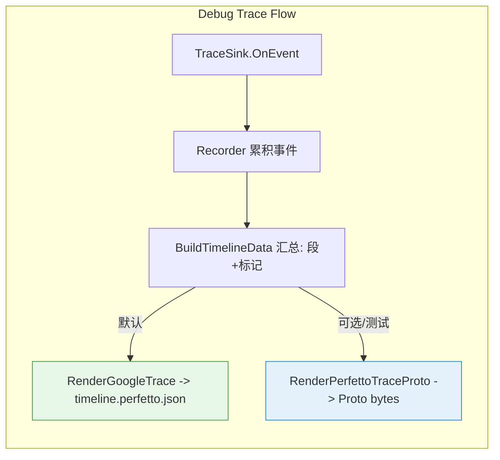
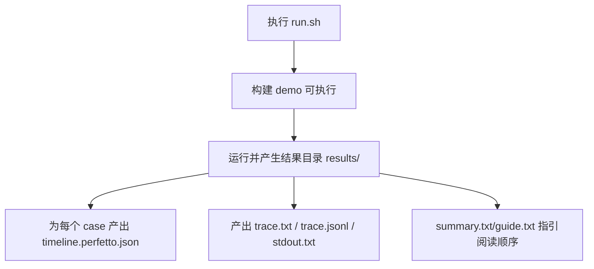
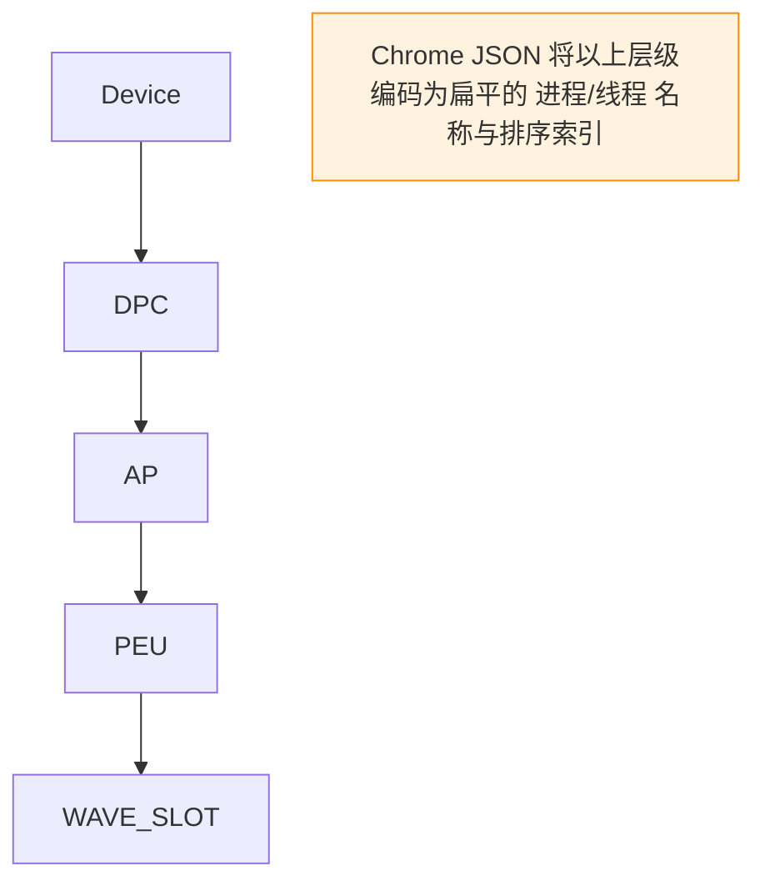

本页面向初学者，带你用项目内置的导出与示例，快速生成并阅读 GPU 周期级时间线的 Perfetto 视图（实际格式为 Chrome trace JSON，便于 grep/diff 与可视化），聚焦“能看见什么、如何生成、字段含义与排查”，不涉及其他子系统细节与业务代码调优方法。Sources: [cycle_timeline_google_trace.cpp](src/debug/timeline/cycle_timeline_google_trace.cpp#L90-L111) [trace_artifact_recorder.cpp](src/debug/trace/trace_artifact_recorder.cpp#L103-L108) [README.md](examples/11-perfetto-waitcnt-slots/README.md#L88-L95)

## 架构总览：从 Trace 事件到 Perfetto 时间线
系统通过 TraceSink 收集事件到 Recorder，再由 CycleTimelineRenderer 汇总语义数据并导出两类格式：默认写出 Chrome JSON 到 timeline.perfetto.json；同时提供原生 Perfetto Proto 导出能力，当前主要用于测试验证与后续扩展。Sources: [cycle_timeline.h](src/gpu_model/debug/timeline/cycle_timeline.h#L32-L38) [trace_artifact_recorder.cpp](src/debug/trace/trace_artifact_recorder.cpp#L103-L108) [trace_perfetto_test.cpp](tests/runtime/trace_perfetto_test.cpp#L77-L90)

渲染器对外暴露 RenderGoogleTrace 与 RenderPerfettoTraceProto 两个入口；产物写盘由 TraceArtifactRecorder 完成，默认输出 timeline.perfetto.json 是 Chrome JSON（元数据带 perfetto_format=chrome_json 与层级/轨道说明）。Sources: [cycle_timeline.h](src/gpu_model/debug/timeline/cycle_timeline.h#L32-L38) [trace_artifact_recorder.cpp](src/debug/trace/trace_artifact_recorder.cpp#L101-L108) [cycle_timeline_google_trace.cpp](src/debug/timeline/cycle_timeline_google_trace.cpp#L90-L111)

## 相关文件与定位（迷你结构图）
- 导出入口：CycleTimelineRenderer（Google JSON 与 Perfetto Proto）→ 被 TraceArtifactRecorder 调用写出 timeline.perfetto.json。Sources: [cycle_timeline.h](src/gpu_model/debug/timeline/cycle_timeline.h#L32-L38) [trace_artifact_recorder.cpp](src/debug/trace/trace_artifact_recorder.cpp#L103-L108)
- Chrome JSON 渲染实现与元数据说明：cycle_timeline_google_trace.cpp。Sources: [cycle_timeline_google_trace.cpp](src/debug/timeline/cycle_timeline_google_trace.cpp#L90-L111)
- Perfetto 原生 Proto 构建（TrackDescriptor/TrackEvent，UUID 层级）：cycle_timeline_perfetto.cpp 与 trace_perfetto_proto.*。Sources: [cycle_timeline_perfetto.cpp](src/debug/timeline/cycle_timeline_perfetto.cpp#L30-L39) [trace_perfetto_proto.h](src/debug/timeline/trace_perfetto_proto.h#L20-L25) [trace_perfetto_proto.cpp](src/debug/timeline/trace_perfetto_proto.cpp#L64-L81)
- 专项示例：examples/11-perfetto-waitcnt-slots（Waitcnt/切换/并发观察）。Sources: [README.md](examples/11-perfetto-waitcnt-slots/README.md#L5-L14)

## 快速上手：生成时间线
- 运行内置示例脚本（会自动构建并生成 9 组结果目录与关键产物）：
  - ./examples/11-perfetto-waitcnt-slots/run.sh。Sources: [README.md](examples/11-perfetto-waitcnt-slots/README.md#L52-L55)
- 预期每个 case 目录包含 timeline.perfetto.json、trace.txt、trace.jsonl 等关键文件；根目录 summary.txt/guide.txt 作为索引。Sources: [README.md](examples/11-perfetto-waitcnt-slots/README.md#L58-L78) [run.sh](examples/11-perfetto-waitcnt-slots/run.sh#L48-L55)
- 脚本末尾会打印推荐查阅顺序（从最容易观察“空泡”的 case 开始），便于你快速定位有代表性的视图。Sources: [run.sh](examples/11-perfetto-waitcnt-slots/run.sh#L66-L83)

脚本会校验各 case 输出的完整性、拆分超长 trace.txt，并在 summary.txt 写入推荐入口，从而保证你拿到的 timeline.perfetto.json 可直接用于文本检查与可视化。Sources: [run.sh](examples/11-perfetto-waitcnt-slots/run.sh#L55-L63) [run.sh](examples/11-perfetto-waitcnt-slots/run.sh#L66-L83)

## 结果目录与优先阅读顺序
- 目录分布：results/{st,mt,cycle}/{timeline_gap,same_peu_slots,switch_away_heavy}，各含标准产物集合。Sources: [README.md](examples/11-perfetto-waitcnt-slots/README.md#L60-L69)
- 推荐优先阅读 timeline.perfetto.json（Chrome trace JSON，适合文本检查/grep/diff），其次 trace.jsonl（逐事件字段），最后 trace.txt（人读预览/分片正文）。Sources: [README.md](examples/11-perfetto-waitcnt-slots/README.md#L88-L95)

## 时间线上能看到什么（面向观察任务）
- timeline_gap：明确的 s_waitcnt 导致的空泡，随后出现 load_arrive，再继续执行，便于验证等待-到达节奏。Sources: [README.md](examples/11-perfetto-waitcnt-slots/README.md#L104-L113) [README.md](examples/11-perfetto-waitcnt-slots/README.md#L116-L121)
- same_peu_slots：在 cycle 模式下展示 resident_fixed 槽位与多 PEU；在 st/mt 下展示 logical_unbounded 槽位与频繁 wave_switch_away。Sources: [README.md](examples/11-perfetto-waitcnt-slots/README.md#L121-L132) [README.md](examples/11-perfetto-waitcnt-slots/README.md#L133-L149)
- switch_away_heavy：高频 wave_switch_away，呈现调度轮转；waitcnt 事件不是主角。Sources: [README.md](examples/11-perfetto-waitcnt-slots/README.md#L150-L156) [README.md](examples/11-perfetto-waitcnt-slots/README.md#L157-L165)

## 轨道层级与布局说明（Chrome JSON）
Chrome JSON 导出在 metadata 中声明 time_unit=cycle、slot_models 集合与层级 Device/DPC/AP/PEU/WAVE_SLOT，并注明“flattened path process/thread”布局与 chrome_json 格式的局限，便于在视图中理解每条轨的来源与含义。Sources: [cycle_timeline_google_trace.cpp](src/debug/timeline/cycle_timeline_google_trace.cpp#L90-L111)

各层级在 Chrome JSON 中通过 process_name/thread_name + sort_index 编码，配合“扁平化路径标签”实现层次感；这是当前默认导出策略。Sources: [cycle_timeline_google_trace.cpp](src/debug/timeline/cycle_timeline_google_trace.cpp#L174-L190) [cycle_timeline_google_trace.cpp](src/debug/timeline/cycle_timeline_google_trace.cpp#L101-L107)

## 事件切片与标记：时间线元素构成
- 指令切片（长条）：来源于 Issue→Commit 配对，记录 issue_cycle、commit_cycle、render_duration_cycles、pc、block/wave 等，并剔除了 s_waitcnt 指令的切片以避免噪音。Sources: [cycle_timeline.cpp](src/debug/timeline/cycle_timeline.cpp#L180-L196) [cycle_timeline_google_trace.cpp](src/debug/timeline/cycle_timeline_google_trace.cpp#L53-L67)
- 标记事件（瞬时点）：包含 wave_launch/wave_generate/wave_dispatch/slot_bind/issue_select、arrive、stall、barrier、wave_exit、wave_switch_away 等，按 Default 粒度屏蔽了部分频繁事件（如 IssueSelect、WaveSwitchAway 和某些 Stall）。Sources: [cycle_timeline.cpp](src/debug/timeline/cycle_timeline.cpp#L209-L258) [cycle_timeline.cpp](src/debug/timeline/cycle_timeline.cpp#L108-L123)

## 统一命名与示例校验
导出统一使用“规范化命名”（canonical_name/presentation_name）以避免对消息文本做二义性解析，测试明确断言出现 wave_launch、wave_exit 等名称；同时 recorder 侧为常见事件附带 canonical_name 与 category，便于后续可视化与筛选。Sources: [trace_perfetto_test.cpp](tests/runtime/trace_perfetto_test.cpp#L146-L160) [trace_recorder_test.cpp](tests/runtime/trace_recorder_test.cpp#L183-L199)

## 字段速查（Chrome JSON args）
下表列出最常用字段，便于你在 timeline.perfetto.json 中按需 grep/筛选：
- 位置与身份：dpc/ap/peu/slot/block/wave，用于定位事件归属与并行关系。Sources: [cycle_timeline_google_trace.cpp](src/debug/timeline/cycle_timeline_google_trace.cpp#L82-L88)
- 指令切片：issue_cycle、commit_cycle、render_duration_cycles、pc、slot_model。Sources: [cycle_timeline_google_trace.cpp](src/debug/timeline/cycle_timeline_google_trace.cpp#L53-L67)
- 语义补充：category/canonical_name/presentation_name/display_name、waitcnt_*（阈值、挂起数、阻塞域）、flow_*（若存在）。Sources: [trace_event_export.cpp](src/debug/trace/trace_event_export.cpp#L91-L119) [trace_event_export.cpp](src/debug/trace/trace_event_export.cpp#L151-L179)

## 导出格式对比（当前默认与可选）
- Chrome trace JSON（默认）：由 TraceArtifactRecorder 写出 timeline.perfetto.json，结构含 traceEvents 与 metadata，适合文本检查/版本对比；空记录时输出空 traceEvents 与 metadata。Sources: [trace_artifact_recorder.cpp](src/debug/trace/trace_artifact_recorder.cpp#L103-L108) [trace_perfetto_test.cpp](tests/runtime/trace_perfetto_test.cpp#L81-L90) [cycle_timeline.cpp](src/debug/timeline/cycle_timeline.cpp#L267-L277)
- Perfetto 原生 Proto（可选/测试）：构建 TrackDescriptor 树（Device/Runtime/…/Slot）与 TrackEvent 包，编码为 protobuf wire 格式字符串；当前在测试中解析校验 canonical 名称。Sources: [cycle_timeline_perfetto.cpp](src/debug/timeline/cycle_timeline_perfetto.cpp#L30-L39) [cycle_timeline_perfetto.cpp](src/debug/timeline/cycle_timeline_perfetto.cpp#L115-L159) [trace_perfetto_proto.cpp](src/debug/timeline/trace_perfetto_proto.cpp#L64-L81) [trace_perfetto_test.cpp](tests/runtime/trace_perfetto_test.cpp#L146-L160)

## 示例运行与结果解读路径
- 一键运行：./examples/11-perfetto-waitcnt-slots/run.sh；成功后 summary.txt 中包含 “perfetto_waitcnt_slots_demo ok”，并列出推荐 quick-start 路径。Sources: [README.md](examples/11-perfetto-waitcnt-slots/README.md#L96-L105) [run.sh](examples/11-perfetto-waitcnt-slots/run.sh#L66-L83)
- 结果速读：优先打开 timeline.perfetto.json；空泡优先看 cycle/timeline_gap；并发与槽位分配看 same_peu_slots；调度节奏看 switch_away_heavy。Sources: [README.md](examples/11-perfetto-waitcnt-slots/README.md#L86-L95) [README.md](examples/11-perfetto-waitcnt-slots/README.md#L166-L174)

## 故障排查（Troubleshooting）
- timeline.perfetto.json 不存在/为空：确认 run.sh 成功完成并通过断言；若 recorder 无事件，导出将返回空 traceEvents 但含 metadata（time_unit/slot_models）。Sources: [run.sh](examples/11-perfetto-waitcnt-slots/run.sh#L55-L63) [cycle_timeline.cpp](src/debug/timeline/cycle_timeline.cpp#L269-L277)
- trace.txt 过长难以阅读：脚本会在 >2000 行时自动分片到 trace_parts，并在 trace.txt 写入预览头与分片提示。Sources: [run.sh](examples/11-perfetto-waitcnt-slots/run.sh#L20-L46)
- 观察不到 waitcnt 空泡或 switch_away：优先对照三个子 case 的预期现象核对导出语义与事件布局，而非怀疑可视化本身。Sources: [README.md](examples/11-perfetto-waitcnt-slots/README.md#L185-L188) [README.md](examples/11-perfetto-waitcnt-slots/README.md#L104-L113)

## 行动清单（Action）
- 执行 ./examples/11-perfetto-waitcnt-slots/run.sh 生成 9 组时间线产物。Sources: [README.md](examples/11-perfetto-waitcnt-slots/README.md#L52-L55)
- 依照 summary.txt 的推荐顺序，先读 cycle/timeline_gap 的 timeline.perfetto.json，验证空泡与 load_arrive。Sources: [run.sh](examples/11-perfetto-waitcnt-slots/run.sh#L66-L83)
- 使用 grep 在 timeline.perfetto.json 中检索 wave_launch/wave_exit、load_arrive、stall/waitcnt_global 等关键标记，建立基本的时间线心智模型。Sources: [trace_perfetto_test.cpp](tests/runtime/trace_perfetto_test.cpp#L77-L90) [trace_recorder_test.cpp](tests/runtime/trace_recorder_test.cpp#L183-L199)

## 进一步阅读（建议路线）
- 想系统理解 trace 字段含义与开关策略：请继续阅读 [Trace 格式、字段与开关策略](22-trace-ge-shi-zi-duan-yu-kai-guan-ce-lue)。Sources: [trace_event_export.cpp](src/debug/trace/trace_event_export.cpp#L91-L119)
- 想完整跑通从示例到验证的流程：请参考 [运行示例与验证](4-yun-xing-shi-li-yu-yan-zheng)。Sources: [README.md](examples/11-perfetto-waitcnt-slots/README.md#L96-L105)
- 想在真实 HIP 程序上观察时间线：请移步 [使用真实 HIP 程序运行](6-shi-yong-zhen-shi-hip-cheng-xu-yun-xing)。Sources: [trace_artifact_recorder.cpp](src/debug/trace/trace_artifact_recorder.cpp#L101-L108)