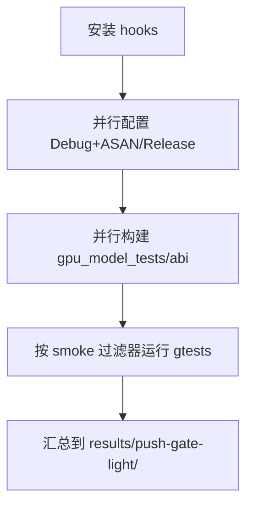
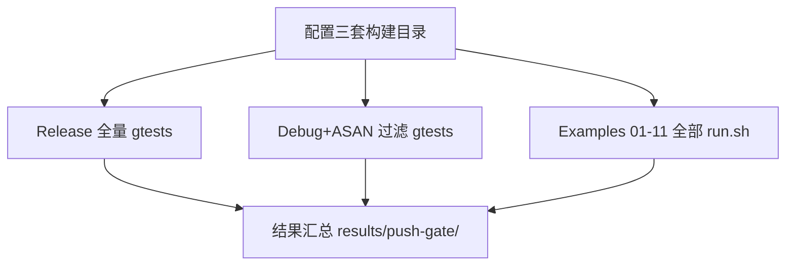
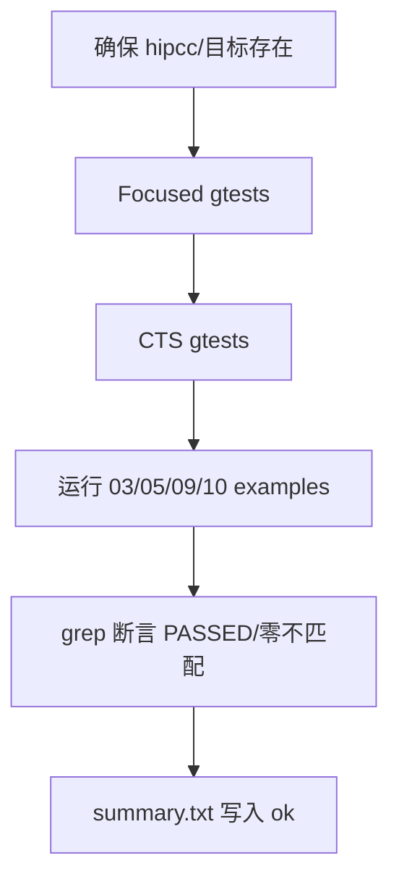
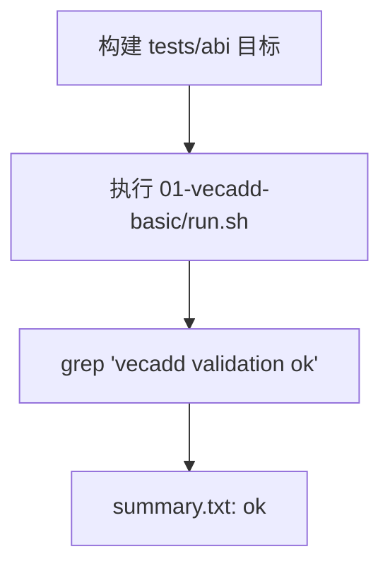

本页聚焦仓库内的常用脚本与回归套件，帮助初学者用一条命令完成提交前门禁、专项回归与最小执行验证，并指引生成类与覆盖率报告脚本的基本用法与产物定位。读完本页，你可以在本地完成“轻量门禁 → 全量门禁 → 专项回归 → 报告生成”的完整闭环。Sources: [README.md](scripts/README.md#L5-L21)

## 目录速览与角色定位
脚本目录承担“门禁/回归编排、ISA/Opcode 生成、覆盖率报告、环境辅助”四类职责；下列清单为主入口与其默认行为的权威说明。Sources: [README.md](scripts/README.md#L5-L21)

- 目录结构（节选）
  - install_git_hooks.sh（安装本地 git hooks，启用 pre-push 轻量门禁）
  - run_push_gate_light.sh（提交前轻量门禁：并行跑 Release/Debug+ASAN smoke 集）
  - run_push_gate.sh（手动全量门禁：并行跑 Release/Debug+ASAN 全量测试 + 全部 examples）
  - run_shared_heavy_regression.sh / run_real_hip_kernel_regression.sh / run_abi_regression.sh / run_scaling_regression.sh / run_disable_trace_smoke.sh（专项回归）
  - run_exec_checks.sh（最小执行检查）
  - gen_gcn_isa_db.py / gen_gcn_full_opcode_table.py / report_isa_coverage.py（生成与覆盖率报告）
  - emit_amdgpu_asm.sh（将 LLVM IR 降为 AMDGPU 汇编，要求 llc）Sources: [README.md](scripts/README.md#L7-L19)

为便于初学者对“门禁编排”形成直观认识，下面给出一个抽象化的工作流示意图，反映轻量/全量门禁各自并行单元与日志产物目录。Sources: [run_push_gate.sh](scripts/run_push_gate.sh#L53-L66)

```mermaid
flowchart LR
  subgraph LightGate[轻量门禁 run_push_gate_light.sh]
    A1[配置+构建 Debug+ASAN] --> B1[运行 smoke gtests]
    A2[配置+构建 Release] --> B2[运行 smoke gtests]
    B1 --> C1[results/push-gate-light/*.log]
    B2 --> C1
  end

  subgraph FullGate[全量门禁 run_push_gate.sh]
    D1[配置+构建 Debug+ASAN] --> E1[过滤 gtests（排除规模测试）]
    D2[配置+构建 Release] --> E2[全量 gtests]
    D3[配置+构建 Examples] --> E3[examples 01-11 全部 run.sh]
    E1 --> F[results/push-gate/*.{log,xml,slowest.txt}]
    E2 --> F
    E3 --> F
  end
```
Sources: [run_push_gate_light.sh](scripts/run_push_gate_light.sh#L8-L18)

## 门禁脚本总览（提交前/本地全量）
本节汇总两类门禁脚本的默认目标、环境变量、构建/日志目录约定，建议开发者在日常提交前优先执行轻量门禁，通过率稳定后再跑全量门禁以覆盖 examples。Sources: [README.md](scripts/README.md#L11-L39)

- 轻量门禁：run_push_gate_light.sh
  - 并行运行 Debug+ASAN 与 Release 两条轻量 smoke 线，默认 gtest 过滤器可用 GPU_MODEL_GATE_LIGHT_GTEST_FILTER 覆盖，日志落在 results/push-gate-light/。Sources: [run_push_gate_light.sh](scripts/run_push_gate_light.sh#L8-L13)
  - 构建目标：gpu_model_tests 与 gpu_model_hip_runtime_abi；各自独立配置与构建，互不影响。Sources: [run_push_gate_light.sh](scripts/run_push_gate_light.sh#L31-L37)

- 全量门禁：run_push_gate.sh
  - 三条并行流水：Debug+ASAN（过滤掉 RequestedShapes/ThreadScales）、Release（全量 gpu_model_tests）、Examples（01-11 全部 run.sh，比较/可视化类保留多模式），日志与 XML/耗时 Top20 汇总写入 results/push-gate/。Sources: [run_push_gate.sh](scripts/run_push_gate.sh#L68-L82)
  - examples 运行时显式关闭 GPU_MODEL_USE_HIPCC_CACHE 以保证可重复性。Sources: [run_push_gate.sh](scripts/run_push_gate.sh#L108-L111)

表：门禁脚本关键参数与产物概览（阅读表前请先执行 scripts/install_git_hooks.sh 以启用 pre-push 轻量门禁）
- run_push_gate_light.sh：JOBS 并行度、GPU_MODEL_GATE_LIGHT_GTEST_FILTER；构建目录 build-asan/build-gate-release；日志 results/push-gate-light/*.log。Sources: [run_push_gate_light.sh](scripts/run_push_gate_light.sh#L6-L13)
- run_push_gate.sh：JOBS、GPU_MODEL_GATE_DEBUG_ASAN_GTEST_FILTER；构建目录 build-asan/build-gate-release/build-gate-examples；日志 results/push-gate/* 与 *.xml/*.slowest.txt。Sources: [run_push_gate.sh](scripts/run_push_gate.sh#L9-L12)

## 动手：提交前轻量门禁（pre-push）
建议工作流：先安装 hooks，然后在每次 git push 前自动触发 run_push_gate_light.sh；也可手动执行以快速自检。Sources: [install_git_hooks.sh](scripts/install_git_hooks.sh#L6-L12)


Sources: [pre-push](.githooks/pre-push#L4-L6)

若需调整冒烟集合，设置 GPU_MODEL_GATE_LIGHT_GTEST_FILTER 后再执行脚本；完成后在 results/push-gate-light/ 下检查 *.log。Sources: [run_push_gate_light.sh](scripts/run_push_gate_light.sh#L10-L13)

## 动手：本地全量门禁（手动）
当轻量门禁通过后，执行 run_push_gate.sh 以获得完整置信度：并行跑 Debug+ASAN/Release 全量测试与全部 examples；同时生成 XML 与最慢 Top20 汇总文本，便于优化。Sources: [run_push_gate.sh](scripts/run_push_gate.sh#L53-L66)


Sources: [run_push_gate.sh](scripts/run_push_gate.sh#L84-L111)

注意：examples 运行覆盖比较/可视化类示例的多模式；且显式禁止 hipcc cache 以确保结果可重复。Sources: [run_push_gate.sh](scripts/run_push_gate.sh#L92-L111)

## 专项回归套件
专项脚本将核心风险面以“主题环（ring）”方式集中验证：Focused gtests → CTS → 示例校验 → 结果断言，失败即退出，适合在专题开发时高频运行。Sources: [README.md](scripts/README.md#L40-L61)

- Shared-Heavy 回归：run_shared_heavy_regression.sh
  - 聚焦共享内存与同步重负载路径：包含解码/ABI/运行时/并行执行的 Focused gtests、HIP CTS/Feature CTS 的 100 用例计数检查，外加 03/05/09/10 四个 examples 校验零不匹配。Sources: [run_shared_heavy_regression.sh](scripts/run_shared_heavy_regression.sh#L16-L33)
  - 通过 grep 断言 PASSED 与各示例 mismatches=0，产物写入 <build>/shared-heavy-regression。Sources: [run_shared_heavy_regression.sh](scripts/run_shared_heavy_regression.sh#L54-L66)


Sources: [run_shared_heavy_regression.sh](scripts/run_shared_heavy_regression.sh#L11-L19)

- 真实 HIP Kernel 回归：run_real_hip_kernel_regression.sh
  - 先复用 Shared-Heavy ring，再补原子算子聚焦 gtests 与 04-atomic-reduction 示例值校验（257）。Sources: [run_real_hip_kernel_regression.sh](scripts/run_real_hip_kernel_regression.sh#L21-L33)

- ABI 回归：run_abi_regression.sh
  - 覆盖 by-value aggregate、三维 hidden-args/builtin-ids、llvm-mc ABI 固件对象；以集中 gtest 过滤器执行并断言 PASSED。Sources: [run_abi_regression.sh](scripts/run_abi_regression.sh#L16-L33)

- 规模/形状回归：run_scaling_regression.sh
  - 仅运行 RequestedShapes/* 与 RequestedThreadScales/*，快速验证规模敏感路径。Sources: [run_scaling_regression.sh](scripts/run_scaling_regression.sh#L11-L13)

- 关闭 Trace 冒烟：run_disable_trace_smoke.sh
  - 统一设置 GPU_MODEL_DISABLE_TRACE=1，验证 runtime/execution/cycle stats 在不依赖 trace 时仍保持正确；支持 GPU_MODEL_DISABLE_TRACE_GTEST_FILTER 覆盖集合。Sources: [run_disable_trace_smoke.sh](scripts/run_disable_trace_smoke.sh#L13-L16)

## 最小执行检查（一分钟自检）
run_exec_checks.sh 构建最小目标后，直接运行 examples/01-vecadd-basic，并通过 grep “vecadd validation ok” 验证端到端路径与输出正确性，适合研发自检或 CI 烟测。Sources: [run_exec_checks.sh](scripts/run_exec_checks.sh#L12-L21)


Sources: [run_exec_checks.sh](scripts/run_exec_checks.sh#L15-L23)

## 生成与报告脚本
- emit_amdgpu_asm.sh：将 LLVM IR (.ll) 通过 llc 生成 AMDGPU 汇编（可选 mcpu，默认 gfx900）；会校验输入文件存在与 llc 可用。用法：emit_amdgpu_asm.sh input.ll output.s [gfx_target]。Sources: [emit_amdgpu_asm.sh](scripts/emit_amdgpu_asm.sh#L4-L12)

- gen_gcn_isa_db.py：从 YAML 规范加载指令元信息，生成包含指令格式、操作数、隐式寄存器、标志位与编码定义的 C++ 头/实现片段（脚本内定义了完整的结构体与枚举映射）。Sources: [gen_gcn_isa_db.py](scripts/gen_gcn_isa_db.py#L97-L125)

- gen_gcn_full_opcode_table.py：遍历 LLVM AMDGPU TableGen (*.td) 规则，解析 SOP/VOP/DS/SMEM/FLAT/MIMG 等家族的 opcode→mnemonic 映射，输出完整 opcode 表。Sources: [gen_gcn_full_opcode_table.py](scripts/gen_gcn_full_opcode_table.py#L64-L81)

- report_isa_coverage.py：读取 src/spec/gcn_db/instructions.yaml 的受管集合，对照工程与测试源码中出现的助记符，统计 Raw-Object 支持、Decode/Exec/Loader 测试命中与家族/格式维度覆盖率，并生成 Markdown 报告。Sources: [report_isa_coverage.py](scripts/report_isa_coverage.py#L15-L23)

报告脚本内部构建 coverage 集合、分组统计与 Markdown 表格，包含生成时间、唯一指令计数与各集合命中率；适合配合“技术深潜-ISA 覆盖率生成与报告解读”。Sources: [report_isa_coverage.py](scripts/report_isa_coverage.py#L141-L159)

## 环境准备与 Git Hooks
执行 scripts/install_git_hooks.sh 将 core.hooksPath 指向仓库 .githooks，并赋可执行位；随后 pre-push 钩子会自动调用 run_push_gate_light.sh 作为轻量门禁入口。Sources: [install_git_hooks.sh](scripts/install_git_hooks.sh#L6-L9)

pre-push 逻辑极简：解析仓库根目录后直接运行 scripts/run_push_gate_light.sh，建议在首次 clone 后即执行 install_git_hooks.sh。Sources: [pre-push](.githooks/pre-push#L4-L6)

## 常用环境变量与行为速查
- JOBS：并行构建/测试并发度（所有门禁/回归脚本均支持，若未设置默认 8）。Sources: [run_push_gate.sh](scripts/run_push_gate.sh#L10-L18)
- GPU_MODEL_GATE_LIGHT_GTEST_FILTER：轻量门禁的 gtest 过滤器覆盖。Sources: [README.md](scripts/README.md#L18-L19)
- GPU_MODEL_GATE_DEBUG_ASAN_GTEST_FILTER：全量门禁 Debug+ASAN 过滤器覆盖（默认排除规模/形状类）。Sources: [run_push_gate.sh](scripts/run_push_gate.sh#L11-L12)
- GPU_MODEL_GATE_LOG_DIR / GPU_MODEL_GATE_{DEBUG,RELEASE,EXAMPLES}_BUILD_DIR：重定位日志/构建目录。Sources: [run_push_gate.sh](scripts/run_push_gate.sh#L6-L12)
- GPU_MODEL_DISABLE_TRACE / GPU_MODEL_DISABLE_TRACE_GTEST_FILTER：关闭 trace 冒烟与集合覆盖。Sources: [run_disable_trace_smoke.sh](scripts/run_disable_trace_smoke.sh#L13-L16)
- GPU_MODEL_USE_HIPCC_CACHE=0：在 examples 全量门禁中显式关闭缓存，确保可重复。Sources: [run_push_gate.sh](scripts/run_push_gate.sh#L108-L111)

## 故障排查（入门向）
- 提示“missing llc in PATH”：安装 LLVM 工具链并确保 llc 在 PATH 中；emit_amdgpu_asm.sh 会在缺失时直接退出。Sources: [emit_amdgpu_asm.sh](scripts/emit_amdgpu_asm.sh#L18-L24)
- 提示“hipcc 不存在”或相关构建失败：专项回归脚本会使用 gpu_model_require_cmd hipcc 进行前置检查，优先安装 HIP 工具链再运行。Sources: [run_shared_heavy_regression.sh](scripts/run_shared_heavy_regression.sh#L11-L13)
- 门禁日志在哪：轻量门禁 results/push-gate-light， 全量门禁 results/push-gate，并包含 XML 与 slowest.txt。Sources: [run_push_gate.sh](scripts/run_push_gate.sh#L61-L66)

## 建议的阅读与实践路径
- 若想进一步理解如何运行与验证示例，请阅读并实践“运行示例与验证”页面：[运行示例与验证](4-yun-xing-shi-li-yu-yan-zheng)。Sources: [run_push_gate.sh](scripts/run_push_gate.sh#L92-L111)
- 若要系统理解测试布局、类别与覆盖策略，请转到“测试与质量保障-测试布局与类别”页面：[测试布局与类别（功能/周期/加载器等）](24-ce-shi-bu-ju-yu-lei-bie-gong-neng-zhou-qi-jia-zai-qi-deng)。Sources: [run_push_gate.sh](scripts/run_push_gate.sh#L58-L66)
- 需要解读 ISA 覆盖率报告与生成流程，请前往对应说明页面：[ISA 覆盖率生成与报告解读](26-isa-fu-gai-lu-sheng-cheng-yu-bao-gao-jie-du)。Sources: [report_isa_coverage.py](scripts/report_isa_coverage.py#L161-L179)