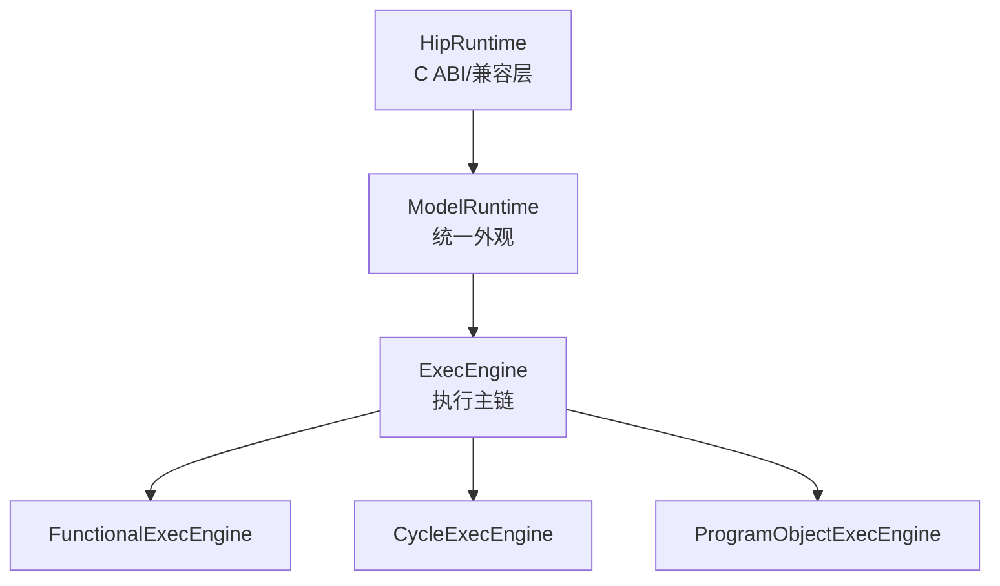

本页帮助初学者在最短时间内建立对仓库目录与常用术语的清晰认知，便于后续按图索骥地查阅示例、脚本、源码与测试资产。[目录导览与术语](8-mu-lu-dao-lan-yu-zhu-yu) [You are currently here]，定位于“快速上手”导航节点，仅涉及目录与名词解释，不展开实现细节。Sources: [README.md](README.md#L28-L40) [docs/README.md](docs/README.md#L7-L18)

## 导航与阅读路径提示
建议先完成“快速上手”序列，再进入“技术深潜”。推荐路径：先看[概览](1-gai-lan) → [快速开始](2-kuai-su-kai-shi) → [运行示例与验证](4-yun-xing-shi-li-yu-yan-zheng) → 本页[目录导览与术语](8-mu-lu-dao-lan-yu-zhu-yu)；随后建议前往[分层与职责边界总览](10-fen-ceng-yu-zhi-ze-bian-jie-zong-lan)与[执行模式与 ExecEngine 工作流](11-zhi-xing-mo-shi-yu-execengine-gong-zuo-liu)获取更系统的背景。Sources: [README.md](README.md#L55-L61) [docs/README.md](docs/README.md#L28-L40)

## 项目目录鸟瞰（可视化结构）
下图展示顶层目录的角色定位，便于把常用入口（examples/scripts/docs/src/tests）与其用途建立映射关系。Sources: [README.md](README.md#L41-L53) [examples/README.md](examples/README.md#L1-L13) [scripts/README.md](scripts/README.md#L5-L19)

```
.
├── docs/           # 项目文档入口与设计/状态/约束
├── examples/       # 可执行 HIP 示例集合（按难度编号）
├── scripts/        # 回归/门禁/生成类脚本入口
├── src/            # 模型源码（runtime/program/instruction/execution/…）
├── tests/          # 测试集（functional/cycle/loader/runtime/…）
└── tools/          # 构建与缓存小工具（如 hipcc_cache.sh）
```
Sources: [docs/README.md](docs/README.md#L7-L18) [examples/README.md](examples/README.md#L22-L40) [scripts/README.md](scripts/README.md#L20-L39) [tests/CMakeLists.txt](tests/CMakeLists.txt#L1-L20)

## 架构鸟瞰（Mermaid）
说明：本图仅用于术语定位，展示从 HIP 兼容层到执行与追踪产物的主干流向，帮助你把名词与目录对上号。Sources: [README.md](README.md#L41-L53) [docs/runtime-layering.md](docs/runtime-layering.md#L12-L21)

```mermaid
flowchart LR
  A[HIP 程序/示例] --> B(HipRuntime 兼容层<br/>src/runtime/hip_runtime*.cpp)
  B --> C(ModelRuntime 外观<br/>src/runtime/* & src/gpu_model/runtime/*)
  C --> D{ExecEngine 执行主链<br/>src/runtime/exec_engine.cpp}
  D --> E[Program/Loader/ISA<br/>src/{program,loader,isa}]
  D --> F[Execution/Cycle/Wave<br/>src/execution]
  D --> G[Memory System<br/>src/memory]
  D --> H[Trace/Log 输出<br/>src/debug + timeline.perfetto.json]
```
Sources: [docs/runtime-layering.md](docs/runtime-layering.md#L36-L64) [README.md](README.md#L34-L40) [docs/trace-structured-output.md](docs/trace-structured-output.md#L77-L83)

## 关键目录与用途一览（表）
- 目的：把常见任务与目录对齐，明确“去哪里找什么”。Sources: [docs/README.md](docs/README.md#L41-L53) [scripts/README.md](scripts/README.md#L20-L39)

| 目录 | 主要内容 | 新手首选操作 | 参考文档/脚本 |
|---|---|---|---|
| docs/ | 主线规范、设计与状态 | 先读 docs/README.md，按推荐顺序浏览 | docs/README.md |
| examples/ | 可运行 HIP 示例（编号 01-13） | 进入 01-vecadd-basic，执行 run.sh | examples/README.md |
| scripts/ | 门禁/回归/生成脚本 | run_push_gate_light.sh 做日常快速回归 | scripts/README.md |
| src/ | 模型源码（runtime/program/…） | 结合术语在对应子目录浏览 | README 架构概览 |
| tests/ | 测试分类（functional/cycle/loader/runtime） | 用 gtest 筛选单类测试验证 | tests/CMakeLists.txt |
| tools/ | HIP 编译缓存工具 | 默认启用 hipcc_cache.sh | examples/README.md |
Sources: [README.md](README.md#L55-L83) [examples/README.md](examples/README.md#L41-L49) [scripts/README.md](scripts/README.md#L11-L19) [tests/CMakeLists.txt](tests/CMakeLists.txt#L94-L121)

## 执行模式术语（st / mt / cycle）
- st（SingleThreaded）：单线程功能执行，提供确定性参考。mt（MultiThreaded）：多线程功能执行，使用 Marl fiber 并行。cycle（Cycle）：naive 周期模型，提供时间线估算；注意其“cycle”为模型时间、非物理时间。Sources: [examples/README.md](examples/README.md#L16-L21) [README.md](README.md#L34-L40) [README.md](README.md#L94-L97)

| 模式 | 定位 | 典型使用 | 产物/备注 |
|---|---|---|---|
| st | 功能正确性的序参考 | 小规模内核、对比分析 | 可与 mt/cycle 对比 |
| mt | 默认执行模式 | 大多数示例默认只跑 mt | results/mt/* 产物 |
| cycle | 周期近似对比 | 调度/等待/可视化 | timeline.perfetto.json |
Sources: [examples/README.md](examples/README.md#L9-L13) [examples/README.md](examples/README.md#L49-L58) [README.md](README.md#L37-L40)

## 运行时分层术语（HipRuntime / ModelRuntime / ExecEngine）
- HipRuntime：与 AMD HIP runtime 对齐的兼容层与 C ABI 入口，负责参数适配与指针映射，不自持执行逻辑。ModelRuntime：项目核心 runtime 外观，统一 device/memory/program load/launch 等；统一进入 ExecEngine。ExecEngine：ModelRuntime 内部执行主链，驱动 Functional/Cycle/ProgramObject 执行，并组织 WaveContext 生命周期与状态输出。Sources: [docs/runtime-layering.md](docs/runtime-layering.md#L12-L35) [docs/runtime-layering.md](docs/runtime-layering.md#L36-L64)


Sources: [docs/runtime-layering.md](docs/runtime-layering.md#L57-L64) [docs/runtime-layering.md](docs/runtime-layering.md#L118-L129)

## 程序对象与指令相关术语
- ProgramObject / ExecutableKernel：承载已装载内核与可执行实体；由 ModelRuntime 统一装载并经 ExecEngine 发起执行。ISA/Opcode/Decode：GCN ISA 解码/描述符/语义链路源自本地规范与生成表，遵循 LLVM AMDGPU 合同与数据库格式。Sources: [README.md](README.md#L47-L53) [src/spec/README.md](src/spec/README.md#L1-L11) [src/spec/README.md](src/spec/README.md#L20-L25)

- ISA 覆盖率：仓库内提供按语义族与编码格式统计的覆盖率报告，用于评估“被跟踪子集”的解码/执行/加载器测试覆盖情况。Sources: [docs/isa_coverage_report.md](docs/isa_coverage_report.md#L5-L17) [docs/isa_coverage_report.md](docs/isa_coverage_report.md#L18-L30)

## 调试与 Trace 术语
- Trace 产物：timeline.perfetto.json（Perfetto 可视化）、trace.jsonl（结构化 JSON Lines）、trace.txt（分节文本）；关闭追踪不应改变执行事实，且“cycle”为模型时间。Sources: [examples/README.md](examples/README.md#L75-L84) [docs/trace-structured-output.md](docs/trace-structured-output.md#L5-L13)

- 结构化事实：Recorder 生产事实，渲染器仅消费，不推断业务状态；WaveStep 为权威执行事实；Run/Model/Kernel/Summary 等 snapshot 统一驱动多制品输出。Sources: [docs/trace-structured-output.md](docs/trace-structured-output.md#L5-L12) [docs/trace-structured-output.md](docs/trace-structured-output.md#L81-L96)

- Slot 语义：cycle 使用 resident_fixed（真实 resident slot）；st/mt 使用 logical_unbounded（逻辑轨道），便于并行/对比视图的统一。Sources: [examples/README.md](examples/README.md#L81-L84)

## 测试布局与命名术语
- 测试按主题分类：functional（功能）、cycle（周期）、loader（加载器）、runtime（运行时）、instruction/isa（指令/描述符）等；CMake 列表反映了具体文件分类与命名约定，可据此快速定位某一类语义的测试集合。Sources: [tests/CMakeLists.txt](tests/CMakeLists.txt#L20-L38) [tests/CMakeLists.txt](tests/CMakeLists.txt#L57-L89) [tests/CMakeLists.txt](tests/CMakeLists.txt#L94-L123)

## 常用脚本术语与入口
- 轻量门禁：run_push_gate_light.sh 适合日常提交前的快速回归（并行 Debug+ASan/Release smoke），默认不跑全量 tests 与 examples。全量门禁：run_push_gate.sh 并行运行 Debug+ASan/Release 以及 01-11 号示例，统一落盘结果与最慢测试榜单。Sources: [scripts/README.md](scripts/README.md#L11-L19) [scripts/README.md](scripts/README.md#L20-L39)

- 其他回归与检查：run_exec_checks.sh（最小基础检查）、run_real_hip_kernel_regression.sh（真实 HIP 回归）、run_disable_trace_smoke.sh（关闭 trace 的冒烟）。生成类：gen_gcn_isa_db.py / gen_gcn_full_opcode_table.py / report_isa_coverage.py。Sources: [scripts/README.md](scripts/README.md#L40-L61) [scripts/README.md](scripts/README.md#L62-L67)

## 初学者常见问题定位建议
- 想跑一个最小示例：进入 examples/01-vecadd-basic 执行 run.sh，成功标准见 examples/README。默认只跑 mt，产物位于 results/mt。Sources: [README.md](README.md#L17-L19) [examples/README.md](examples/README.md#L26-L33) [examples/README.md](examples/README.md#L49-L58)

- 想理解分层与职责：优先阅读 runtime-layering.md 的分层、交互路径与正式解释规则，避免从历史命名反推当前设计。Sources: [docs/runtime-layering.md](docs/runtime-layering.md#L65-L101) [docs/runtime-layering.md](docs/runtime-layering.md#L181-L193)

## 下一步阅读（按“快速上手”节奏）
- 若你需要明确模型边界与适用范围，请继续阅读：[限制与适用范围](9-xian-zhi-yu-gua-yong-fan-wei)。Sources: [README.md](README.md#L92-L97)

- 若你准备深入理解分层架构与职责边界，请转到：[分层与职责边界总览](10-fen-ceng-yu-zhi-ze-bian-jie-zong-lan) 与 [执行模式与 ExecEngine 工作流](11-zhi-xing-mo-shi-yu-execengine-gong-zuo-liu)。Sources: [README.md](README.md#L41-L53) [docs/runtime-layering.md](docs/runtime-layering.md#L12-L21)

- 若你想先体验 Trace 可视化，请回到快速上手中的：[可视化 Trace（Perfetto）](5-ke-shi-hua-trace-perfetto)。Sources: [examples/README.md](examples/README.md#L75-L84) [README.md](README.md#L38-L40)