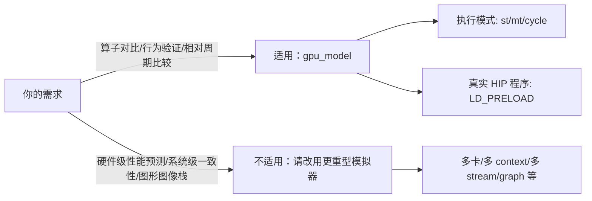
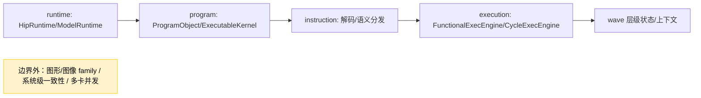

本页面向入门级开发者，明确 gpu_model 的功能边界、适用场景与不适用场景，帮助你以正确预期使用“功能模型 + naive 周期模型”进行算子与编译器相关分析，而非将其当作硬件级精确仿真或系统级模拟器。Sources: [README.md](README.md#L28-L31) [README.md](README.md#L92-L96)

## 我们解决什么问题（适用范围）
gpu_model 的定位是为算子库优化、编译器 codegen 对比、硬件参数变更评估、以及 HIP/AMDGPU kernel 行为验证提供“可执行、可追踪、可扩展”的分析平台；默认提供 st/mt 功能执行与 naive cycle 执行用于相对比较，并支持以 LD_PRELOAD 方式让真实 HIP 程序进入模型执行路径。Sources: [README.md](README.md#L28-L31) [README.md](README.md#L34-L39)


Sources: [README.md](README.md#L34-L39) [README.md](README.md#L92-L96) [docs/runtime-layering.md](docs/runtime-layering.md#L80-L88)

## 边界内外一图看懂
模型覆盖“单卡、单 context、单 stream、同步语义”的第一阶段边界；明确暂不覆盖多卡、多 context、多 stream 并发、异步 memcpy/重叠、graph、P2P、image/sampler/texture 与复杂 debug API。Sources: [docs/module-development-status.md](docs/module-development-status.md#L114-L121) [docs/module-development-status.md](docs/module-development-status.md#L137-L148)

```mermaid
graph TD
  subgraph 覆盖（第一阶段）
    S1[单卡]
    S2[单 context]
    S3[单 stream/同步]
    S4[Global/Shared/Private/Constant/Kernarg]
    S5[GCN Compute ISA 解码/执行（子集）]
    S6[st/mt 功能执行 + naive cycle]
    S7[真实 HIP 程序经 HipRuntime/ModelRuntime 进入 ExecEngine]
  end
  subgraph 未覆盖/暂缓
    U1[多卡/多 context/多 stream 并发]
    U2[async memcpy/overlap/graph/P2P]
    U3[image/sampler/texture]
    U4[系统级一致性/MSHR/GPUVM/页错误/DMA]
    U5[图形/图像 family 指令]
  end
  S1-->S6
  S6-->S7
  U1-->U2
  U2-->U3
  U3-->U4
  U4-->U5
```
Sources: [docs/module-development-status.md](docs/module-development-status.md#L114-L121) [docs/module-development-status.md](docs/module-development-status.md#L137-L148) [docs/memory-hierarchy-interface-reservation.md](docs/memory-hierarchy-interface-reservation.md#L31-L38) [README.md](README.md#L94-L96)

## 能力边界速览（支持 vs 暂不支持）
- 执行模式与时间语义：提供 st/mt 功能执行与 naive cycle；cycle 为模型时间，用于相对比较与可视化，不是物理时间或硬件级性能预测。Sources: [README.md](README.md#L34-L35) [README.md](README.md#L92-L96)
- 运行时与会话：通过 HipRuntime 兼容层进入 ModelRuntime 主链，聚焦同步语义与单设备；async/stream/graph 保留最小兼容或暂缓。Sources: [docs/runtime-layering.md](docs/runtime-layering.md#L12-L35) [docs/runtime-layering.md](docs/runtime-layering.md#L80-L88)
- 程序加载与格式：支持 AMDGPU object/HIP fatbin/真实 HIP 可执行程序进入模型执行主链。Sources: [README.md](README.md#L39-L39) [docs/runtime-layering.md](docs/runtime-layering.md#L151-L161)
- ISA 覆盖与测试：GCN ISA 尚未完全覆盖，graphics/image family 仍为占位；已跟踪子集在解码/执行测试层面达 100%，loader 集成测试部分覆盖。Sources: [README.md](README.md#L92-L95) [docs/isa_coverage_report.md](docs/isa_coverage_report.md#L11-L17)
- 内存/缓存与一致性：提供多地址空间与基本存取；当前不涉及 coherence、MSHR、GPUVM、跨 wave 合并，cache 层以轻量接口演进为主。Sources: [docs/module-development-status.md](docs/module-development-status.md#L121-L136) [docs/memory-hierarchy-interface-reservation.md](docs/memory-hierarchy-interface-reservation.md#L20-L38)

## 我们不做什么（不适用范围）
- 硬件级精确性能预测：naive cycle 旨在相对比较与观察等待/气泡/时间线，不代表物理时间与硬件真实性能。Sources: [README.md](README.md#L92-L96)
- 系统级存储一致性与协议：不建模 coherence、MSHR、GPUVM/缺页、DMA、跨 wave 合并与完整协议控制器。Sources: [docs/memory-hierarchy-interface-reservation.md](docs/memory-hierarchy-interface-reservation.md#L31-L38) [docs/memory-hierarchy-interface-reservation.md](docs/memory-hierarchy-interface-reservation.md#L66-L85)
- 多设备并发与高级运行时特性：不覆盖多卡、多 context、多 stream 并发、异步 memcpy/overlap、graph、P2P、复杂 debug API。Sources: [docs/module-development-status.md](docs/module-development-status.md#L137-L148)

## 架构层级与覆盖边界
项目公开主线聚焦 runtime → program → instruction → execution → arch 五层；“适用范围”限定在这五层内的 compute 相关路径，不涉图形/图像 family 与系统级协同。Sources: [README.md](README.md#L41-L53)


Sources: [README.md](README.md#L41-L53)

## 模型时间与 Trace 解读边界
timeline.perfetto.json 与 trace.txt 中的 cycle 是“模型时间”，用于对比不同实现/策略的相对趋势；不要据此推断物理时钟或 GPU 绝对性能。Sources: [README.md](README.md#L92-L96)

## ISA 覆盖状态与限制
当前仓库对 GCN ISA 的整体定位是“逐步补齐”，graphics/image family 未纳入一阶段目标；针对已跟踪子集，解码与执行测试覆盖已达 100%，但 loader 集成测试覆盖仍在推进。Sources: [README.md](README.md#L92-L95) [docs/isa_coverage_report.md](docs/isa_coverage_report.md#L11-L17)

## 运行时与真实 HIP 程序的边界
真实 HIP 可执行程序通过 HipRuntime C ABI 与 LDPRELOAD 进入 ModelRuntime → ExecEngine 主链；当前以单卡、单 context、单 stream、同步语义为边界，async/stream/graph 等仅作最小兼容或暂缓。Sources: [docs/runtime-layering.md](docs/runtime-layering.md#L12-L35) [docs/runtime-layering.md](docs/runtime-layering.md#L151-L161) [docs/runtime-layering.md](docs/runtime-layering.md#L80-L88)

## 内存与缓存建模边界
现阶段提供 Global/Constant/Kernarg/Data/Shared/Private 等语义空间与字节级 MemorySystem；缓存路径以轻量级接口预留为主，不建模 coherence/MSHR/GPUVM/页错误/DMA，合并策略与 VL1/SL1/L2 命中延迟按分层接口逐步演进。Sources: [docs/module-development-status.md](docs/module-development-status.md#L121-L136) [docs/memory-hierarchy-interface-reservation.md](docs/memory-hierarchy-interface-reservation.md#L20-L38) [docs/memory-hierarchy-interface-reservation.md](docs/memory-hierarchy-interface-reservation.md#L66-L85)

## 设备与架构适配边界
第一阶段目标针对 mac500 设备规格，单卡、wave64、固定拓扑与统一的 device property 查询；这一定义限定了“适用范围”的架构前提。Sources: [docs/module-development-status.md](docs/module-development-status.md#L162-L166)

## 常见误解澄清
- “cycle 等于硬件时钟”：错误。这里的 cycle 是模型时间，用于解释执行顺序、等待与气泡分布，非物理时钟。Sources: [README.md](README.md#L92-L96)
- “覆盖了全部 GCN 指令族”：错误。graphics/image family 仍为占位，计算相关子集按计划推进。Sources: [README.md](README.md#L92-L95)

## 建议阅读路径（进一步理解边界）
- 想理解分层职责与边界，请继续阅读[分层与职责边界总览](10-fen-ceng-yu-zhi-ze-bian-jie-zong-lan)。Sources: [docs/runtime-layering.md](docs/runtime-layering.md#L181-L193)
- 需要了解执行模式与工作流，请看[执行模式与 ExecEngine 工作流](11-zhi-xing-mo-shi-yu-execengine-gong-zuo-liu)。Sources: [README.md](README.md#L41-L53)
- 关注存储语义适用边界，请看[Global/Shared/Private/Constant 存储语义](17-global-shared-private-constant-cun-chu-yu-yi)。Sources: [docs/module-development-status.md](docs/module-development-status.md#L121-L136)
